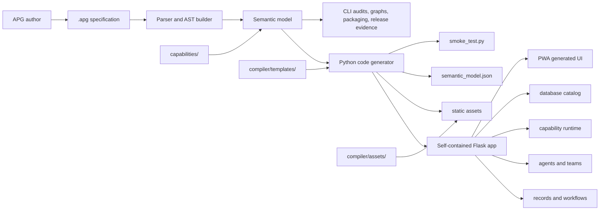

# APG - Agentic Platform Generator

APG is an Africa-first agentic application generator. It turns concise `.apg`
specifications into self-contained Flask applications with records, workflows,
agent consoles, capability consoles, database catalogs, PWA shell assets, and
reviewable release evidence.

APG is built for teams that need to compose serious business software quickly:
SACCOs, fintechs, insurers, healthcare operators, pharma and supply-chain
teams, governments, NGOs, telcos, retailers, transport operators, energy
utilities, hospitality groups, and legal practices.

Current source-tree inventory: 33 capability domains, 440 non-hidden
domain/code capability directories, 322 checked `cap_spec.md` files, and 592
`capability_contract.py` modules including build artifacts. Treat those counts
as a repository inventory, not a claim that every package has the same runtime
depth.

## Architecture



## Quick Start

Install the developer environment with `uv`:

```bash
uv venv .venv
uv pip install -e ".[dev]"
```

Write `clinic.apg`:

```apg
module clinic version 1.0.0 {
    description: "Clinic operations";
}

table Patient {
    name: str;
    phone: str;
    status: str;
}

workflow Intake {
    steps: ["registered", "triaged", "seen"];
}

agent CarePlanner {
    role: "care planner";
    model: "openai:gpt-4.1-mini";
    runtime: codex;
    system: "Plan the next safe patient follow-up.";
}
```

Compile and run:

```bash
apg compile clinic.apg --output generated/clinic --verify
python generated/clinic/app.py --host 127.0.0.1 --port 8080
```

Open:

- `http://127.0.0.1:8080/ui` for the generated app shell.
- `http://127.0.0.1:8080/openapi.json` for the generated API contract.
- `python generated/clinic/app.py --self-test` for runtime verification.
- `python generated/clinic/smoke_test.py` for the generated smoke test.

Refresh the numbered example baseline when compiler output changes:

```bash
apg baseline examples --refresh
```

`--refresh` is the short alias for `--refresh-outputs`.

## Key Features

- Python-first compiler pipeline: parser, AST builder, semantic model, lint,
  validation, graphs, code generation, packaging, release evidence, and drift
  checks.
- Generated Flask applications with `app.py`, package exports, OpenAPI 3.1,
  component manifests, semantic models, smoke tests, Dockerfile, environment
  example, and optional agent/capability/application sidecars.
- Self-contained generated UI. Browser dependencies are vendored into
  `static/`; generated apps do not require CDN assets.
- Capability contracts with configuration, deterministic rules, UI route
  metadata, theme tokens, i18n metadata, streaming metadata, and package
  lifecycle audits.
- Agent and team composition for Codex, Claude Code, OpenCode, OpenAI, Ollama,
  Pi, and compatible adapter runtimes.
- Africa-first product surface: payments and financial rails are modeled around
  MPESA, MTN MoMo, Airtel Money, Orange Money, Wave, M-Shwari, SACCO workflows,
  USSD, multilingual UI, and low-bandwidth operational use.
- Baseline gate for all numbered examples: semantic/lint/validate readiness,
  graph-suite output, generated release evidence, output synchronization,
  self-tests, smoke tests, HTTP contract probes, and Python-only targeting.
- Current full repository test evidence: `uv run pytest tests/ -q` completed
  with 1486 passed, 1 skipped, and 3 warnings.

## Capability Domains

APG currently carries 350+ capability directories across these source-tree
domains:

| Domain | Count | Typical scope |
| --- | ---: | --- |
| agriculture | 12 | crops, farms, irrigation, markets, weather, land, inputs |
| insurance | 8 | claims, policies, underwriting, actuarial, distribution, microinsurance |
| legal | 8 | matters, contracts, dispute resolution, billing, compliance, IP |
| hospitality | 8 | property management, reservations, revenue, food and beverage, loyalty |
| NGO | 6 | grants, donors, beneficiaries, programs, monitoring and evaluation |
| SACCO and fintech | 33 | wallets, payments, KYC, AML, lending, agency, switch, USSD apps |
| government | 13 | tax, permits, licensing, land, elections, emergency, citizen services |
| healthcare | 9 | EMR, lab, pharmacy, telemedicine, patient management, registries |
| pharma | 9 | clinical trials, compliance, distribution, manufacturing, QMS, regulatory |
| SCM | 18 | procurement, inventory, warehouse, logistics, supplier and vendor flows |
| HCM | 12 | employee data, payroll, benefits, recruitment, learning, time attendance |
| CRM | 13 | sales force, marketing, orders, customer service, field service |
| retail | 5 | POS, loyalty, promotions, omnichannel, store inventory |
| transport | 10 | fleet, dispatch, delivery, routing, maintenance, fuel, scheduling |
| telecom | 10 | billing, orders, QoS, provisioning, inventory, network, security |
| energy | 6 | metering, billing, generation, grid, renewables, distribution |
| finance | 21 | GL, AR, AP, cash, budgeting, assets, tax, treasury, reporting |
| manufacturing | 15 | BOM, MRP, MES, QMS, shop floor, PLM, MRO, planning |
| real estate | 10 | leases, property, tenants, maintenance, valuation, renewals |
| intelligence | 22 | OSINT, alerts, fusion, threats, geoint, sigint, dark web, reporting |
| common platform | 105 | auth, audit, cache, connectors, doc intelligence, workflows, search |
| other platform domains | 55 | BI, CKM, composition, EAM, education, GRC, ITSM, loc, mining, mobile, PDE, PPM, procurement |

Seven common infrastructure capabilities are called out because generated apps
and business domains repeatedly compose them:

- `common/obs` - observability
- `common/dcat` - data catalog
- `common/fflag` - feature flags
- `common/gql` - GraphQL
- `common/ussd` - USSD
- `common/docint` - document intelligence
- `common/pmin` - process mining

## Generated UI Workspaces

Every generated Flask app can expose these 14 workspaces when the APG source
contains the matching records, workflows, agents, capabilities, databases, or
auth metadata:

1. Home dashboard with operational cards, charts, shortcuts, and activity.
2. Entity list tables with saved-view style query links, filters, sorting,
   pagination, import/export, and CSV export.
3. Kanban boards for entities with `status`, `state`, `stage`, or `phase`.
4. Record detail pages with field display, inline edit, related lists, revision
   checks, and activity timelines.
5. Create/edit drawers and form fragments with typed inputs, validation errors,
   HTMX swaps, and optimistic UI feedback.
6. Workflow list workspace.
7. Workflow wizard with step navigation, run progress, journals, signals,
   resume, and compensation paths.
8. Streaming agent console.
9. Streaming agent-team console.
10. Capability console for rules, configuration resolution/validation,
    approvals, health, theme, screens, and streaming metadata.
11. Database catalog with schemas, tables, columns, indexes, relationships, and
    status.
12. Flow debugger for workflow runs, event journals, circuit breakers, and
    subscriptions.
13. Login/auth surfaces with session login, logout, protected UI redirects, and
    API-key/JWT-aware mutation checks.
14. Landing page plus full app shell with sidebar, topbar, command palette,
    notifications, theme toggle, i18n switcher, install/update controls,
    offline banner, manifest, and service worker.

Generated static assets are copied into each output directory:

```text
static/
  apg.css
  htmx.min.js
  sortable.min.js
  uplot.min.js
  uplot.min.css
  apg-charts.js
  apg-sse.js
  manifest.webmanifest
  sw.js
  icon.svg
```

The generated app loads those local assets; no CDN is required.

## CLI

Primary command:

```bash
apg --help
```

Important workflows:

```bash
apg compile <source.apg> --output <dir> --verify
apg lint <source-or-directory> --json
apg validate <source.apg> --target python --json
apg model <source.apg> --json
apg graph-suite <source.apg> --json
apg release <source.apg> --json
apg package <source.apg> --target web --out <dir> --json
apg baseline examples --refresh
apg docs audit --json
apg tooling audit --json
apg doctor --json
apg capabilities contracts --json
apg capabilities scaffold <domain> <code> --name "Display Name" --json
apg capabilities implementation-audit --json
```

The advertised compiler target is `python`. Web, desktop, mobile, and container
delivery are package profiles over generated Python artifacts.

## Documentation

- [Documentation index](docs/README.md)
- [Installation and CLI reference](docs/installation.md)
- [Quick start](docs/quickstart.md)
- [Architecture](docs/architecture.md)
- [Developer guide](docs/developer_guide.md)
- [Generated UI](docs/generated_ui.md)
- [Capabilities](docs/capabilities/README.md)
- [Tooling](docs/tooling.md)
- [Research summary for this docs refresh](docs/research/docs-update/)

## Repository Map

```text
apg/
  cli/                  current Click-based APG CLI
  cli.py                legacy argparse compatibility surface
  compiler/             parser, semantic model, generator, audits, templates
  compiler/assets/      vendored generated-app static assets
  compiler/templates/   generated UI Jinja templates
  capabilities/         package-backed capability source tree
  examples/             numbered APG examples and checked generated output
  tests/                compiler, CLI, generated app, UI, and audit tests
  docs/                 developer and platform documentation
  setup.py              package metadata and dependencies
```

## License

Copyright (c) 2025 Datacraft. Author: Nyimbi Odero.
