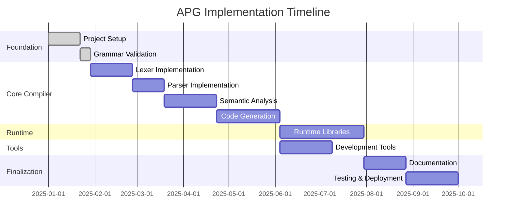

# APG Language Implementation Roadmap

**Comprehensive TODO for implementing the APG v11 language and toolchain**

Copyright (c) 2025 Datacraft  
Author: Nyimbi Odero

---

## Executive Summary

This document outlines the complete implementation plan for APG (Application Programming Generation) v11, a revolutionary ultra-terse domain-specific language that compiles to high-quality Python code. The implementation follows a systematic approach across 8 major phases, from foundation setup to production deployment.

### Key Deliverables

1. **APG Compiler**: Complete ANTLR-based compiler generating Python 3.12+ code
2. **Runtime Libraries**: Comprehensive runtime support for all domains
3. **Development Tools**: IDE extensions, debugging tools, and project templates
4. **Documentation**: Complete language documentation and tutorials
5. **Testing Framework**: Comprehensive test suite and validation tools
6. **Deployment Tools**: Cloud deployment and infrastructure automation
7. **Community Platform**: Documentation site, package repository, and support tools

### Success Metrics

- **Productivity**: 10-30x reduction in code volume compared to traditional approaches
- **Quality**: Generated code passes all static analysis and security checks
- **Performance**: Generated applications perform within 10% of hand-written Python
- **Compatibility**: Supports all major Python frameworks and libraries
- **Adoption**: Clear path from prototype to enterprise deployment

---

## Phase 1: Foundation and Infrastructure Setup

**Duration**: 2-3 weeks  
**Priority**: Critical  
**Dependencies**: None

### 1.1 Project Structure and Build System

#### 1.1.1 Repository Setup
- [ ] **Initialize Git repository with proper structure**
  ```bash
  apg/
  ├── compiler/           # APG compiler implementation
  ├── runtime/           # Runtime libraries and frameworks
  ├── tools/            # Development and deployment tools
  ├── docs/             # Documentation and tutorials
  ├── examples/         # Example APG applications
  ├── tests/            # Test suites and validation
  ├── spec/             # Language specifications
  └── packages/         # Package management and distribution
  ```

- [ ] **Configure build system using uv (modern Python package manager)**
  ```toml
  # pyproject.toml
  [project]
  name = "apg-lang"
  version = "0.1.0"
  description = "Ultra-terse application programming generation language"
  authors = [{name = "Nyimbi Odero", email = "nyimbi@datacraft.io"}]
  dependencies = [
      "antlr4-python3-runtime>=4.13.0",
      "pydantic>=2.5.0",
      "typer>=0.9.0",
      "rich>=13.0.0",
      "jinja2>=3.1.0"
  ]
  
  [project.optional-dependencies]
  dev = [
      "pytest>=7.4.0",
      "pytest-asyncio>=0.21.0",
      "black>=23.0.0",
      "ruff>=0.1.0",
      "mypy>=1.7.0",
      "coverage>=7.3.0"
  ]
  
  [project.scripts]
  apg = "apg.cli:main"
  ```

- [ ] **Set up CI/CD pipeline (GitHub Actions)**
  ```yaml
  # .github/workflows/ci.yml
  name: CI/CD Pipeline
  on: [push, pull_request]
  jobs:
    test:
      runs-on: ubuntu-latest
      strategy:
        matrix:
          python-version: ["3.12", "3.13"]
    build:
      runs-on: ubuntu-latest
    deploy:
      runs-on: ubuntu-latest
      if: github.ref == 'refs/heads/main'
  ```

#### 1.1.2 Development Environment
- [ ] **Configure development tools and linting**
  - Black code formatting with line length 88
  - Ruff for fast linting and import sorting
  - MyPy for static type checking
  - Pre-commit hooks for code quality

- [ ] **Set up testing infrastructure**
  - pytest for unit and integration tests
  - pytest-asyncio for async test support
  - coverage.py for code coverage tracking
  - hypothesis for property-based testing

- [ ] **Documentation infrastructure**
  - mkdocs-material for documentation site
  - Sphinx for API documentation generation
  - Jupyter notebooks for interactive examples
  - Automated documentation deployment

### 1.2 Language Specification Finalization

#### 1.2.1 Grammar Validation and Enhancement
- [ ] **Review and validate APG v11 ANTLR grammar**
  - Verify all demonstrated features are properly defined
  - Ensure grammar handles edge cases and error conditions
  - Add missing productions for business calculations
  - Validate industrial IoT and digital twin syntax

- [ ] **Grammar testing and validation**
  ```python
  # tests/test_grammar.py
  def test_all_entity_types():
      """Test that all entity types parse correctly"""
      entity_types = [
          'agent', 'robot', 'sensor', 'twin', 'vision', 
          'anomaly', 'calc', 'db', 'form', 'intel'
      ]
      for entity_type in entity_types:
          # Test basic entity creation
          # Test with complex configurations
          # Test with nested entities
  ```

- [ ] **Create grammar documentation**
  - EBNF notation for all productions
  - Railroad diagrams for complex rules
  - Examples for each grammar construct
  - Migration guide from previous versions

#### 1.2.2 Semantic Rules Definition
- [ ] **Define type system rules**
  - Type inference algorithms
  - Union type resolution
  - Generic type instantiation
  - Constraint validation

- [ ] **Entity relationship rules**
  - Reference resolution mechanisms
  - Dependency graph construction
  - Circular dependency detection
  - Scope and visibility rules

- [ ] **Domain-specific validation rules**
  - Industrial protocol validation
  - AI model compatibility checks
  - Database schema consistency
  - Business rule compliance

### 1.3 Core Dependencies and Tools

#### 1.3.1 ANTLR Integration
- [ ] **Install and configure ANTLR 4.13+**
  ```bash
  # Install ANTLR tool
  curl -O https://www.antlr.org/download/antlr-4.13.1-complete.jar
  export CLASSPATH=".:antlr-4.13.1-complete.jar:$CLASSPATH"
  alias antlr4='java org.antlr.v4.Tool'
  alias grun='java org.antlr.v4.gui.TestRig'
  ```

- [ ] **Generate Python parser from grammar**
  ```bash
  antlr4 -Dlanguage=Python3 -visitor -listener apg_v11_complete.g4
  ```

- [ ] **Create ANTLR build integration**
  - Automated grammar compilation
  - Parser regeneration on grammar changes
  - Visitor and listener generation
  - Error recovery and reporting

#### 1.3.2 Python Runtime Requirements
- [ ] **Core runtime libraries**
  - Pydantic v2 for data validation
  - FastAPI for web services
  - SQLAlchemy for database ORM
  - AsyncIO for concurrent operations
  - Typer for CLI interfaces

- [ ] **Domain-specific libraries**
  - OpenCV for computer vision
  - python-opcua for industrial protocols
  - transformers for AI models
  - networkx for graph analysis
  - numpy/scipy for scientific computing

- [ ] **Development and testing tools**
  - pytest for testing framework
  - mypy for type checking
  - black for code formatting
  - ruff for linting
  - coverage for test coverage

---

## Phase 2: Lexer and Parser Implementation

**Duration**: 3-4 weeks  
**Priority**: Critical  
**Dependencies**: Phase 1 complete

### 2.1 Lexical Analysis Implementation

#### 2.1.1 Token Generation and Classification
- [ ] **Implement comprehensive tokenizer**
  ```python
  # compiler/lexer.py
  class APGLexer:
      def __init__(self, input_stream: str):
          self.antlr_lexer = apg_v11_completeLexer(InputStream(input_stream))
          self.tokens = []
          self.errors = []
      
      def tokenize(self) -> List[Token]:
          """Generate tokens from input stream"""
          # Handle all token types from grammar
          # Manage whitespace and comments
          # Process string literals and f-strings
          # Handle numeric literals with proper precision
  ```

- [ ] **Domain-specific keyword recognition**
  - Industrial IoT protocol keywords (opc_ua, modbus_tcp, etc.)
  - AI/ML model keywords (gpt4, claude3, transformers, etc.)
  - Computer vision keywords (opencv, detection, classification)
  - Business process keywords (workflow, compliance, audit)

- [ ] **Advanced tokenization features**
  - F-string tokenization and interpolation
  - Regular expression literal support
  - Time/duration literal parsing
  - URL and pattern recognition
  - Semantic versioning tokenization

#### 2.1.2 Error Handling and Recovery
- [ ] **Implement robust error reporting**
  ```python
  class LexicalError:
      def __init__(self, line: int, column: int, message: str, suggestion: str = None):
          self.line = line
          self.column = column
          self.message = message
          self.suggestion = suggestion
      
      def format_error(self, source_code: str) -> str:
          """Format error with context and suggestions"""
  ```

- [ ] **Error recovery strategies**
  - Skip invalid characters with warnings
  - Suggest corrections for common mistakes
  - Handle incomplete tokens gracefully
  - Maintain position tracking for debugging

### 2.2 Syntax Analysis Implementation

#### 2.2.1 Parser Infrastructure
- [ ] **ANTLR parser wrapper implementation**
  ```python
  # compiler/parser.py
  class APGParser:
      def __init__(self, tokens: List[Token]):
          self.token_stream = CommonTokenStream(tokens)
          self.antlr_parser = apg_v11_completeParser(self.token_stream)
          self.error_listener = APGErrorListener()
          
      def parse(self) -> ParseTree:
          """Parse tokens into syntax tree"""
          self.antlr_parser.addErrorListener(self.error_listener)
          return self.antlr_parser.program()
  ```

- [ ] **Custom error listener for enhanced diagnostics**
  ```python
  class APGErrorListener(ErrorListener):
      def syntaxError(self, recognizer, offendingSymbol, line, column, msg, e):
          # Enhanced error messages
          # Context-aware suggestions
          # Recovery strategies
  ```

#### 2.2.2 Parse Tree to AST Conversion
- [ ] **Abstract Syntax Tree node definitions**
  ```python
  # compiler/ast_nodes.py
  from abc import ABC, abstractmethod
  from typing import List, Optional, Any
  
  class ASTNode(ABC):
      def __init__(self, line: int, column: int):
          self.line = line
          self.column = column
          self.parent: Optional[ASTNode] = None
          self.children: List[ASTNode] = []
      
      @abstractmethod
      def accept(self, visitor: 'ASTVisitor') -> Any:
          pass
  
  class EntityNode(ASTNode):
      def __init__(self, entity_type: str, name: str, body: 'EntityBodyNode'):
          super().__init__(entity_type.line, entity_type.column)
          self.entity_type = entity_type
          self.name = name
          self.body = body
  
  class ConfigItemNode(ASTNode):
      def __init__(self, key: str, value: 'ExpressionNode'):
          self.key = key
          self.value = value
  ```

- [ ] **Parse tree visitor for AST construction**
  ```python
  # compiler/ast_builder.py
  class ASTBuilder(apg_v11_completeBaseVisitor):
      def visitProgram(self, ctx) -> ProgramNode:
          """Convert program parse tree to AST"""
          
      def visitEntity(self, ctx) -> EntityNode:
          """Convert entity parse tree to AST"""
          
      def visitExpression(self, ctx) -> ExpressionNode:
          """Convert expression parse tree to AST"""
  ```

### 2.3 Advanced Parsing Features

#### 2.3.1 Precedence and Associativity
- [ ] **Operator precedence handling**
  - Arithmetic operators (*, /, +, -, **)
  - Comparison operators (==, !=, <, >, <=, >=)
  - Logical operators (&&, ||, !)
  - Pipeline operators (|, ->)
  - Assignment operators (=, +=, -=, etc.)

- [ ] **Expression parsing with proper precedence**
  ```python
  # Handle complex expressions like:
  # result = data | filter(valid=true) | map(transform) | reduce(sum)
  # calculation = (revenue - costs) * tax_rate + adjustments
  # cascade = primary_server->backup_server->emergency_fallback
  ```

#### 2.3.2 Context-Sensitive Parsing
- [ ] **Domain-specific parsing contexts**
  - Industrial protocol configuration parsing
  - AI model parameter parsing
  - Computer vision pipeline parsing
  - Business workflow parsing

- [ ] **Type-aware parsing**
  - Generic type parameter parsing
  - Union type parsing
  - Optional type parsing
  - Constraint parsing

---

## Phase 3: Semantic Analysis and Type System

**Duration**: 4-5 weeks  
**Priority**: Critical  
**Dependencies**: Phase 2 complete

### 3.1 Symbol Table and Scope Management

#### 3.1.1 Symbol Table Implementation
- [ ] **Multi-level symbol table structure**
  ```python
  # compiler/symbol_table.py
  class Symbol:
      def __init__(self, name: str, symbol_type: Type, scope: Scope):
          self.name = name
          self.type = symbol_type
          self.scope = scope
          self.line = 0
          self.column = 0
          self.is_mutable = True
          self.attributes = {}
  
  class SymbolTable:
      def __init__(self):
          self.scopes: List[Scope] = []
          self.current_scope: Optional[Scope] = None
          
      def enter_scope(self, scope_name: str) -> Scope:
          """Enter a new scope"""
          
      def exit_scope(self) -> None:
          """Exit current scope"""
          
      def declare_symbol(self, symbol: Symbol) -> None:
          """Declare a new symbol in current scope"""
          
      def lookup_symbol(self, name: str) -> Optional[Symbol]:
          """Look up symbol in current and parent scopes"""
  ```

- [ ] **Scope hierarchy management**
  - Global scope for imports and top-level entities
  - Entity scope for entity-level configurations
  - Method scope for function parameters and locals
  - Block scope for control structures

#### 3.1.2 Reference Resolution
- [ ] **Entity reference resolution**
  ```python
  # Handle references like:
  # workflow: UserDB.users -> form.save()
  # cascade: primary_db->replica_db->cache
  # reference: sensors* (all sensor instances)
  ```

- [ ] **Dependency graph construction**
  - Build entity dependency graph
  - Detect circular dependencies
  - Topological sorting for compilation order
  - Lazy loading dependency resolution

### 3.2 Type System Implementation

#### 3.2.1 Type Hierarchy and Inference
- [ ] **Core type system**
  ```python
  # compiler/type_system.py
  from abc import ABC, abstractmethod
  from typing import List, Dict, Optional, Union as PyUnion
  
  class Type(ABC):
      def __init__(self, name: str):
          self.name = name
          
      @abstractmethod
      def is_assignable_to(self, other: 'Type') -> bool:
          """Check if this type can be assigned to another"""
          
      @abstractmethod
      def unify_with(self, other: 'Type') -> Optional['Type']:
          """Attempt to unify two types"""
  
  class PrimitiveType(Type):
      """Basic types: str, int, float, bool, etc."""
  
  class GenericType(Type):
      """Generic types: List[T], Dict[K, V], etc."""
      def __init__(self, base_type: Type, type_args: List[Type]):
          self.base_type = base_type
          self.type_args = type_args
  
  class UnionType(Type):
      """Union types: str | int | None"""
      def __init__(self, types: List[Type]):
          self.types = types
  
  class EntityType(Type):
      """User-defined entity types"""
      def __init__(self, entity_node: EntityNode):
          self.entity_node = entity_node
          self.fields: Dict[str, Type] = {}
  ```

- [ ] **Type inference engine**
  ```python
  class TypeInferenceEngine:
      def __init__(self, symbol_table: SymbolTable):
          self.symbol_table = symbol_table
          self.type_constraints: List[TypeConstraint] = []
          
      def infer_expression_type(self, expr: ExpressionNode) -> Type:
          """Infer the type of an expression"""
          
      def resolve_generic_types(self, context: Dict[str, Type]) -> None:
          """Resolve generic type parameters"""
          
      def check_type_constraints(self) -> List[TypeError]:
          """Validate all type constraints"""
  ```

#### 3.2.2 Domain-Specific Type Validation
- [ ] **Industrial IoT type validation**
  - OPC-UA node type validation
  - Modbus register type checking
  - Sensor data type compatibility
  - Real-time constraint validation

- [ ] **AI/ML type validation**
  - Model input/output compatibility
  - Tensor shape validation
  - Pipeline component compatibility
  - Training data type checking

- [ ] **Business logic type validation**
  - Workflow step compatibility
  - Business rule type consistency
  - Calculation formula validation
  - Compliance constraint checking

### 3.3 Semantic Analysis Implementation

#### 3.3.1 AST Visitor for Semantic Analysis
- [ ] **Semantic analyzer implementation**
  ```python
  # compiler/semantic_analyzer.py
  class SemanticAnalyzer(ASTVisitor):
      def __init__(self):
          self.symbol_table = SymbolTable()
          self.type_checker = TypeChecker()
          self.errors: List[SemanticError] = []
          
      def analyze(self, program: ProgramNode) -> AnalysisResult:
          """Perform complete semantic analysis"""
          self.visit(program)
          return AnalysisResult(self.symbol_table, self.errors)
          
      def visit_entity(self, node: EntityNode) -> None:
          """Analyze entity declaration"""
          # Check entity type validity
          # Validate entity name uniqueness
          # Analyze entity body
          # Register entity in symbol table
          
      def visit_config_item(self, node: ConfigItemNode) -> None:
          """Analyze configuration items"""
          # Validate configuration key
          # Type check configuration value
          # Check domain-specific constraints
  ```

#### 3.3.2 Advanced Semantic Checks
- [ ] **Cross-entity validation**
  ```python
  def validate_entity_relationships(self, entities: List[EntityNode]) -> List[SemanticError]:
      """Validate relationships between entities"""
      # Check database table references
      # Validate workflow step dependencies
      # Verify cascade chain compatibility
      # Check minion protocol usage
  ```

- [ ] **Domain-specific semantic validation**
  - Industrial protocol compatibility checks
  - AI model pipeline validation
  - Computer vision processing chain validation
  - Business process compliance checking

---

## Phase 4: Code Generation Engine

**Duration**: 5-6 weeks  
**Priority**: Critical  
**Dependencies**: Phase 3 complete

### 4.1 Code Generation Architecture

#### 4.1.1 Template Engine Setup
- [ ] **Jinja2 template system configuration**
  ```python
  # compiler/code_generator.py
  from jinja2 import Environment, FileSystemLoader, select_autoescape
  
  class CodeGenerator:
      def __init__(self):
          self.env = Environment(
              loader=FileSystemLoader('templates/'),
              autoescape=select_autoescape(['html', 'xml']),
              trim_blocks=True,
              lstrip_blocks=True
          )
          self.type_mapper = PythonTypeMapper()
          self.import_manager = ImportManager()
          
      def generate_module(self, entities: List[EntityNode]) -> str:
          """Generate complete Python module"""
          template = self.env.get_template('module.py.j2')
          return template.render(entities=entities, imports=self.import_manager.get_imports())
  ```

- [ ] **Python code templates**
  ```jinja2
  {# templates/entity.py.j2 #}
  
  
  # Database entity: {{ entity.name }}
  class {{ entity.name }}:
      
      class {{ table.name }}(Base):
          __tablename__ = '{{ table.name.lower() }}'
          
          {{ field.name }} = Column({{ field.sqlalchemy_type }})
          
      
  
  
  ```

#### 4.1.2 Entity-Specific Code Generation
- [ ] **Database entity generation**
  ```python
  class DatabaseEntityGenerator:
      def generate_sqlalchemy_model(self, table_node: TableNode) -> str:
          """Generate SQLAlchemy model from table definition"""
          # Column type mapping
          # Relationship generation
          # Index and constraint creation
          # Migration script generation
          
      def generate_pydantic_schema(self, table_node: TableNode) -> str:
          """Generate Pydantic schema for validation"""
          # Field validation rules
          # Custom validators
          # Serialization config
  ```

- [ ] **Web application generation**
  ```python
  class WebAppGenerator:
      def generate_fastapi_routes(self, entities: List[EntityNode]) -> str:
          """Generate FastAPI routes from entity definitions"""
          # CRUD endpoints
          # Authentication middleware
          # Request/response models
          # OpenAPI documentation
          
      def generate_forms(self, form_nodes: List[FormNode]) -> str:
          """Generate web forms with validation"""
          # HTML template generation
          # JavaScript validation
          # CSRF protection
          # File upload handling
  ```

### 4.2 Domain-Specific Code Generation

#### 4.2.1 Digital Twin Code Generation
- [ ] **Industrial IoT integration**
  ```python
  class IndustrialIoTGenerator:
      def generate_opc_ua_client(self, sync_config: SyncConfigNode) -> str:
          """Generate OPC-UA client code"""
          # Connection management
          # Subscription handling
          # Data type conversion
          # Error handling and reconnection
          
      def generate_modbus_client(self, modbus_config: ModbusConfigNode) -> str:
          """Generate Modbus client code"""
          # TCP/RTU connection handling
          # Register reading/writing
          # Exception handling
          # Polling optimization
  ```

- [ ] **Physics simulation integration**
  ```python
  class PhysicsSimulationGenerator:
      def generate_finite_element_model(self, physics_config: PhysicsConfigNode) -> str:
          """Generate FEA simulation code"""
          # Mesh generation
          # Material property setup
          # Boundary condition application
          # Solver configuration
  ```

#### 4.2.2 AI/ML Code Generation
- [ ] **AI agent generation**
  ```python
  class AIAgentGenerator:
      def generate_agent_framework(self, agent_node: AgentNode) -> str:
          """Generate AI agent implementation"""
          # Model cascade implementation
          # Memory system setup
          # Cognitive architecture
          # Tool integration
          
      def generate_model_pipeline(self, models_config: ModelsConfigNode) -> str:
          """Generate ML pipeline code"""
          # Model loading and initialization
          # Fallback chain implementation
          # Performance monitoring
          # Resource management
  ```

#### 4.2.3 Computer Vision Code Generation
- [ ] **Vision system generation**
  ```python
  class VisionSystemGenerator:
      def generate_vision_pipeline(self, vision_config: VisionConfigNode) -> str:
          """Generate computer vision pipeline"""
          # Camera initialization
          # Image preprocessing
          # Feature extraction
          # Object detection/classification
          # Quality control metrics
  ```

### 4.3 Advanced Code Generation Features

#### 4.3.1 Async/Await Generation
- [ ] **Asynchronous code patterns**
  ```python
  # Generate async methods for I/O operations
  async def fetch_sensor_data(self, sensor_id: str) -> SensorReading:
      async with self.client_session() as session:
          response = await session.get(f"/sensors/{sensor_id}/reading")
          return SensorReading.parse_obj(await response.json())
  ```

- [ ] **Concurrent processing patterns**
  ```python
  # Generate concurrent execution for parallel workflows
  async def process_parallel_tasks(self, tasks: List[Task]) -> List[Result]:
      async with asyncio.TaskGroup() as tg:
          task_futures = [tg.create_task(self.process_task(task)) for task in tasks]
      return [future.result() for future in task_futures]
  ```

#### 4.3.2 Type Annotation Generation
- [ ] **Modern Python type hints**
  ```python
  # Generate Python 3.12+ style type annotations
  from typing import Optional, Union, List, Dict, Any
  
  def process_data(
      self, 
      input_data: list[dict[str, Any]], 
      config: ProcessingConfig | None = None
  ) -> list[ProcessedResult]:
      """Process input data with optional configuration"""
  ```

---

## Phase 5: Runtime Library Development

**Duration**: 6-8 weeks  
**Priority**: High  
**Dependencies**: Phase 4 complete

### 5.1 Core Runtime Infrastructure

#### 5.1.1 Base Classes and Utilities
- [ ] **Entity base classes**
  ```python
  # runtime/base_classes.py
  from abc import ABC, abstractmethod
  from typing import Dict, Any, Optional
  from pydantic import BaseModel, ConfigDict
  
  class APGEntity(BaseModel, ABC):
      """Base class for all APG entities"""
      model_config = ConfigDict(
          extra='forbid',
          validate_assignment=True,
          use_enum_values=True,
          arbitrary_types_allowed=True
      )
      
      name: str
      entity_type: str
      configuration: Dict[str, Any] = {}
      
      @abstractmethod
      async def initialize(self) -> None:
          """Initialize the entity"""
          
      @abstractmethod
      async def start(self) -> None:
          """Start entity operations"""
          
      @abstractmethod
      async def stop(self) -> None:
          """Stop entity operations"""
  
  class DatabaseEntity(APGEntity):
      """Base class for database entities"""
      
  class WebEntity(APGEntity):
      """Base class for web entities"""
      
  class AIEntity(APGEntity):
      """Base class for AI entities"""
  ```

- [ ] **Configuration management**
  ```python
  # runtime/config_manager.py
  class ConfigurationManager:
      def __init__(self):
          self.configs = {}
          self.environment_overrides = {}
          
      def load_configuration(self, config_path: str) -> Dict[str, Any]:
          """Load configuration from file"""
          
      def resolve_environment_variables(self, config: Dict[str, Any]) -> Dict[str, Any]:
          """Resolve environment variable references"""
          
      def validate_configuration(self, config: Dict[str, Any], schema: BaseModel) -> None:
          """Validate configuration against schema"""
  ```

#### 5.1.2 Async Framework Integration
- [ ] **AsyncIO runtime support**
  ```python
  # runtime/async_runtime.py
  import asyncio
  from typing import List, Callable, Any
  
  class APGRuntime:
      def __init__(self):
          self.entities: List[APGEntity] = []
          self.event_loop: Optional[asyncio.AbstractEventLoop] = None
          self.shutdown_tasks: List[Callable] = []
          
      async def initialize_entities(self) -> None:
          """Initialize all entities concurrently"""
          await asyncio.gather(*[entity.initialize() for entity in self.entities])
          
      async def start_runtime(self) -> None:
          """Start the APG runtime"""
          await self.initialize_entities()
          await asyncio.gather(*[entity.start() for entity in self.entities])
          
      async def shutdown_runtime(self) -> None:
          """Gracefully shutdown the runtime"""
          await asyncio.gather(*[entity.stop() for entity in self.entities])
  ```

### 5.2 Database Integration Runtime

#### 5.2.1 SQLAlchemy Integration
- [ ] **Database connection management**
  ```python
  # runtime/database_adapters.py
  from sqlalchemy.ext.asyncio import create_async_engine, AsyncSession
  from sqlalchemy.orm import declarative_base, sessionmaker
  
  class DatabaseManager:
      def __init__(self, database_url: str):
          self.engine = create_async_engine(database_url)
          self.session_factory = sessionmaker(
              self.engine, 
              class_=AsyncSession, 
              expire_on_commit=False
          )
          
      async def get_session(self) -> AsyncSession:
          """Get database session"""
          return self.session_factory()
          
      async def execute_migrations(self) -> None:
          """Execute database migrations"""
          # Alembic integration for schema migrations
  ```

- [ ] **ORM model generation support**
  ```python
  class ORMModelRegistry:
      def __init__(self):
          self.models = {}
          self.relationships = {}
          
      def register_model(self, model_class: type) -> None:
          """Register ORM model"""
          
      def create_relationships(self) -> None:
          """Create foreign key relationships"""
  ```

#### 5.2.2 Multi-Database Support
- [ ] **Database adapter pattern**
  ```python
  class DatabaseAdapter(ABC):
      @abstractmethod
      async def connect(self) -> None:
          """Connect to database"""
          
      @abstractmethod
      async def execute_query(self, query: str, params: Dict[str, Any]) -> Any:
          """Execute query"""
  
  class PostgreSQLAdapter(DatabaseAdapter):
      """PostgreSQL-specific implementation"""
      
  class SQLiteAdapter(DatabaseAdapter):
      """SQLite-specific implementation"""
      
  class MongoDBAdapter(DatabaseAdapter):
      """MongoDB-specific implementation"""
  ```

### 5.3 Web Framework Runtime

#### 5.3.1 FastAPI Integration
- [ ] **Web application runtime**
  ```python
  # runtime/web_runtime.py
  from fastapi import FastAPI, Depends, HTTPException
  from fastapi.middleware.cors import CORSMiddleware
  from fastapi.security import HTTPBearer, HTTPAuthorizationCredentials
  
  class APGWebApp:
      def __init__(self):
          self.app = FastAPI(
              title="APG Generated Application",
              description="Generated by APG Language",
              version="1.0.0"
          )
          self.setup_middleware()
          
      def setup_middleware(self) -> None:
          """Configure middleware"""
          self.app.add_middleware(
              CORSMiddleware,
              allow_origins=["*"],  # Configure appropriately
              allow_credentials=True,
              allow_methods=["*"],
              allow_headers=["*"],
          )
          
      def register_routes(self, entities: List[APGEntity]) -> None:
          """Register routes from entities"""
          for entity in entities:
              if hasattr(entity, 'create_routes'):
                  entity.create_routes(self.app)
  ```

- [ ] **Form handling runtime**
  ```python
  class FormHandler:
      def __init__(self, form_config: FormConfig):
          self.config = form_config
          self.validators = self.create_validators()
          
      async def validate_form_data(self, data: Dict[str, Any]) -> ValidationResult:
          """Validate form data"""
          
      async def save_form_data(self, data: Dict[str, Any]) -> SaveResult:
          """Save validated form data"""
  ```

### 5.4 Industrial IoT Runtime

#### 5.4.1 OPC-UA Integration
- [ ] **OPC-UA client runtime**
  ```python
  # runtime/industrial_protocols.py
  from asyncua import Client, Node
  from asyncua.common.subscription import SubHandler
  
  class OPCUAHandler(SubHandler):
      def datachange_notification(self, node: Node, val, data):
          """Handle data change notifications"""
          # Process real-time data updates
          # Trigger digital twin synchronization
          # Apply anomaly detection
  
  class OPCUAManager:
      def __init__(self, endpoint_url: str):
          self.client = Client(endpoint_url)
          self.subscriptions = {}
          
      async def connect_and_subscribe(self, node_ids: List[str]) -> None:
          """Connect to OPC-UA server and subscribe to nodes"""
          await self.client.connect()
          
          subscription = await self.client.create_subscription(100, OPCUAHandler())
          for node_id in node_ids:
              node = self.client.get_node(node_id)
              await subscription.subscribe_data_change(node)
  ```

#### 5.4.2 Modbus Integration
- [ ] **Modbus client runtime**
  ```python
  from pymodbus.client.asynchronous.tcp import AsyncModbusTCPClient
  
  class ModbusManager:
      def __init__(self, host: str, port: int = 502):
          self.client = AsyncModbusTCPClient(host, port)
          self.polling_tasks = {}
          
      async def start_polling(self, registers: Dict[str, int], interval: float) -> None:
          """Start polling Modbus registers"""
          for register_name, address in registers.items():
              task = asyncio.create_task(self.poll_register(register_name, address, interval))
              self.polling_tasks[register_name] = task
  ```

### 5.5 AI/ML Runtime Integration

#### 5.5.1 Model Pipeline Runtime
- [ ] **AI model cascade implementation**
  ```python
  # runtime/ml_frameworks.py
  from typing import List, Optional, Any, Protocol
  
  class ModelInterface(Protocol):
      async def predict(self, input_data: Any) -> Any:
          """Make prediction"""
          
      def is_available(self) -> bool:
          """Check if model is available"""
  
  class ModelCascade:
      def __init__(self, models: List[ModelInterface]):
          self.models = models
          
      async def predict(self, input_data: Any) -> Any:
          """Try models in cascade order"""
          for model in self.models:
              if model.is_available():
                  try:
                      return await model.predict(input_data)
                  except Exception as e:
                      logger.warning(f"Model {model} failed: {e}")
                      continue
          raise RuntimeError("All models in cascade failed")
  ```

- [ ] **Memory system implementation**
  ```python
  class MemorySystem:
      def __init__(self):
          self.episodic_memory = EpisodicMemory()
          self.semantic_memory = SemanticMemory()
          self.working_memory = WorkingMemory()
          
      async def store_interaction(self, interaction: Interaction) -> None:
          """Store interaction in appropriate memory systems"""
          
      async def retrieve_relevant_memories(self, query: str, limit: int = 10) -> List[Memory]:
          """Retrieve memories relevant to query"""
  ```

### 5.6 Computer Vision Runtime

#### 5.6.1 OpenCV Integration
- [ ] **Vision pipeline runtime**
  ```python
  # runtime/vision_processing.py
  import cv2
  import numpy as np
  from typing import List, Tuple, Dict, Any
  
  class VisionPipeline:
      def __init__(self, pipeline_config: VisionPipelineConfig):
          self.config = pipeline_config
          self.processors = self.create_processors()
          
      def create_processors(self) -> List[ImageProcessor]:
          """Create image processing pipeline"""
          processors = []
          for step in self.config.steps:
              if step.type == "gaussian_blur":
                  processors.append(GaussianBlurProcessor(**step.params))
              elif step.type == "edge_detection":
                  processors.append(EdgeDetectionProcessor(**step.params))
              # Add more processors as needed
          return processors
          
      async def process_image(self, image: np.ndarray) -> ProcessingResult:
          """Process image through pipeline"""
          result = image
          for processor in self.processors:
              result = await processor.process(result)
          return ProcessingResult(result, self.extract_metrics(result))
  ```

#### 5.6.2 Quality Control Integration
- [ ] **Anomaly detection runtime**
  ```python
  class AnomalyDetector:
      def __init__(self, detection_config: AnomalyDetectionConfig):
          self.config = detection_config
          self.models = self.load_models()
          
      async def detect_anomalies(self, image: np.ndarray) -> AnomalyResult:
          """Detect anomalies in image"""
          features = self.extract_features(image)
          
          anomalies = []
          for model in self.models:
              anomaly_score = await model.predict(features)
              if anomaly_score > self.config.threshold:
                  anomalies.append(Anomaly(
                      type=model.anomaly_type,
                      score=anomaly_score,
                      location=model.locate_anomaly(image, features)
                  ))
          
          return AnomalyResult(anomalies, features)
  ```

---

## Phase 6: Development Tools and IDE Integration

**Duration**: 4-5 weeks  
**Priority**: Medium  
**Dependencies**: Phase 4 complete

### 6.1 Command Line Interface

#### 6.1.1 APG CLI Tool
- [ ] **Main CLI application**
  ```python
  # tools/cli.py
  import typer
  from rich.console import Console
  from rich.progress import Progress
  from pathlib import Path
  
  app = typer.Typer(
      name="apg",
      help="APG - Ultra-terse Application Programming Generation Language",
      add_completion=False
  )
  console = Console()
  
  @app.command()
  def compile(
      source_file: Path = typer.Argument(..., help="APG source file to compile"),
      output_dir: Path = typer.Option("./generated", help="Output directory"),
      target: str = typer.Option("python", help="Target language"),
      optimize: bool = typer.Option(True, help="Enable optimizations"),
      debug: bool = typer.Option(False, help="Enable debug mode")
  ):
      """Compile APG source code to target language"""
      with Progress() as progress:
          task = progress.add_task("Compiling...", total=100)
          
          # Lexical analysis
          progress.update(task, advance=20, description="Lexical analysis...")
          
          # Syntax analysis  
          progress.update(task, advance=20, description="Syntax analysis...")
          
          # Semantic analysis
          progress.update(task, advance=20, description="Semantic analysis...")
          
          # Code generation
          progress.update(task, advance=30, description="Code generation...")
          
          # Optimization
          progress.update(task, advance=10, description="Optimization...")
          
      console.print(f"✅ Compilation successful! Output: {output_dir}")
  
  @app.command()
  def init(
      project_name: str = typer.Argument(..., help="Project name"),
      template: str = typer.Option("basic", help="Project template"),
      directory: Path = typer.Option(".", help="Project directory")
  ):
      """Initialize new APG project"""
      # Create project structure
      # Copy template files
      # Configure build system
  
  @app.command()
  def dev(
      source_file: Path = typer.Argument(..., help="APG source file"),
      watch: bool = typer.Option(False, help="Watch for changes"),
      reload: bool = typer.Option(False, help="Auto-reload on changes"),
      port: int = typer.Option(8000, help="Development server port")
  ):
      """Start development server with hot reload"""
      # File watching
      # Auto-compilation
      # Hot reload functionality
  ```

#### 6.1.2 Project Templates
- [ ] **Template system**
  ```python
  # tools/templates.py
  class ProjectTemplate:
      def __init__(self, name: str, description: str):
          self.name = name
          self.description = description
          self.files = {}
          
      def create_project(self, project_name: str, target_dir: Path) -> None:
          """Create project from template"""
          
  templates = {
      "basic": ProjectTemplate(
          "basic",
          "Basic APG application with database and web interface"
      ),
      "digital-twin": ProjectTemplate(
          "digital-twin", 
          "Digital twin application with IoT integration"
      ),
      "ai-agent": ProjectTemplate(
          "ai-agent",
          "AI agent system with NLP and ML capabilities"
      ),
      "business-erp": ProjectTemplate(
          "business-erp",
          "Enterprise resource planning system"
      )
  }
  ```

### 6.2 IDE Extensions

#### 6.2.1 Visual Studio Code Extension
- [ ] **Language server protocol implementation**
  ```typescript
  // extensions/vscode/src/extension.ts
  import * as vscode from 'vscode';
  import { LanguageClient, LanguageClientOptions, ServerOptions } from 'vscode-languageclient/node';
  
  let client: LanguageClient;
  
  export function activate(context: vscode.ExtensionContext) {
      const serverOptions: ServerOptions = {
          command: 'apg-language-server',
          args: ['--stdio']
      };
      
      const clientOptions: LanguageClientOptions = {
          documentSelector: [{ scheme: 'file', language: 'apg' }],
          synchronize: {
              fileEvents: vscode.workspace.createFileSystemWatcher('**/.apg')
          }
      };
      
      client = new LanguageClient(
          'apgLanguageServer',
          'APG Language Server',
          serverOptions,
          clientOptions
      );
      
      client.start();
  }
  ```

- [ ] **Syntax highlighting and grammar**
  ```json
  // extensions/vscode/syntaxes/apg.tmLanguage.json
  {
      "name": "APG",
      "scopeName": "source.apg",
      "patterns": [
          {
              "name": "keyword.control.apg",
              "match": "\\b(agent|robot|sensor|twin|vision|anomaly|calc|db|form|intel|when|then|if|else|for|while|match|case)\\b"
          },
          {
              "name": "entity.name.type.apg",
              "match": "\\b(str|int|float|bool|datetime|decimal|list|dict)\\b"
          }
      ]
  }
  ```

#### 6.2.2 Language Server
- [ ] **APG language server**
  ```python
  # tools/language_server.py
  from pygls.server import LanguageServer
  from pygls.lsp.types import (
      CompletionItem, CompletionList, CompletionParams,
      Diagnostic, DiagnosticSeverity, Position, Range
  )
  
  class APGLanguageServer(LanguageServer):
      def __init__(self):
          super().__init__()
          self.compiler = APGCompiler()
          
      @self.feature('textDocument/completion')
      def complete(self, params: CompletionParams) -> CompletionList:
          """Provide code completion"""
          document = self.workspace.get_document(params.text_document.uri)
          position = params.position
          
          # Parse document up to position
          # Provide context-aware completions
          # Return entity types, keywords, etc.
          
      @self.feature('textDocument/hover')
      def hover(self, params):
          """Provide hover information"""
          # Symbol information
          # Type information
          # Documentation
          
      @self.feature('textDocument/definition')
      def goto_definition(self, params):
          """Provide go-to-definition"""
          # Find symbol definition
          # Return location
  ```

### 6.3 Debugging and Testing Tools

#### 6.3.1 APG Debugger
- [ ] **Debug support integration**
  ```python
  # tools/debugger.py
  class APGDebugger:
      def __init__(self):
          self.breakpoints = {}
          self.call_stack = []
          self.variables = {}
          
      def set_breakpoint(self, file: str, line: int) -> None:
          """Set breakpoint"""
          
      def step_over(self) -> None:
          """Step over current line"""
          
      def step_into(self) -> None:
          """Step into function call"""
          
      def inspect_variable(self, name: str) -> Any:
          """Inspect variable value"""
  ```

#### 6.3.2 Testing Framework Integration
- [ ] **APG test runner**
  ```python
  # tools/test_runner.py
  class APGTestRunner:
      def __init__(self):
          self.test_cases = []
          self.results = []
          
      def discover_tests(self, directory: Path) -> List[TestCase]:
          """Discover APG test files"""
          
      def run_tests(self, test_cases: List[TestCase]) -> TestResults:
          """Run test cases and collect results"""
          
      def generate_coverage_report(self) -> CoverageReport:
          """Generate code coverage report"""
  ```

---

## Phase 7: Documentation and Examples

**Duration**: 3-4 weeks  
**Priority**: Medium  
**Dependencies**: Phase 5 complete

### 7.1 Comprehensive Documentation

#### 7.1.1 Documentation Website
- [ ] **MkDocs Material setup**
  ```yaml
  # mkdocs.yml
  site_name: APG Language Documentation
  site_description: Ultra-terse Application Programming Generation Language
  site_author: Nyimbi Odero, Datacraft
  
  theme:
    name: material
    palette:
      primary: blue
      accent: light blue
    features:
      - navigation.tabs
      - navigation.sections
      - search.highlight
      - content.code.annotate
  
  nav:
    - Home: index.md
    - Quick Start: quickstart.md
    - Language Reference: language_reference.md
    - Tutorials:
      - Basic Applications: tutorials/basic_apps.md
      - Digital Twins: tutorials/digital_twins.md
      - AI Agents: tutorials/ai_agents.md
      - OSINT Systems: tutorials/osint.md
    - API Reference: api/
    - Examples: examples/
  ```

- [ ] **Interactive tutorials**
  ```markdown
  # Digital Twin Tutorial
  
  Learn how to create a complete digital twin system in APG.
  
  ## Step 1: Define the Physical Asset
  
  ```apg
  twin ProductionLine {
      physical_model: "Assembly_Line_A1";
      sync: real_time_sync("opc.tcp://192.168.1.100:4840");
      
      @geometry: {
          length: 50m;
          stations: 12;
          throughput: 100_units_per_hour;
      };
  }
  ```
  
  This creates a digital twin that automatically:
  - Connects to OPC-UA server
  - Synchronizes with physical sensors
  - Maintains 3D geometry model
  ```

#### 7.1.2 API Documentation Generation
- [ ] **Automated API docs**
  ```python
  # tools/doc_generator.py
  class APIDocGenerator:
      def __init__(self):
          self.parser = APGParser()
          self.doc_templates = {}
          
      def generate_entity_docs(self, entity: EntityNode) -> str:
          """Generate documentation for entity"""
          # Extract docstrings and comments
          # Generate parameter documentation
          # Create usage examples
          
      def generate_complete_api_reference(self, program: ProgramNode) -> str:
          """Generate complete API reference"""
          # Process all entities
          # Create cross-references
          # Generate searchable index
  ```

### 7.2 Example Applications

#### 7.2.1 Complete Example Projects
- [ ] **E-commerce application example**
  ```apg
  // examples/ecommerce/store.apg
  db StoreDB {
      products: table {
          id: int [pk, increment];
          name: str [required, max_length=200];
          price: decimal(10,2) [required, min_value=0];
          stock: int [default=0];
      };
      
      orders: table {
          id: int [pk, increment];
          customer_email: str [email, required];
          total: decimal(10,2);
          status: str [choices=['pending', 'shipped', 'delivered']];
      };
  }
  
  form ProductForm {
      fields: name, price, stock;
      validation: {
          name: [required, min_length=3];
          price: [required, min_value=0.01];
      };
      action: save -> StoreDB.products;
  }
  
  api StoreAPI {
      endpoints: {
          "/products": GET -> list_products(),
          "/products/{id}": GET -> get_product(id),
          "/orders": POST -> create_order();
      };
  }
  ```

- [ ] **IoT monitoring system example**
  ```apg
  // examples/iot_monitoring/factory.apg
  sensor TemperatureSensor {
      type: "pt100_rtd";
      location: "Zone_A_Station_1";
      sampling_rate: 1Hz;
      range: [-40, 125]; // Celsius
  }
  
  anomaly TempAnomalyDetector {
      input: TemperatureSensor;
      algorithm: isolation_forest(contamination=0.1);
      threshold: 95th_percentile;
      
      when: anomaly_detected -> {
          alert.send("Temperature anomaly detected");
          hvac.adjust_setpoint(target_temp - 5);
      };
  }
  
  dashboard MonitoringDashboard {
      widgets: [
          temperature_chart: line_chart(TemperatureSensor.readings),
          anomaly_alerts: alert_list(TempAnomalyDetector.alerts),
          system_status: status_indicator(system.health)
      ];
      refresh_rate: 5s;
  }
  ```

#### 7.2.2 Industry-Specific Examples
- [ ] **Manufacturing examples**
  - Automotive assembly line monitoring
  - Pharmaceutical batch processing
  - Semiconductor fabrication control
  - Food safety compliance system

- [ ] **Healthcare examples**  
  - Patient monitoring system
  - Medical device integration
  - Clinical workflow automation
  - Regulatory compliance tracking

- [ ] **Financial services examples**
  - Trading system monitoring
  - Risk management platform
  - Compliance reporting system
  - Fraud detection pipeline

### 7.3 Video Tutorials and Learning Resources

#### 7.3.1 Video Content Creation
- [ ] **Tutorial video series**
  - "APG in 5 minutes" - Quick introduction
  - "Building your first digital twin"
  - "AI agents with APG"
  - "Enterprise deployment strategies"

- [ ] **Interactive learning platform**
  ```python
  # tools/interactive_tutorial.py
  class InteractiveTutorial:
      def __init__(self):
          self.lessons = []
          self.progress_tracker = ProgressTracker()
          
      def create_lesson(self, title: str, content: str, exercises: List[Exercise]) -> Lesson:
          """Create interactive lesson"""
          
      def validate_exercise(self, exercise_id: str, user_code: str) -> ValidationResult:
          """Validate user's exercise solution"""
  ```

---

## Phase 8: Testing, Validation, and Deployment

**Duration**: 4-5 weeks  
**Priority**: Critical  
**Dependencies**: All previous phases

### 8.1 Comprehensive Testing Strategy

#### 8.1.1 Unit Testing
- [ ] **Compiler component tests**
  ```python
  # tests/unit/test_lexer.py
  import pytest
  from compiler.lexer import APGLexer
  
  class TestAPGLexer:
      def test_tokenize_entity_declaration(self):
          """Test tokenization of entity declarations"""
          source = "agent Assistant { models: gpt4->claude3; }"
          lexer = APGLexer(source)
          tokens = lexer.tokenize()
          
          assert tokens[0].type == "ENTITY_TYPE"
          assert tokens[0].value == "agent"
          assert tokens[1].type == "IDENTIFIER"
          assert tokens[1].value == "Assistant"
          
      def test_tokenize_cascade_syntax(self):
          """Test cascade syntax tokenization"""
          source = "models: gpt4->claude3->llama2;"
          lexer = APGLexer(source)
          tokens = lexer.tokenize()
          
          # Verify cascade operator tokens
          cascade_tokens = [t for t in tokens if t.type == "ARROW"]
          assert len(cascade_tokens) == 2
  
  # tests/unit/test_parser.py
  class TestAPGParser:
      def test_parse_entity(self):
          """Test entity parsing"""
          
      def test_parse_complex_expression(self):
          """Test complex expression parsing"""
          
      def test_error_recovery(self):
          """Test parser error recovery"""
  
  # tests/unit/test_semantic_analyzer.py
  class TestSemanticAnalyzer:
      def test_type_checking(self):
          """Test type checking functionality"""
          
      def test_symbol_resolution(self):
          """Test symbol resolution"""
          
      def test_domain_validation(self):
          """Test domain-specific validation"""
  ```

#### 8.1.2 Integration Testing
- [ ] **End-to-end compilation tests**
  ```python
  # tests/integration/test_compilation.py
  class TestCompilationPipeline:
      def test_compile_basic_application(self):
          """Test compilation of basic web application"""
          source_file = "examples/basic_blog.apg"
          output_dir = tempfile.mkdtemp()
          
          compiler = APGCompiler()
          result = compiler.compile_file(source_file, output_dir)
          
          assert result.success
          assert (Path(output_dir) / "main.py").exists()
          assert (Path(output_dir) / "models.py").exists()
          assert (Path(output_dir) / "requirements.txt").exists()
          
      def test_compile_digital_twin(self):
          """Test compilation of digital twin application"""
          
      def test_compile_ai_agent(self):
          """Test compilation of AI agent system"""
  ```

- [ ] **Runtime integration tests**
  ```python
  # tests/integration/test_runtime.py
  class TestRuntimeIntegration:
      @pytest.mark.asyncio
      async def test_database_integration(self):
          """Test database runtime integration"""
          
      @pytest.mark.asyncio  
      async def test_web_framework_integration(self):
          """Test web framework integration"""
          
      @pytest.mark.asyncio
      async def test_industrial_iot_integration(self):
          """Test industrial IoT integration"""
  ```

#### 8.1.3 Performance Testing
- [ ] **Compilation performance benchmarks**
  ```python
  # tests/performance/test_compilation_speed.py
  import time
  import pytest
  from pathlib import Path
  
  class TestCompilationPerformance:
      def test_large_application_compilation_time(self):
          """Test compilation time for large applications"""
          source_file = "tests/fixtures/large_application.apg"
          
          start_time = time.time()
          compiler = APGCompiler()
          result = compiler.compile_file(source_file, "/tmp/output")
          compilation_time = time.time() - start_time
          
          # Should compile large application in under 10 seconds
          assert compilation_time < 10.0
          assert result.success
          
      def test_memory_usage_during_compilation(self):
          """Test memory usage during compilation"""
          # Monitor memory usage during compilation
          # Ensure memory usage stays within reasonable bounds
  ```

- [ ] **Generated code performance tests**
  ```python
  # tests/performance/test_generated_code.py
  class TestGeneratedCodePerformance:
      def test_database_query_performance(self):
          """Test performance of generated database queries"""
          
      def test_web_endpoint_response_time(self):
          """Test response time of generated web endpoints"""
          
      def test_industrial_iot_latency(self):
          """Test real-time performance of IoT integrations"""
  ```

### 8.2 Security and Quality Validation

#### 8.2.1 Security Testing
- [ ] **Generated code security analysis**
  ```python
  # tests/security/test_code_security.py
  class TestCodeSecurity:
      def test_sql_injection_prevention(self):
          """Test that generated code prevents SQL injection"""
          
      def test_xss_prevention(self):
          """Test XSS prevention in generated web code"""
          
      def test_authentication_security(self):
          """Test authentication implementation security"""
          
      def test_data_encryption(self):
          """Test data encryption in generated code"""
  ```

- [ ] **Dependency vulnerability scanning**
  ```bash
  # Security scanning pipeline
  safety check                    # Check Python dependencies
  bandit -r generated_code/      # Static security analysis
  semgrep --config=security generated_code/  # Security pattern matching
  ```

#### 8.2.2 Code Quality Validation
- [ ] **Generated code quality metrics**
  ```python
  # tests/quality/test_code_quality.py
  class TestCodeQuality:
      def test_code_complexity(self):
          """Test cyclomatic complexity of generated code"""
          
      def test_code_coverage(self):
          """Test code coverage of generated tests"""
          
      def test_type_annotation_coverage(self):
          """Test type annotation coverage"""
          
      def test_documentation_coverage(self):
          """Test documentation coverage"""
  ```

### 8.3 Deployment and Distribution

#### 8.3.1 Package Distribution
- [ ] **PyPI package preparation**
  ```toml
  # pyproject.toml production configuration
  [build-system]
  requires = ["setuptools>=61.0", "wheel"]
  build-backend = "setuptools.build_meta"
  
  [project]
  name = "apg-lang"
  version = "1.0.0"
  description = "Ultra-terse Application Programming Generation Language"
  authors = [{name = "Nyimbi Odero", email = "nyimbi@datacraft.io"}]
  license = {text = "MIT"}
  readme = "README.md"
  requires-python = ">=3.12"
  
  classifiers = [
      "Development Status :: 4 - Beta",
      "Intended Audience :: Developers",
      "License :: OSI Approved :: MIT License",
      "Programming Language :: Python :: 3.12",
      "Programming Language :: Python :: 3.13",
      "Topic :: Software Development :: Code Generators",
      "Topic :: Software Development :: Compilers"
  ]
  
  [project.urls]
  Homepage = "https://apg.datacraft.io"
  Documentation = "https://docs.apg.datacraft.io"
  Repository = "https://github.com/datacraft/apg"
  ```

- [ ] **Docker container images**
  ```dockerfile
  # Dockerfile for APG runtime
  FROM python:3.12-slim
  
  WORKDIR /app
  
  # Install system dependencies
  RUN apt-get update && apt-get install -y \
      build-essential \
      && rm -rf /var/lib/apt/lists/*
  
  # Install APG
  COPY . .
  RUN pip install -e .
  
  # Set up runtime environment
  EXPOSE 8000
  CMD ["apg", "serve"]
  ```

#### 8.3.2 Cloud Deployment Tools
- [ ] **Kubernetes deployment manifests**
  ```yaml
  # k8s/apg-deployment.yaml
  apiVersion: apps/v1
  kind: Deployment
  metadata:
    name: apg-application
  spec:
    replicas: 3
    selector:
      matchLabels:
        app: apg-application
    template:
      metadata:
        labels:
          app: apg-application
      spec:
        containers:
        - name: apg-app
          image: datacraft/apg:latest
          ports:
          - containerPort: 8000
          env:
          - name: DATABASE_URL
            valueFrom:
              secretKeyRef:
                name: apg-secrets
                key: database-url
  ```

- [ ] **Terraform infrastructure templates**
  ```hcl
  # terraform/apg-infrastructure.tf
  resource "aws_ecs_cluster" "apg_cluster" {
    name = "apg-applications"
  }
  
  resource "aws_ecs_service" "apg_service" {
    name            = "apg-service"
    cluster         = aws_ecs_cluster.apg_cluster.id
    task_definition = aws_ecs_task_definition.apg_task.arn
    desired_count   = 3
  }
  ```

### 8.4 Monitoring and Observability

#### 8.4.1 Application Monitoring
- [ ] **Built-in telemetry**
  ```python
  # runtime/telemetry.py
  from opentelemetry import trace, metrics
  from opentelemetry.exporter.prometheus import PrometheusMetricReader
  
  class APGTelemetry:
      def __init__(self):
          self.tracer = trace.get_tracer(__name__)
          self.meter = metrics.get_meter(__name__)
          
          # Create metrics
          self.compilation_duration = self.meter.create_histogram(
              "apg_compilation_duration_seconds",
              description="Time spent compiling APG code"
          )
          
          self.entity_count = self.meter.create_counter(
              "apg_entities_total",
              description="Total number of entities processed"
          )
          
      def record_compilation_time(self, duration: float) -> None:
          """Record compilation time metric"""
          self.compilation_duration.record(duration)
          
      def increment_entity_count(self, entity_type: str) -> None:
          """Increment entity count metric"""
          self.entity_count.add(1, {"entity_type": entity_type})
  ```

#### 8.4.2 Health Checks and Diagnostics
- [ ] **Health check endpoints**
  ```python
  # runtime/health_checks.py
  class HealthChecker:
      def __init__(self):
          self.checks = []
          
      async def check_database_connectivity(self) -> HealthCheckResult:
          """Check database connectivity"""
          
      async def check_external_services(self) -> HealthCheckResult:
          """Check external service availability"""
          
      async def run_all_checks(self) -> OverallHealthStatus:
          """Run all health checks"""
          results = await asyncio.gather(*[check() for check in self.checks])
          return OverallHealthStatus(results)
  ```

---

## Implementation Timeline and Milestones

### Timeline Overview

| Phase | Duration | Start Week | End Week | Key Deliverables |
|-------|----------|------------|-----------|------------------|
| Phase 1 | 2-3 weeks | Week 1 | Week 3 | Project structure, grammar validation |
| Phase 2 | 3-4 weeks | Week 4 | Week 7 | Lexer and parser implementation |
| Phase 3 | 4-5 weeks | Week 8 | Week 12 | Semantic analysis and type system |
| Phase 4 | 5-6 weeks | Week 13 | Week 18 | Code generation engine |
| Phase 5 | 6-8 weeks | Week 19 | Week 26 | Runtime library development |
| Phase 6 | 4-5 weeks | Week 19 | Week 23 | Development tools (parallel with Phase 5) |
| Phase 7 | 3-4 weeks | Week 24 | Week 27 | Documentation and examples |
| Phase 8 | 4-5 weeks | Week 28 | Week 32 | Testing and deployment |

**Total Timeline**: 32 weeks (8 months)

### Critical Path Dependencies



### Success Criteria and Metrics

#### Phase-Specific Success Criteria

**Phase 1 - Foundation**
- [ ] Complete project structure established
- [ ] Grammar validates all demonstrated features
- [ ] CI/CD pipeline operational
- [ ] Development environment configured

**Phase 2 - Lexer/Parser**
- [ ] All APG syntax constructs parse correctly
- [ ] Error reporting provides helpful diagnostics
- [ ] Parse tree generation for all entity types
- [ ] Performance: Parse 10,000 lines in <1 second

**Phase 3 - Semantic Analysis**
- [ ] Type system handles all APG types
- [ ] Cross-entity references resolve correctly
- [ ] Domain-specific validation rules implemented
- [ ] Semantic error messages are actionable

**Phase 4 - Code Generation**
- [ ] Generates valid Python 3.12+ code
- [ ] All entity types produce working code
- [ ] Generated code passes type checking
- [ ] Template system supports all domains

**Phase 5 - Runtime Libraries**
- [ ] All generated code runs successfully
- [ ] Database integration works end-to-end
- [ ] Web framework integration complete
- [ ] Industrial IoT protocols functional
- [ ] AI/ML pipelines operational

**Phase 6 - Development Tools**
- [ ] CLI tool provides full functionality
- [ ] VS Code extension offers rich IDE experience
- [ ] Language server provides completions/diagnostics
- [ ] Debugging tools work with generated code

**Phase 7 - Documentation**
- [ ] Complete language reference available
- [ ] Tutorial covers all major use cases
- [ ] API documentation auto-generated
- [ ] Video tutorials demonstrate key concepts

**Phase 8 - Testing/Deployment**
- [ ] Test coverage >90% for compiler components
- [ ] All example applications deploy successfully
- [ ] Performance benchmarks meet targets
- [ ] Security validation passes all checks
- [ ] PyPI package ready for distribution

#### Overall Success Metrics

**Productivity Metrics**
- [ ] 10-30x reduction in code volume vs traditional approaches
- [ ] Development time reduction >50% for target applications
- [ ] Learning curve <1 week for experienced developers

**Quality Metrics**
- [ ] Generated code passes static analysis (mypy, ruff, bandit)
- [ ] Runtime performance within 10% of hand-written Python
- [ ] Memory usage <2x compared to equivalent hand-written code
- [ ] Security scan results show no high/critical vulnerabilities

**Adoption Metrics**
- [ ] Example applications demonstrate real-world viability
- [ ] Documentation enables independent development
- [ ] Community feedback validates language design
- [ ] Enterprise deployment path clearly defined

---

## Risk Management and Mitigation Strategies

### Technical Risks

#### High Priority Risks

**Risk**: Grammar complexity leads to parsing ambiguities
- **Impact**: High - Could block compilation pipeline
- **Probability**: Medium
- **Mitigation**: 
  - Extensive grammar testing with edge cases
  - ANTLR expertise consultation
  - Incremental grammar validation
  - Fallback to simpler syntax if needed
- **Contingency**: Simplify problematic grammar constructs

**Risk**: Code generation produces insecure or inefficient code
- **Impact**: High - Security and performance issues
- **Probability**: Medium
- **Mitigation**:
  - Security-focused code templates
  - Automated security scanning in CI/CD
  - Performance benchmarking in testing
  - Code review by security experts
- **Contingency**: Manual security review and optimization

**Risk**: Runtime library complexity exceeds development capacity
- **Impact**: High - Could delay entire project
- **Probability**: Medium
- **Mitigation**:
  - Prioritize core functionality first
  - Leverage existing Python libraries extensively
  - Modular architecture allows incremental development
  - Community contributions for specialized domains
- **Contingency**: Reduce scope to essential runtime features

#### Medium Priority Risks

**Risk**: Integration with external systems (OPC-UA, AI models) proves unreliable
- **Impact**: Medium - Affects domain-specific functionality
- **Probability**: Medium
- **Mitigation**:
  - Thorough testing with real systems
  - Fallback mechanisms and error handling
  - Documentation of system requirements
  - Vendor-specific adapters where needed
- **Contingency**: Focus on most stable integrations first

**Risk**: Performance of generated code doesn't meet expectations
- **Impact**: Medium - Affects adoption
- **Probability**: Low
- **Mitigation**:
  - Continuous performance benchmarking
  - Code generation optimization techniques
  - Profiling and bottleneck identification
  - Community feedback on performance issues
- **Contingency**: Performance optimization phase if needed

### Project Management Risks

#### Resource and Timeline Risks

**Risk**: Single developer capacity constraints
- **Impact**: High - Could delay all phases
- **Probability**: Medium
- **Mitigation**:
  - Modular development approach
  - Clear prioritization of features
  - Community contribution framework
  - External contractor consideration for specialized areas
- **Contingency**: Extend timeline or reduce scope

**Risk**: Scope creep from domain-specific requirements
- **Impact**: Medium - Could expand timeline significantly
- **Probability**: High
- **Mitigation**:
  - Clear feature prioritization matrix
  - Version-based feature rollout
  - Stakeholder expectation management
  - Regular scope review meetings
- **Contingency**: Defer non-critical features to future versions

### Market and Adoption Risks

**Risk**: Limited adoption due to learning curve
- **Impact**: Medium - Affects long-term success
- **Probability**: Medium
- **Mitigation**:
  - Comprehensive documentation and tutorials
  - Migration tools from existing technologies
  - Community building and support
  - Enterprise consulting services
- **Contingency**: Enhanced training and support programs

**Risk**: Competition from similar tools or language evolution
- **Impact**: Medium - Could affect market position
- **Probability**: Low
- **Mitigation**:
  - Unique value proposition focus
  - Rapid iteration and improvement
  - Community feedback integration
  - Open source development model
- **Contingency**: Pivot to specialized niches where APG excels

---

## Quality Assurance and Validation Framework

### Code Quality Standards

#### Generated Code Requirements
- **Type Safety**: All generated Python code must include complete type annotations
- **Security**: Generated code must pass security scanning (bandit, semgrep)
- **Performance**: Generated code performance within 10% of hand-written equivalent
- **Maintainability**: Generated code must be readable and well-structured
- **Testing**: Generated code must include comprehensive test suites

#### Compiler Quality Requirements
- **Reliability**: Compiler must handle all valid APG programs correctly
- **Error Handling**: Compiler must provide actionable error messages
- **Performance**: Compilation time must scale linearly with program size
- **Correctness**: Generated code must faithfully implement APG semantics

### Validation Test Suites

#### Compiler Validation
```python
# Comprehensive test suite structure
tests/
├── unit/                          # Unit tests for individual components
│   ├── test_lexer.py             # Lexical analysis tests
│   ├── test_parser.py            # Syntax analysis tests
│   ├── test_semantic_analyzer.py # Semantic analysis tests
│   └── test_code_generator.py    # Code generation tests
├── integration/                   # Integration tests
│   ├── test_compilation_pipeline.py
│   ├── test_runtime_integration.py
│   └── test_domain_integration.py
├── end_to_end/                    # Complete application tests
│   ├── test_web_applications.py
│   ├── test_digital_twins.py
│   ├── test_ai_agents.py
│   └── test_business_systems.py
├── performance/                   # Performance benchmarks
│   ├── test_compilation_speed.py
│   ├── test_memory_usage.py
│   └── test_generated_code_performance.py
└── security/                      # Security validation
    ├── test_code_security.py
    ├── test_injection_prevention.py
    └── test_authentication_security.py
```

#### Domain-Specific Validation
- **Industrial IoT**: Test with real OPC-UA servers and Modbus devices
- **AI/ML**: Validate model integration with actual ML frameworks
- **Computer Vision**: Test with real camera feeds and image processing
- **Business Systems**: Validate with enterprise-scale data volumes

### Continuous Integration Pipeline

```yaml
# .github/workflows/comprehensive_ci.yml
name: Comprehensive CI/CD Pipeline
on: [push, pull_request]

jobs:
  code_quality:
    runs-on: ubuntu-latest
    steps:
    - uses: actions/checkout@v4
    - name: Set up Python
      uses: actions/setup-python@v4
      with:
        python-version: '3.12'
    - name: Install dependencies
      run: |
        pip install -e .[dev]
    - name: Lint with ruff
      run: ruff check .
    - name: Format check with black
      run: black --check .
    - name: Type check with mypy
      run: mypy compiler/ runtime/ tools/
    
  unit_tests:
    runs-on: ubuntu-latest
    strategy:
      matrix:
        python-version: ['3.12', '3.13']
    steps:
    - uses: actions/checkout@v4
    - name: Set up Python ${{ matrix.python-version }}
      uses: actions/setup-python@v4
      with:
        python-version: ${{ matrix.python-version }}
    - name: Run unit tests
      run: |
        pytest tests/unit/ -v --cov=compiler --cov=runtime
    
  integration_tests:
    runs-on: ubuntu-latest
    services:
      postgres:
        image: postgres:15
        env:
          POSTGRES_PASSWORD: test
        options: >-
          --health-cmd pg_isready
          --health-interval 10s
          --health-timeout 5s
          --health-retries 5
    steps:
    - uses: actions/checkout@v4
    - name: Run integration tests
      run: |
        pytest tests/integration/ -v
        
  security_scan:
    runs-on: ubuntu-latest
    steps:
    - uses: actions/checkout@v4
    - name: Security scan
      run: |
        bandit -r compiler/ runtime/ tools/
        safety check
        semgrep --config=security .
        
  performance_tests:
    runs-on: ubuntu-latest
    steps:
    - uses: actions/checkout@v4
    - name: Performance benchmarks
      run: |
        pytest tests/performance/ -v --benchmark-only
        
  end_to_end_tests:
    runs-on: ubuntu-latest
    steps:
    - uses: actions/checkout@v4
    - name: Test example applications
      run: |
        # Compile and test all example applications
        for example in examples/*.apg; do
          apg compile "$example" --output "test_output/$(basename $example)"
          cd "test_output/$(basename $example)"
          python -m pytest
          cd ../..
        done
```

---

## Success Metrics and KPIs

### Development Progress Metrics

#### Compiler Development
- **Grammar Coverage**: % of language features implemented
- **Test Coverage**: % of compiler code covered by tests
- **Error Handling**: % of error conditions with helpful messages
- **Performance**: Compilation speed (lines per second)

#### Code Generation Quality
- **Type Safety**: % of generated code with complete type annotations
- **Security**: Number of security issues in generated code (target: 0)
- **Performance**: Generated code performance vs hand-written (target: >90%)
- **Maintainability**: Code complexity metrics (cyclomatic complexity <10)

#### Runtime Library Completeness
- **Domain Coverage**: Number of domains with full runtime support
- **Integration Tests**: % of runtime features with integration tests
- **Documentation**: % of runtime APIs with complete documentation
- **Performance**: Runtime overhead vs native Python (target: <10%)

### User Experience Metrics

#### Developer Productivity
- **Code Reduction**: Lines of APG vs equivalent traditional code (target: 10-30x)
- **Development Speed**: Time to implement common applications (target: 50% reduction)
- **Learning Curve**: Time for experienced developer to become productive (target: <1 week)
- **Error Resolution**: Average time to resolve compilation errors (target: <5 minutes)

#### IDE and Tooling Experience
- **Feature Completeness**: % of language features with IDE support
- **Response Time**: IDE response time for completions/diagnostics (target: <100ms)
- **Error Quality**: % of errors with actionable suggestions (target: >80%)
- **Documentation Access**: % of language constructs with hover documentation

### Production Readiness Metrics

#### Reliability and Stability
- **Compiler Stability**: % of valid programs that compile successfully (target: >99.9%)
- **Runtime Stability**: % of generated applications that run without runtime errors (target: >99%)
- **Backward Compatibility**: % of v1.0 programs that compile in subsequent versions (target: 100%)
- **Error Recovery**: % of compilation errors that allow continued compilation

#### Performance and Scalability
- **Compilation Scalability**: Maximum program size compilable in reasonable time (target: 100k lines)
- **Runtime Performance**: Performance of generated applications vs benchmarks
- **Memory Usage**: Compiler memory usage for large programs (target: <1GB for 100k lines)
- **Concurrent Compilation**: Support for parallel compilation of multiple files

#### Security and Quality
- **Security Scan Results**: Number of security vulnerabilities in generated code (target: 0 high/critical)
- **Code Quality Metrics**: Generated code quality scores (target: A grade)
- **Dependency Security**: % of dependencies with known vulnerabilities (target: 0%)
- **Compliance**: % of generated code that meets enterprise security standards

### Adoption and Community Metrics

#### Community Engagement
- **Documentation Usage**: Page views and time spent on documentation
- **GitHub Activity**: Stars, forks, issues, pull requests
- **Community Questions**: Questions answered vs asked in forums/discussions
- **Contribution Rate**: Number of external contributors and contributions

#### Industry Adoption
- **Enterprise Pilots**: Number of enterprise pilot projects
- **Production Deployments**: Number of production applications built with APG
- **Industry Coverage**: Number of industries with successful APG implementations
- **Partner Ecosystem**: Number of technology partners and integrations

---

This comprehensive TODO document provides a complete roadmap for implementing the APG v11 language and toolchain. The systematic approach ensures that each phase builds upon previous work while maintaining high quality standards and meeting the ambitious goals of creating a revolutionary ultra-terse programming language that can generate production-ready Python applications across multiple domains.