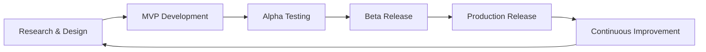

# 🗺️ APG Metadata Management Roadmap

## 🎯 **Current Status: Production Ready**

✅ **Version 1.0** - Core platform complete with all fundamental features  
✅ **15+ Data Connectors** - Comprehensive data source coverage  
✅ **AI-Powered Classification** - 94%+ accuracy with ensemble methods  
✅ **Enterprise Architecture** - Multi-tenant, scalable, secure  
✅ **Complete Documentation** - Production deployment ready  

---

## 🚀 **Future Enhancement Roadmap**

### **Q1 2025: Advanced Intelligence & Analytics**

#### 🧠 **AI & Machine Learning Enhancements**
- **Advanced Classification Models**
  - Custom domain-specific ML models (healthcare, finance, retail)
  - Transfer learning from pre-trained models
  - Active learning with human-in-the-loop validation
  - Cross-lingual data classification support

- **Predictive Analytics**
  - Data quality degradation prediction
  - Usage pattern forecasting
  - Anomaly detection in metadata changes
  - Resource utilization optimization

- **Natural Language Processing**
  - Automated documentation generation from code/schemas
  - Intelligent data dictionary creation
  - Multi-language documentation support
  - Voice-activated metadata queries

#### 📊 **Advanced Analytics Dashboard**
```python
# Example: Predictive Data Quality Dashboard
@dashboard_component
class PredictiveQualityWidget:
    async def render(self):
        predictions = await ai_service.predict_quality_issues()
        return {
            "at_risk_assets": predictions.high_risk_count,
            "predicted_issues": predictions.issue_forecast,
            "recommendations": predictions.recommendations
        }
```

#### 🔄 **Real-Time Streaming Analytics**
- Apache Kafka integration for real-time metadata updates
- Stream processing with Apache Flink/Spark Streaming
- Real-time data quality monitoring
- Live lineage updates as data flows

### **Q2 2025: Data Mesh & Federation**

#### 🕸️ **Data Mesh Architecture**
- **Federated Metadata Management**
  - Domain-specific metadata governance
  - Cross-domain data product discovery
  - Decentralized ownership with centralized discoverability
  - Data product marketplace integration

- **Data Contract Management**  
  - Automated contract validation and monitoring
  - Schema evolution management
  - SLA monitoring and alerting
  - Producer-consumer contract enforcement

```python
# Example: Data Contract Definition
@data_contract
class CustomerDataContract:
    schema_version = "2.1"
    owner = "customer_domain_team"
    consumers = ["analytics_team", "ml_team"]
    
    quality_requirements = {
        "completeness": 0.95,
        "freshness": "< 4 hours",
        "uniqueness": 1.0
    }
    
    breaking_change_policy = "notify_30_days"
```

#### 🌐 **Multi-Cloud Federation**
- Cross-cloud metadata synchronization
- Hybrid on-premises and cloud deployments
- Cloud-agnostic data discovery
- Multi-region disaster recovery

### **Q3 2025: Advanced User Experience**

#### 📱 **Mobile & Conversational Interface**
- **Mobile Applications**
  - iOS and Android native apps
  - Offline metadata browsing
  - Push notifications for data quality issues
  - Mobile-optimized lineage visualization

- **Conversational AI Interface**
  - Natural language queries: "Show me all customer PII data"
  - Voice-activated metadata search
  - AI assistant for data discovery
  - Slack/Teams bot integration

```python
# Example: Conversational Query Processing
@conversational_handler
async def process_natural_query(query: str) -> SearchResults:
    # "Find all tables with customer email data updated this week"
    parsed = await nlp_service.parse_query(query)
    
    filters = {
        "contains_column": "email",
        "contains_term": "customer", 
        "updated_since": parsed.time_filter
    }
    
    return await search_service.search(filters)
```

#### 🎨 **Advanced Visualization**
- 3D lineage visualization for complex data flows
- Interactive data flow animations
- Augmented reality data center visualization
- Collaborative editing of metadata

### **Q4 2025: Enterprise Integration & Governance**

#### 🔗 **Enterprise System Integration**
- **Deep BI Tool Integration**
  - Tableau semantic layer synchronization
  - Power BI dataset metadata embedding
  - Looker model documentation automation
  - Qlik Sense data lineage integration

- **Data Pipeline Integration**
  - dbt model documentation and lineage
  - Airflow DAG metadata extraction
  - Spark job lineage tracking
  - Kubernetes job metadata collection

#### 🛡️ **Advanced Governance Features**
- **Privacy Engineering**
  - Automated privacy impact assessments
  - GDPR Article 30 documentation generation
  - Data minimization recommendations
  - Consent management integration

- **Regulatory Compliance**
  - Industry-specific compliance frameworks
  - Automated compliance reporting
  - Policy violation detection and remediation
  - Audit trail visualization

```python
# Example: Automated Compliance Checking
@compliance_rule("GDPR")
async def check_personal_data_retention(asset: Asset) -> ComplianceResult:
    if asset.classification == "PII":
        retention_period = asset.custom_attributes.get("retention_days")
        if not retention_period or retention_period > 2555:  # 7 years
            return ComplianceResult(
                status="violation",
                message="PII data missing retention policy or exceeds limits",
                remediation="Set appropriate retention policy"
            )
    return ComplianceResult(status="compliant")
```

---

## 🔬 **Research & Innovation Track**

### **Advanced AI Research**

#### 🧬 **Graph Neural Networks for Lineage**
- GNN-based lineage inference for complex transformations
- Automated relationship discovery through code analysis
- Semantic similarity learning for asset matching
- Knowledge graph embedding for metadata relationships

#### 🔮 **Quantum-Safe Security**
- Post-quantum cryptography for sensitive metadata
- Quantum key distribution for multi-site deployments
- Quantum-resistant authentication mechanisms

#### 🌊 **Federated Learning at Scale**
- Cross-organization federated metadata learning
- Privacy-preserving collaborative classification
- Differential privacy for sensitive metadata insights
- Secure multi-party computation for analytics

### **Emerging Technology Integration**

#### 🔗 **Blockchain & Web3**
- Immutable metadata audit trails on blockchain
- Decentralized data governance tokens
- NFT-based data asset ownership tracking
- Smart contracts for data usage agreements

#### 🤖 **Advanced Automation**
- Fully automated data catalog curation
- Self-healing data quality issues
- Autonomous metadata governance
- AI-driven data architecture optimization

---

## 📈 **Enhancement Priorities**

### **High Priority (Q1 2025)**
1. **Advanced ML Classification Models** - Industry-specific models
2. **Real-Time Streaming Integration** - Kafka/Flink integration
3. **Predictive Analytics Dashboard** - Quality and usage forecasting
4. **Mobile Application Development** - iOS/Android apps

### **Medium Priority (Q2-Q3 2025)**  
1. **Data Mesh Federation** - Multi-domain metadata management
2. **Conversational AI Interface** - Natural language interactions
3. **Advanced Visualization** - 3D and AR visualizations
4. **Cross-Cloud Federation** - Multi-cloud metadata sync

### **Long-term Vision (2026+)**
1. **Autonomous Data Governance** - Self-managing metadata platform
2. **Quantum-Safe Security** - Future-proof security architecture
3. **Universal Data Fabric** - Single pane of glass for all data
4. **AI-Driven Data Operations** - Fully automated data management

---

## 🎯 **Success Metrics by Quarter**

### **Q1 2025 Targets**
- **Classification Accuracy**: 96%+ (up from 94%)
- **Real-Time Updates**: < 5 second latency
- **Mobile Users**: 25% of total user base
- **ML Model Performance**: 15% improvement in domain-specific accuracy

### **Q2 2025 Targets**  
- **Cross-Domain Discovery**: 5+ federated domains
- **Data Contract Compliance**: 90% SLA adherence
- **Multi-Cloud Support**: 3+ cloud providers integrated
- **User Satisfaction**: 4.5/5 star rating

### **Q3 2025 Targets**
- **Conversational Queries**: 60% of searches via natural language
- **Mobile Adoption**: 40% of users using mobile apps
- **Visualization Engagement**: 80% increase in lineage exploration
- **Response Time**: < 100ms for mobile queries

### **Q4 2025 Targets**
- **Enterprise Integration**: 10+ BI tools integrated
- **Compliance Automation**: 95% automated compliance checking
- **Governance Coverage**: 100% data assets under governance
- **ROI Achievement**: Measurable business value demonstration

---

## 💡 **Innovation Labs**

### **Experimental Features**
```python
# Example: Experimental AI Features
@experimental_feature
class SemanticDataDiscovery:
    """Discover conceptually similar data across different systems"""
    
    async def find_semantic_matches(self, concept: str) -> List[Asset]:
        # Use large language models to understand business concepts
        embeddings = await llm_service.get_concept_embedding(concept)
        similar_assets = await vector_db.similarity_search(embeddings)
        return similar_assets

@experimental_feature  
class AutomatedDataDocumentation:
    """Generate comprehensive documentation from code and usage patterns"""
    
    async def generate_documentation(self, asset: Asset) -> Documentation:
        # Analyze code, queries, and usage patterns
        code_analysis = await analyze_source_code(asset)
        usage_patterns = await analyze_usage_history(asset)
        return await ai_writer.generate_docs(code_analysis, usage_patterns)
```

### **Community Contributions**
- **Open Source Connector Library** - Community-contributed connectors
- **Classification Rule Exchange** - Shared classification patterns
- **Template Marketplace** - Reusable governance templates
- **Best Practices Wiki** - Community knowledge base

---

## 🤝 **Partnership & Ecosystem**

### **Strategic Partnerships**
- **Cloud Providers**: Native integrations with AWS, Azure, GCP
- **Database Vendors**: Deep integrations with Snowflake, Databricks
- **BI Vendors**: Strategic partnerships with Tableau, Microsoft
- **AI/ML Platforms**: Integration with MLflow, SageMaker, Vertex AI

### **Open Source Ecosystem**
- **Apache Foundation Projects**: Contributions to Atlas, Kafka, Spark
- **CNCF Projects**: Cloud-native metadata standards
- **Linux Foundation**: Data governance best practices
- **OpenAPI Initiative**: Metadata API standardization

### **Industry Standards**
- **Data Management Body of Knowledge (DMBOK)** compliance
- **FAIR Data Principles** implementation
- **ISO 8000 Data Quality** standards adoption
- **GDPR/CCPA** compliance framework

---

## 📋 **Implementation Strategy**

### **Agile Development Process**


### **Release Strategy**
- **Monthly Feature Releases** - Regular feature updates
- **Quarterly Major Releases** - Significant capability additions
- **Security Patches** - Immediate security updates as needed
- **LTS Versions** - Annual long-term support releases

### **Quality Assurance**
- **Automated Testing**: 90%+ code coverage maintained
- **Performance Testing**: Load testing for 10x current capacity
- **Security Auditing**: Quarterly security assessments
- **User Acceptance Testing**: Beta program with 50+ enterprise users

---

## 🎉 **The Future is Bright**

The APG Metadata Management platform is positioned to become the **definitive enterprise metadata solution**, leading the industry in:

🚀 **Innovation** - Cutting-edge AI and automation capabilities  
🌐 **Scale** - Global, multi-cloud, multi-tenant architecture  
🤝 **Integration** - Seamless connectivity with the entire data stack  
🔒 **Security** - Enterprise-grade security and compliance  
🎯 **User Experience** - Intuitive, efficient, and delightful to use  

**Ready to transform how organizations understand, govern, and leverage their data assets!**

---

*This roadmap is a living document, updated quarterly based on user feedback, technology evolution, and market demands.*