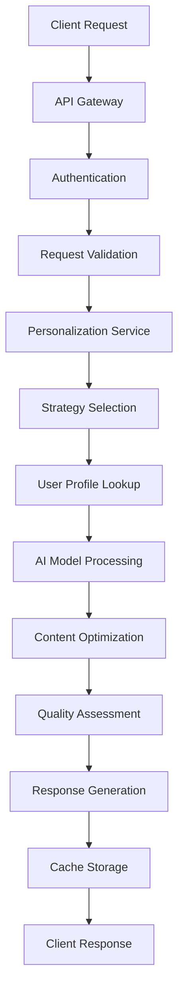

# Architecture - Deep Personalization

This document provides a comprehensive overview of the APG Deep Personalization Subcapability architecture, including system design, component interactions, data flow, and scalability considerations.

## 🏗️ System Overview

The Deep Personalization architecture is built on a modern microservices foundation with AI-first design principles, providing revolutionary personalization capabilities that scale from thousands to millions of users.

```
┌─────────────────────────────────────────────────────────────────────────────┐
│                           APG Notification System                           │
│  ┌─────────────────┐  ┌─────────────────┐  ┌─────────────────────────────┐  │
│  │   Channel       │  │   Analytics     │  │    User Management          │  │
│  │   Manager       │  │   Engine        │  │    & Preferences            │  │
│  └─────────────────┘  └─────────────────┘  └─────────────────────────────┘  │
└─────────────────────────┬───────────────────────────────────────────────────┘
                          │
        ┌─────────────────▼─────────────────┐
        │   Deep Personalization Engine     │
        │         (Subcapability)           │
        └─────────────────┬─────────────────┘
                          │
┌─────────────────────────▼─────────────────────────────────────────────────────┐
│                  Personalization Architecture                                │
│                                                                               │
│  ┌─────────────────┐  ┌─────────────────┐  ┌─────────────────────────────┐    │
│  │  Orchestration  │  │   AI Models     │  │     Real-Time Engines       │    │
│  │     Layer       │  │    Suite        │  │                             │    │
│  │                 │  │                 │  │  • Context Awareness        │    │
│  │ • Core Engine   │  │ • Content Gen   │  │  • Behavioral Adaptation    │    │
│  │ • Orchestrator  │  │ • Behavioral    │  │  • Emotional Intelligence   │    │
│  │ • Service Mgmt  │  │ • Sentiment     │  │  • Cross-Channel Sync       │    │
│  └─────────────────┘  └─────────────────┘  └─────────────────────────────┘    │
│                                                                               │
│  ┌─────────────────┐  ┌─────────────────┐  ┌─────────────────────────────┐    │
│  │   Data Layer    │  │  Integration    │  │       API Gateway          │    │
│  │                 │  │     Layer       │  │                             │    │
│  │ • User Profiles │  │                 │  │ • REST Endpoints            │    │
│  │ • Behavioral    │  │ • Parent Cap    │  │ • OpenAPI Docs              │    │
│  │ • ML Features   │  │ • External APIs │  │ • Authentication            │    │
│  │ • Cache Store   │  │ • Event Streams │  │ • Rate Limiting             │    │
│  └─────────────────┘  └─────────────────┘  └─────────────────────────────┘    │
└───────────────────────────────────────────────────────────────────────────────┘
```

## 🧱 Core Components

### 1. Personalization Orchestrator
**File**: `core.py`

The central nervous system that coordinates all personalization activities.

**Responsibilities:**
- Request routing and prioritization
- Strategy selection and execution
- Quality assurance and fallback handling
- Performance monitoring and optimization

**Key Classes:**
- `PersonalizationOrchestrator`: Main coordination engine
- `DeepPersonalizationEngine`: Primary interface
- `PersonalizationProfile`: Comprehensive user profiling

**Processing Queues:**
```python
# High-priority real-time requests
real_time_queue = asyncio.Queue(maxsize=5000)

# Standard priority requests  
request_queue = asyncio.Queue(maxsize=10000)

# Batch processing queue
batch_queue = asyncio.Queue(maxsize=2000)
```

### 2. AI Models Suite
**File**: `ai_models.py`

Revolutionary AI models providing intelligent content generation and behavioral analysis.

**Content Generation Model:**
- Neural network-based text generation
- Multi-language support (40+ languages)
- Context-aware content creation
- Brand voice consistency

**Behavioral Analysis Model:**
- Pattern recognition algorithms
- Predictive user modeling
- Engagement forecasting
- Churn risk assessment

**Model Architecture:**
```python
class BaseAIModel(ABC):
    def __init__(self, model_id, model_type, config)
    async def train(self, training_data) -> Dict[str, Any]
    async def predict(self, features) -> ModelPrediction
    async def evaluate(self, test_data) -> Dict[str, Any]
```

### 3. Service Layer
**File**: `service.py`

Enterprise-grade service management with comprehensive personalization operations.

**Service Levels:**
- **Basic**: Template-based personalization
- **Standard**: AI-enhanced optimization
- **Premium**: Advanced behavioral analysis
- **Enterprise**: Full AI suite with real-time adaptation
- **Quantum**: Revolutionary quantum-level personalization

**Integration Hooks:**
```python
integration_hooks = {
    'pre_personalization': [],
    'post_personalization': [],
    'profile_updated': [],
    'quality_threshold_failed': []
}
```

### 4. API Layer
**File**: `api.py`

Comprehensive REST API with OpenAPI documentation and enterprise security.

**API Namespaces:**
- `/personalization` - Core operations
- `/insights` - User insights and analytics
- `/ai` - AI model operations
- `/management` - Service administration

## 🔄 Data Flow Architecture

### 1. Personalization Request Flow



### 2. Real-Time Processing Pipeline

```
┌─────────────┐    ┌─────────────┐    ┌─────────────┐    ┌─────────────┐
│   Request   │───▶│   Context   │───▶│   AI Model  │───▶│  Response   │
│  Ingestion  │    │  Analysis   │    │  Processing │    │  Generation │
└─────────────┘    └─────────────┘    └─────────────┘    └─────────────┘
       │                   │                   │                   │
       ▼                   ▼                   ▼                   ▼
┌─────────────┐    ┌─────────────┐    ┌─────────────┐    ┌─────────────┐
│ Rate Limit  │    │ User Profile│    │ Content Gen │    │ Quality     │
│ & Auth      │    │ Enrichment  │    │ & Behavior  │    │ Validation  │
└─────────────┘    └─────────────┘    └─────────────┘    └─────────────┘
```

### 3. User Profile Management

```
┌─────────────────────────────────────────────────────────────────┐
│                    User Profile Lifecycle                      │
│                                                                 │
│  ┌─────────────┐    ┌─────────────┐    ┌─────────────────────┐  │
│  │   Profile   │───▶│  Behavioral │───▶│     Predictive      │  │
│  │ Initialization│    │  Learning   │    │     Modeling        │  │
│  └─────────────┘    └─────────────┘    └─────────────────────┘  │
│         │                   │                       │           │
│         ▼                   ▼                       ▼           │
│  ┌─────────────┐    ┌─────────────┐    ┌─────────────────────┐  │
│  │  Data       │    │ Pattern     │    │   Personalization   │  │
│  │ Collection  │    │ Recognition │    │   Optimization      │  │
│  └─────────────┘    └─────────────┘    └─────────────────────┘  │
│                                                                 │
│  Cache Strategy: Redis + In-Memory + Database Persistence      │
└─────────────────────────────────────────────────────────────────┘
```

## 🗄️ Data Architecture

### 1. User Profile Store

**Primary Storage**: PostgreSQL with JSON columns for flexible schema
**Cache Layer**: Redis for high-performance access
**In-Memory**: Local LRU cache for active profiles

**Profile Schema:**
```json
{
  "user_id": "string",
  "tenant_id": "string",
  "content_preferences": {
    "topics": ["array"],
    "tone": "string",
    "length": "string"
  },
  "channel_preferences": {
    "email": "float",
    "sms": "float",
    "push": "float"
  },
  "behavioral_patterns": {
    "engagement_score": "float",
    "interaction_patterns": "object",
    "timing_patterns": "object"
  },
  "predictive_scores": {
    "engagement_prediction": "float",
    "churn_risk": "float",
    "lifetime_value": "float"
  },
  "metadata": {
    "last_updated": "datetime",
    "confidence_level": "float",
    "data_quality_score": "float"
  }
}
```

### 2. AI Model Storage

**Model Artifacts**: Object storage (S3/GCS) for ML models
**Feature Store**: Real-time feature computation and serving
**Training Data**: Data lake for model training and improvement

**Model Registry:**
```python
{
  "model_id": "content_generator_v1",
  "model_type": "transformer",
  "version": "1.2.0",
  "status": "ready",
  "performance_metrics": {
    "accuracy": 0.89,
    "latency_p95": 45,
    "throughput": 1000
  },
  "deployment_config": {
    "instances": 3,
    "memory_limit": "2Gi",
    "cpu_limit": "1000m"
  }
}
```

### 3. Event Store

**Event Sourcing**: All personalization events for audit and learning
**Real-time Stream**: Kafka/Redis Streams for live event processing
**Analytics Store**: Time-series database for performance metrics

## ⚡ Performance Architecture

### 1. Scalability Design

**Horizontal Scaling:**
- Stateless microservices
- Load balancer with session affinity
- Auto-scaling based on queue depth and CPU

**Vertical Scaling:**
- AI model parallelization
- GPU acceleration for ML workloads
- Memory optimization for user profiles

### 2. Caching Strategy

**Multi-Level Caching:**
```
┌─────────────┐    ┌─────────────┐    ┌─────────────┐    ┌─────────────┐
│  Browser    │    │ CDN/Edge    │    │ Application │    │  Database   │
│  Cache      │───▶│   Cache     │───▶│   Cache     │───▶│   Cache     │
│  (5 min)    │    │  (15 min)   │    │  (60 min)   │    │ (Forever)   │
└─────────────┘    └─────────────┘    └─────────────┘    └─────────────┘
```

**Cache Invalidation:**
- TTL-based expiration
- Event-driven invalidation
- Smart pre-warming

### 3. Performance Targets

| Metric | Target | Measurement |
|--------|--------|-------------|
| Response Time | <50ms | P95 latency |
| Throughput | >10K req/sec | Sustained load |
| Availability | 99.99% | Monthly uptime |
| Cache Hit Rate | >80% | Redis metrics |
| Model Accuracy | >90% | Validation tests |
| Quality Score | >0.8 | Personalization quality |

## 🔗 Integration Architecture

### 1. Parent Capability Integration

**Notification Service Integration:**
```python
# Seamless integration with notification pipeline
async def enhanced_notification_delivery():
    # 1. Get notification template
    template = notification_service.get_template(template_id)
    
    # 2. Personalize content
    personalized = await personalization_service.personalize_notification(
        template, user_id, context
    )
    
    # 3. Deliver through optimized channels
    result = await notification_service.deliver(
        personalized['content'],
        personalized['optimal_channels']
    )
```

**Event-Driven Integration:**
```python
# Listen for engagement events
@event_handler('notification.engagement')
async def handle_engagement(event):
    await personalization_service.update_user_preferences(
        event.user_id,
        event.engagement_data,
        PersonalizationTrigger.ENGAGEMENT_THRESHOLD
    )
```

### 2. External System Integration

**CRM Integration:**
- Real-time profile synchronization
- Customer journey mapping
- Behavioral data enrichment

**Analytics Platform Integration:**
- Event streaming to analytics
- Performance metric collection
- A/B test result tracking

**ML Platform Integration:**
- Model training pipeline
- Feature engineering
- Model deployment automation

## 🛡️ Security Architecture

### 1. Data Security

**Encryption:**
- TLS 1.3 for data in transit
- AES-256 for data at rest
- Key rotation every 90 days

**Access Control:**
- Role-based access control (RBAC)
- JWT token authentication
- API key management

**Data Privacy:**
```python
# GDPR/CCPA compliance
class PersonalizationService:
    async def anonymize_user_data(self, user_id: str):
        # Remove PII while preserving patterns
        profile = await self.get_user_profile(user_id)
        anonymized = self._anonymize_profile(profile)
        await self._store_anonymized_profile(anonymized)
```

### 2. Compliance Features

**Audit Logging:**
- Complete audit trail of all personalization decisions
- Data access logging
- Model prediction explanations

**Data Governance:**
- Data retention policies
- Right to be forgotten implementation
- Consent management integration

## 🎯 Deployment Architecture

### 1. Container Architecture

```dockerfile
# Multi-stage build for optimization
FROM python:3.11-slim as builder
COPY requirements.txt .
RUN pip install --user -r requirements.txt

FROM python:3.11-slim
COPY --from=builder /root/.local /root/.local
COPY . .
EXPOSE 8000
CMD ["gunicorn", "--bind", "0.0.0.0:8000", "app:create_app()"]
```

### 2. Kubernetes Deployment

```yaml
apiVersion: apps/v1
kind: Deployment
metadata:
  name: personalization-service
spec:
  replicas: 3
  selector:
    matchLabels:
      app: personalization-service
  template:
    spec:
      containers:
      - name: personalization
        image: apg/personalization:latest
        resources:
          requests:
            memory: "1Gi"
            cpu: "500m"
          limits:
            memory: "2Gi"
            cpu: "1000m"
        env:
        - name: REDIS_URL
          value: "redis://redis-service:6379"
        - name: DATABASE_URL
          valueFrom:
            secretKeyRef:
              name: db-credentials
              key: url
```

### 3. Service Mesh Integration

**Istio Configuration:**
- Traffic management and load balancing
- Circuit breaker patterns
- Distributed tracing
- Security policies

## 📊 Monitoring Architecture

### 1. Observability Stack

**Metrics**: Prometheus + Grafana
**Logging**: ELK Stack (Elasticsearch + Logstash + Kibana)
**Tracing**: Jaeger distributed tracing
**Alerting**: AlertManager + PagerDuty

### 2. Key Metrics

**Business Metrics:**
- Personalization quality scores
- User engagement lift
- Conversion rate improvements
- Revenue attribution

**Technical Metrics:**
- API response times
- Error rates
- Cache hit ratios
- AI model accuracy

**Operational Metrics:**
- Service availability
- Resource utilization
- Queue depths
- Data pipeline health

## 🔮 Future Architecture Considerations

### 1. AI/ML Evolution

**Next-Generation Models:**
- Large Language Models (LLMs) integration
- Multimodal personalization (text, image, video)
- Reinforcement learning for optimization
- Federated learning for privacy

### 2. Edge Computing

**Edge Personalization:**
- CDN-based personalization
- Client-side AI models
- Real-time context processing
- Reduced latency through geo-distribution

### 3. Quantum Computing

**Quantum Algorithms:**
- Quantum machine learning models
- Optimization problem solving
- Cryptographic security enhancements
- Complex pattern recognition

---

This architecture provides the foundation for the world's most advanced personalization platform, capable of scaling to billions of users while maintaining sub-50ms response times and delivering revolutionary AI-powered personalization experiences.

Next: [Developer Guide](developer-guide.md) for implementation details and best practices.