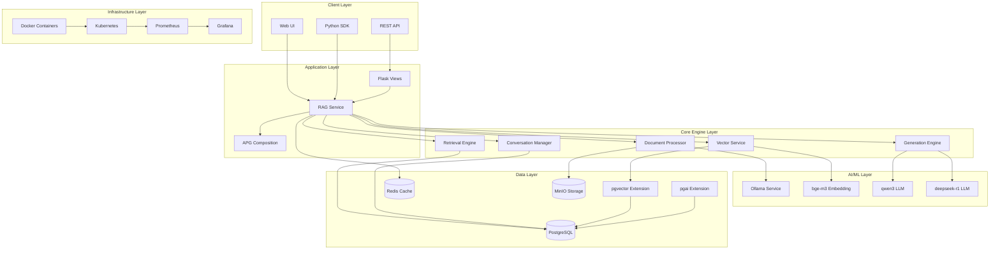
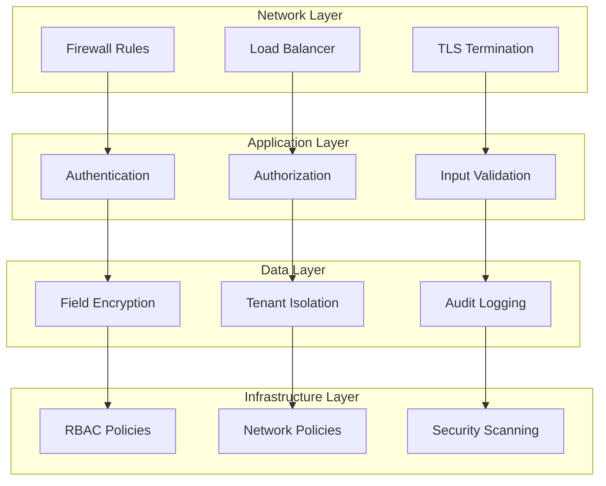

# APG RAG Architecture Documentation

> **Comprehensive architectural overview of the APG RAG capability**

## 🏗️ System Architecture Overview

### High-Level Architecture



## 🎯 Core Components

### 1. Service Layer (`service.py`)

The main orchestration layer that coordinates all RAG operations.

```python
class RAGService:
    """
    Central service coordinating all RAG operations
    - Document processing orchestration
    - Query routing and optimization
    - Response generation coordination
    - Performance monitoring integration
    """
```

**Key Responsibilities:**
- Request routing and validation
- Component orchestration
- Error handling and recovery
- Performance monitoring
- Resource management

**Architecture Patterns:**
- **Service Orchestration**: Coordinates multiple engines
- **Circuit Breaker**: Fault tolerance for external services
- **Bulkhead**: Resource isolation between operations
- **Cache-Aside**: Performance optimization

### 2. Document Processing Engine (`document_processor.py`)

Advanced document ingestion and processing pipeline.

```python
class DocumentProcessor:
    """
    Multi-format document processing with intelligent chunking
    - 20+ format support (PDF, DOCX, HTML, JSON, etc.)
    - Configurable chunking strategies
    - Content quality analysis
    - Metadata extraction and enrichment
    """
```

**Processing Pipeline:**
1. **Format Detection**: Automatic format identification
2. **Content Extraction**: Format-specific extraction logic
3. **Quality Analysis**: Content validation and scoring
4. **Chunking**: Intelligent text segmentation
5. **Metadata Enrichment**: Automatic metadata extraction
6. **Storage**: Efficient document and chunk storage

**Supported Formats:**
- **Text**: TXT, RTF, CSV
- **Documents**: PDF, DOCX, PPTX, XLSX
- **Web**: HTML, XML, JSON, YAML
- **Markup**: Markdown, LaTeX, ReStructuredText
- **Archives**: ZIP (with content extraction)

### 3. Vector Service (`vector_service.py`)

High-performance vector operations with pgvector optimization.

```python
class VectorService:
    """
    Optimized vector operations with caching and batch processing
    - pgvector HNSW/IVFFlat index management
    - Intelligent caching with LRU eviction
    - Batch embedding generation and storage
    - Similarity search optimization
    """
```

**Vector Operations:**
- **Embedding Generation**: bge-m3 model integration
- **Index Management**: Automatic index creation/optimization
- **Similarity Search**: Multiple distance metrics
- **Batch Processing**: Efficient bulk operations
- **Cache Management**: Multi-level caching strategy

**Index Strategies:**
- **IVFFlat**: Fast approximate search for large datasets
- **HNSW**: Hierarchical navigable small world graphs
- **Exact Search**: Brute force for small datasets
- **Hybrid**: Automatic selection based on data size

### 4. Retrieval Engine (`retrieval_engine.py`)

Context-aware document retrieval with advanced ranking.

```python
class RetrievalEngine:
    """
    Intelligent retrieval with multi-dimensional ranking
    - Hybrid search (vector + semantic + keyword)
    - Context-aware ranking algorithms
    - Query analysis and expansion
    - Multi-stage retrieval pipeline
    """
```

**Retrieval Pipeline:**
1. **Query Analysis**: Intent detection and classification
2. **Query Expansion**: Synonym and context expansion
3. **Multi-Modal Search**: Vector, semantic, and keyword
4. **Result Fusion**: Intelligent result merging
5. **Ranking**: Context-aware relevance scoring
6. **Filtering**: Time, source, and custom filters

**Ranking Algorithms:**
- **Vector Similarity**: Cosine, dot product, L2 distance
- **BM25**: Classical text relevance scoring
- **Learning to Rank**: ML-based ranking optimization
- **Contextual Boosting**: Query-specific adjustments

### 5. Generation Engine (`generation_engine.py`)

RAG-powered response generation with quality control.

```python
class GenerationEngine:
    """
    Multi-model generation with source attribution
    - Intelligent model selection (qwen3/deepseek-r1)
    - Comprehensive source attribution
    - Quality control and factual validation
    - Context integration with conversation history
    """
```

**Generation Pipeline:**
1. **Context Assembly**: Retrieved documents + conversation history
2. **Model Selection**: Intelligent routing based on query type
3. **Prompt Engineering**: Dynamic prompt construction
4. **Generation**: Multi-model response generation
5. **Quality Control**: Factual accuracy validation
6. **Attribution**: Source citation and confidence scoring

**Quality Metrics:**
- **Factual Accuracy**: Source-based validation
- **Relevance**: Context alignment scoring
- **Completeness**: Information coverage analysis
- **Coherence**: Response consistency validation

### 6. Conversation Manager (`conversation_manager.py`)

Persistent context management for multi-turn conversations.

```python
class ConversationManager:
    """
    Sophisticated conversation state management
    - Multiple memory strategies (sliding, importance, hybrid)
    - Intelligent context consolidation
    - Multi-user session isolation
    - Memory optimization and pruning
    """
```

**Memory Strategies:**
- **Sliding Window**: Recent conversation turns
- **Importance-Based**: Relevance-weighted retention
- **Hybrid**: Combined approach with dynamic weighting
- **Summarization**: Automatic context compression

## 🔧 Technical Architecture

### Database Architecture

```sql
-- Core tables with pgvector integration
apg_rag_knowledge_bases  -- Tenant knowledge organization
apg_rag_documents        -- Document metadata and storage
apg_rag_document_chunks  -- Vector-indexed text chunks
apg_rag_conversations    -- Persistent conversation state
apg_rag_queries          -- Query history and analytics
apg_rag_audit_logs       -- Comprehensive audit trail
```

**PostgreSQL Extensions:**
- **pgvector**: Vector similarity search operations
- **pgai**: In-database AI/ML operations
- **pg_trgm**: Trigram-based text search
- **uuid-ossp**: UUID generation functions

**Index Strategy:**
```sql
-- Vector similarity indexes
CREATE INDEX ON apg_rag_document_chunks 
USING ivfflat (embedding vector_cosine_ops) 
WITH (lists = 1000);

-- Hybrid search indexes
CREATE INDEX ON apg_rag_document_chunks 
USING gin (content gin_trgm_ops);

-- Temporal indexes for filtering
CREATE INDEX ON apg_rag_documents (created_at DESC);
```

### Caching Architecture

**Multi-Level Caching Strategy:**

```python
# L1: In-Memory Cache (Process Level)
memory_cache = LRUCache(maxsize=10000, ttl=300)

# L2: Redis Cache (Distributed)
redis_cache = RedisCache(ttl=3600, max_memory="2gb")

# L3: PostgreSQL Query Cache
query_cache = PostgreSQLCache(shared_buffers="1GB")
```

**Cache Policies:**
- **Vector Embeddings**: 1-hour TTL, LRU eviction
- **Document Content**: 4-hour TTL, size-based eviction
- **Query Results**: 30-minute TTL, popularity-based
- **Session Data**: Session lifetime, manual invalidation

### AI/ML Integration

**Ollama Service Architecture:**

```yaml
# Model Configuration
models:
  embedding:
    name: "bge-m3"
    context_length: 8192
    embedding_dimension: 1024
    max_batch_size: 100
    
  generation:
    primary: "qwen3"
    fallback: "deepseek-r1"
    max_tokens: 4096
    temperature: 0.7
```

**Model Selection Logic:**
```python
def select_model(query_type: str, complexity: float) -> str:
    """
    Intelligent model selection based on query characteristics
    - qwen3: General purpose, fast response
    - deepseek-r1: Complex reasoning, detailed analysis
    """
    if complexity > 0.8 or query_type in ["analysis", "reasoning"]:
        return "deepseek-r1"
    return "qwen3"
```

## 🔒 Security Architecture

### Multi-Layered Security



**Security Components:**

1. **Network Security**
   - TLS 1.3 encryption for all communications
   - Network segmentation with firewall rules
   - API rate limiting and DDoS protection

2. **Application Security**
   - JWT-based authentication with refresh tokens
   - Role-based access control (RBAC)
   - Input validation and sanitization
   - SQL injection prevention

3. **Data Security**
   - Field-level encryption for sensitive data
   - Complete tenant isolation at database level
   - Comprehensive audit logging
   - Data retention and deletion policies

4. **Infrastructure Security**
   - Container security scanning
   - Kubernetes security policies
   - Secret management with rotation
   - Regular security assessments

### Compliance Framework

**Regulatory Compliance:**

```python
# GDPR Compliance
@gdpr_compliant
class PersonalDataManager:
    """
    GDPR-compliant personal data handling
    - Right to deletion (Article 17)
    - Data portability (Article 20)
    - Consent management (Article 7)
    - Breach notification (Article 33)
    """
    
# HIPAA Compliance
@hipaa_compliant
class HealthDataProcessor:
    """
    HIPAA-compliant PHI handling
    - Administrative safeguards
    - Physical safeguards
    - Technical safeguards
    - Audit controls
    """
```

## 📊 Performance Architecture

### Scalability Design

**Horizontal Scaling:**
```yaml
# Kubernetes HPA Configuration
apiVersion: autoscaling/v2
kind: HorizontalPodAutoscaler
spec:
  minReplicas: 3
  maxReplicas: 50
  metrics:
  - type: Resource
    resource:
      name: cpu
      target:
        type: Utilization
        averageUtilization: 70
  - type: Resource
    resource:
      name: memory
      target:
        type: Utilization
        averageUtilization: 80
```

**Vertical Scaling:**
```yaml
# Resource Management
resources:
  requests:
    memory: "2Gi"
    cpu: "1"
  limits:
    memory: "8Gi"
    cpu: "4"
```

### Performance Optimization

**Database Optimization:**
```sql
-- PostgreSQL performance tuning
ALTER SYSTEM SET shared_buffers = '2GB';
ALTER SYSTEM SET effective_cache_size = '6GB';
ALTER SYSTEM SET maintenance_work_mem = '512MB';
ALTER SYSTEM SET max_parallel_workers_per_gather = 4;
ALTER SYSTEM SET random_page_cost = 1.1;
```

**Application Optimization:**
```python
# Connection pooling
DATABASE_CONFIG = {
    "pool_size": 20,
    "max_overflow": 30,
    "pool_timeout": 30,
    "pool_recycle": 3600,
}

# Async processing
ASYNC_CONFIG = {
    "max_concurrent_operations": 100,
    "operation_timeout": 300,
    "batch_size": 1000,
}
```

## 🔄 Integration Architecture

### APG Ecosystem Integration

```python
# APG Capability Metadata
APG_CAPABILITY_METADATA = {
    "capability_id": "rag",
    "version": "1.0.0",
    "category": "common",
    "interfaces": {
        "query": "natural_language_query",
        "document": "multi_format_ingestion",
        "conversation": "persistent_context",
    },
    "composition_keywords": [
        "search", "query", "ask", "find", "retrieve",
        "generate", "answer", "explain", "summarize"
    ]
}
```

**External System Integration:**
- **Identity Providers**: LDAP, SAML, OAuth2
- **Storage Systems**: S3, MinIO, NFS
- **Monitoring**: Prometheus, Grafana, ELK
- **Message Queues**: Redis, RabbitMQ, Kafka

### API Architecture

**RESTful API Design:**
```python
# Resource-based endpoints
/api/v1/rag/knowledge-bases      # Knowledge base management
/api/v1/rag/documents           # Document operations
/api/v1/rag/queries             # Query processing
/api/v1/rag/conversations       # Conversation management
/api/v1/rag/health              # Health monitoring
```

**Response Format:**
```json
{
  "success": true,
  "data": {...},
  "metadata": {
    "timestamp": "2025-01-29T10:00:00Z",
    "request_id": "req_uuid",
    "processing_time_ms": 150,
    "tenant_id": "tenant_uuid"
  },
  "errors": []
}
```

## 🎯 Deployment Architecture

### Container Architecture

```dockerfile
# Multi-stage build
FROM python:3.11-slim as builder
# Build dependencies and application

FROM python:3.11-slim as production
# Production-optimized runtime
USER app
HEALTHCHECK --interval=30s --timeout=10s --retries=3
```

### Orchestration Architecture

```yaml
# Kubernetes Deployment
apiVersion: apps/v1
kind: Deployment
metadata:
  name: apg-rag
spec:
  replicas: 3
  strategy:
    type: RollingUpdate
    rollingUpdate:
      maxSurge: 1
      maxUnavailable: 0
```

### Service Mesh Integration

**Istio Configuration:**
```yaml
# Service mesh configuration
apiVersion: networking.istio.io/v1beta1
kind: VirtualService
metadata:
  name: apg-rag
spec:
  hosts:
  - apg-rag
  http:
  - route:
    - destination:
        host: apg-rag
    timeout: 30s
    retries:
      attempts: 3
      perTryTimeout: 10s
```

## 📈 Monitoring Architecture

### Observability Stack

```yaml
# Monitoring Stack
monitoring:
  metrics:
    - prometheus: Core metrics collection
    - grafana: Visualization and dashboards
    - alertmanager: Alert routing and notification
    
  logging:
    - fluentd: Log collection and forwarding
    - elasticsearch: Log storage and indexing
    - kibana: Log analysis and visualization
    
  tracing:
    - jaeger: Distributed request tracing
    - zipkin: Trace collection and analysis
```

### Custom Metrics

```python
# Business Metrics
RAG_METRICS = {
    "query_response_time": Histogram,
    "document_processing_rate": Counter,
    "embedding_generation_time": Histogram,
    "retrieval_accuracy": Gauge,
    "generation_quality_score": Histogram,
    "conversation_turns": Counter,
    "active_sessions": Gauge,
    "cache_hit_rate": Gauge,
}
```

## 🔮 Future Architecture Considerations

### Planned Enhancements

1. **Microservices Decomposition**
   - Service mesh with Istio
   - Event-driven architecture with Kafka
   - Independent scaling and deployment

2. **Advanced AI Integration**
   - Multi-modal processing (images, audio, video)
   - Federated learning capabilities
   - Custom model training pipelines

3. **Global Distribution**
   - Multi-region deployment
   - Edge computing integration
   - Data locality optimization

4. **Next-Generation Features**
   - Real-time collaboration
   - 3D knowledge visualization
   - Voice and gesture interfaces

This architecture provides a solid foundation for enterprise-scale RAG operations while maintaining flexibility for future enhancements and requirements.