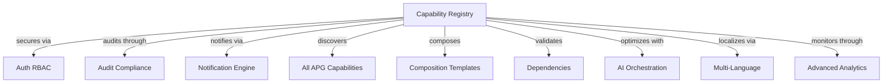

# APG Capability Registry - Comprehensive Specification

## Executive Summary

### Business Value Proposition within APG Ecosystem

The **Capability Registry** is the foundational infrastructure of the APG platform, providing intelligent capability discovery, registration, and orchestration services. This critical component enables the APG platform's unique modular, composable architecture that allows for dynamic enterprise application generation.

**Strategic APG Platform Value:**
- **Intelligent Capability Discovery**: Auto-discovery and registration of all APG capabilities with metadata management
- **Dynamic Composition Engine**: Enables real-time composition of enterprise applications from modular capabilities
- **Dependency Resolution**: Automated dependency analysis and conflict detection across capability compositions
- **Marketplace Integration**: Central registry for APG marketplace with capability versioning and compatibility
- **Zero-Configuration Orchestration**: Seamless capability integration without manual configuration
- **AI-Powered Recommendations**: Intelligent capability composition suggestions based on business requirements

### APG Platform Integration Context

**Core APG Infrastructure Dependencies:**
- **auth_rbac**: Multi-tenant security, capability access control, and user authentication
- **audit_compliance**: Complete audit trails for capability registration, composition changes, and access logs
- **notification_engine**: Automated alerts for capability updates, dependency conflicts, and composition status

**Strategic APG Service Integrations:**
- **All APG Capabilities**: Central registry for discovery and metadata management of every APG capability
- **APG CLI Tools**: Integration with APG command-line tools for capability management and deployment
- **APG Marketplace**: Registration and publishing of capabilities to APG marketplace
- **APG Deployment Infrastructure**: Integration with containerized deployment and scaling systems

### Target Users within APG Ecosystem

- **APG Platform Administrators**: Capability oversight, registry management, composition monitoring
- **Enterprise Architects**: Application composition design, dependency analysis, architecture validation
- **DevOps Engineers**: Deployment automation, capability versioning, infrastructure management
- **Business Analysts**: Business requirement analysis, capability mapping, solution design
- **APG Developers**: Capability development, integration testing, marketplace publishing
- **System Integrators**: Multi-tenant deployment, capability customization, client-specific compositions

## Detailed Functional Requirements

### 1. APG Capability Discovery & Registration

**APG User Stories:**

**US-CR-001**: As an APG Platform Administrator, I want automatic discovery of all APG capabilities with complete metadata extraction, version tracking, and dependency analysis for centralized management.

**US-CR-002**: As an APG Developer, I want seamless capability registration through APG's composition engine with automatic validation, conflict detection, and marketplace preparation.

**US-CR-003**: As an Enterprise Architect, I want intelligent capability search and filtering with business domain mapping, technical requirements matching, and composition recommendations.

**Acceptance Criteria:**
- Automatic scanning and registration of all APG capabilities across the platform hierarchy
- Real-time metadata extraction including dependencies, services provided, data models, and API endpoints
- Version tracking with semantic versioning support and backward compatibility analysis
- Dependency graph construction with circular dependency detection and resolution recommendations
- Integration with APG's auth_rbac for capability access control and tenant-based visibility
- Audit logging through APG's audit_compliance for all registration and discovery activities
- Performance optimization with sub-second capability search across 100+ capabilities

### 2. APG Intelligent Composition Engine

**APG User Stories:**

**US-CR-004**: As an Enterprise Architect, I want AI-powered capability composition recommendations based on business requirements, industry templates, and best practices from APG's knowledge base.

**US-CR-005**: As a Business Analyst, I want industry-specific composition templates that automatically include required capabilities for healthcare, manufacturing, financial services, and other verticals.

**US-CR-006**: As a DevOps Engineer, I want automated composition validation with dependency resolution, conflict detection, and deployment requirement analysis before application generation.

**Acceptance Criteria:**
- AI-driven composition recommendations using APG's machine learning infrastructure
- Industry template library with 15+ pre-configured compositions for major business verticals
- Real-time composition validation with comprehensive dependency analysis and conflict resolution
- Integration with APG's geographical_location_services for location-aware capability selection
- Performance impact analysis for composed applications within APG's multi-tenant architecture
- Cost optimization recommendations based on resource utilization and scaling patterns
- Integration with APG's sustainability_esg_management for environmental impact assessment

### 3. APG Metadata Management & Versioning

**APG User Stories:**

**US-CR-007**: As an APG Developer, I want comprehensive metadata management for capabilities including semantic versioning, API compatibility matrices, and migration guidance.

**US-CR-008**: As a System Integrator, I want capability versioning with backward compatibility analysis, breaking change detection, and automatic migration path generation.

**US-CR-009**: As an APG Platform Administrator, I want centralized metadata governance with quality metrics, documentation completeness scoring, and compliance validation.

**Acceptance Criteria:**
- Comprehensive metadata schema covering functional, technical, business, and compliance attributes
- Semantic versioning with automated compatibility analysis and breaking change detection
- API evolution tracking with backward compatibility matrices and migration documentation
- Documentation quality scoring with completeness metrics and improvement recommendations
- Integration with APG's multi_language_localization for international metadata support
- Compliance metadata integration with APG's governance_risk_compliance for regulatory tracking
- Performance metrics integration with APG's advanced_analytics_platform for capability optimization

### 4. APG Dependency Resolution & Conflict Management

**APG User Stories:**

**US-CR-010**: As an Enterprise Architect, I want intelligent dependency resolution with automatic conflict detection, alternative capability suggestions, and optimization recommendations.

**US-CR-011**: As a DevOps Engineer, I want real-time dependency validation during composition with immediate feedback on conflicts, missing dependencies, and resolution strategies.

**US-CR-012**: As an APG Developer, I want dependency impact analysis showing how capability changes affect dependent compositions and downstream applications.

**Acceptance Criteria:**
- Advanced dependency graph analysis with circular dependency detection and resolution
- Real-time conflict detection with alternative capability recommendations and optimization strategies
- Impact analysis showing downstream effects of capability changes across all compositions
- Integration with APG's workflow_business_process_mgmt for dependency change workflow automation
- Performance optimization for dependency resolution with sub-100ms response times
- Integration with APG's ai_orchestration for intelligent dependency recommendation algorithms
- Rollback capability for dependency changes with automatic restoration of previous working configurations

## Technical Architecture within APG Platform

### APG-Integrated Data Architecture

**Entity Relationship with APG Capabilities:**



**Data Model Prefix**: `CR` (Capability Registry)

**Core Models:**
- `CRCapability`: Central capability metadata with APG integration points
- `CRDependency`: Dependency relationships with version constraints and conflict resolution
- `CRComposition`: Saved compositions with templates and industry configurations
- `CRVersion`: Version tracking with compatibility matrices and migration paths
- `CRMetadata`: Extended metadata with business, technical, and compliance attributes
- `CRRegistry`: Central registry configuration with tenant isolation and access control

### APG Service Integration Architecture

**Service Layer Pattern:**
```python
# APG-Integrated Service Architecture
@async_service
class CapabilityRegistryService:
    def __init__(self):
        self.auth_service = self.get_apg_service('auth_rbac')
        self.audit_service = self.get_apg_service('audit_compliance')
        self.notification_service = self.get_apg_service('notification_engine')
        self.ai_service = self.get_apg_service('ai_orchestration')
        self.analytics_service = self.get_apg_service('advanced_analytics_platform')
    
    async def discover_capabilities(self, tenant_context: APGTenantContext) -> CRDiscoveryResult:
        # Intelligent capability discovery with APG integration
        pass
    
    async def compose_application(self, requirements: CRCompositionRequest) -> CRCompositionResult:
        # AI-powered application composition using APG capabilities
        pass
```

### APG UI Integration Patterns

**Flask-AppBuilder Integration:**
- Extends APG's existing UI framework with consistent capability registry management interface
- Integrates with APG's navigation and menu systems for seamless user experience
- Leverages APG's real-time collaboration features for multi-user composition design
- Mobile-responsive design compatible with APG's mobile_device_management patterns
- Dashboard integration with APG's business_intelligence_analytics for capability insights

### APG API Compatibility

**REST API Design:**
- Follows APG's API versioning and authentication patterns with JWT token integration
- Integrates with APG's rate limiting and security middleware for protection
- Supports APG's multi-tenant request routing with tenant isolation
- Compatible with APG's API gateway and documentation systems
- WebSocket integration for real-time composition updates via APG infrastructure

## AI/ML Integration with APG Capabilities

### APG AI Orchestration Integration

**Intelligent Registry Features:**
- Capability recommendation engine using APG's federated learning capabilities
- Composition optimization through APG's reinforcement learning systems
- Dependency resolution optimization via APG's intelligent orchestration
- Performance prediction using APG's predictive analytics infrastructure
- Cost optimization through APG's advanced analytics and machine learning platform

### APG-Enhanced Intelligence Capabilities

**Advanced AI Features:**
- Natural language capability search using APG's natural language processing
- Automated documentation generation with APG's content management integration
- Intelligent composition validation with business rule enforcement
- Predictive maintenance for capability health and performance optimization
- Automated testing strategy recommendations based on composition complexity

## Security Framework using APG Infrastructure

### APG Auth RBAC Integration

**Role-Based Security Model:**
- **Registry Administrator**: Full registry management, capability approval, system configuration
- **Composition Designer**: Application composition, template creation, dependency analysis
- **Capability Developer**: Capability registration, metadata management, version publishing
- **Business Analyst**: Composition viewing, business requirement mapping, template usage
- **Tenant Administrator**: Tenant-specific capability access, composition management
- **Read-Only Observer**: Discovery access, composition viewing, documentation access

**Multi-Tenant Security:**
- Tenant-isolated capability access with APG's proven security patterns
- Row-level security for capability visibility and composition access control
- Field-level encryption for sensitive capability metadata and business information
- API security through APG's OAuth 2.0 / JWT implementation with rate limiting

### APG Audit Compliance Integration

**Comprehensive Audit Trail:**
- All capability registration and composition activities logged with APG's audit infrastructure
- Regulatory compliance tracking for industry-specific capability usage and access
- Data retention policies aligned with APG compliance requirements for long-term archival
- Automated compliance reporting with APG's reporting engine for audit preparation
- Digital signatures and approval workflows via APG systems for critical operations

## Performance Requirements within APG Architecture

### Scalability within APG Multi-Tenant Environment

**Performance Benchmarks:**
- Support 1000+ capabilities per tenant within APG's architecture with sub-second search
- Real-time capability discovery with <50ms response times using APG's caching infrastructure
- Composition validation with <200ms latency via APG's optimization algorithms
- 99.9% uptime SLA aligned with APG platform guarantees and failover mechanisms
- Horizontal scaling using APG's containerized deployment patterns with auto-scaling

### APG-Compatible Caching and Optimization

**Performance Optimization:**
- Redis caching integration with APG's caching infrastructure for metadata and compositions
- Database query optimization using APG's proven patterns for complex dependency queries
- CDN integration for capability documentation and multimedia assets
- Background job processing via APG's async task infrastructure for heavy operations
- Real-time data synchronization with APG's event streaming for capability updates

## UI/UX Design Following APG Patterns

### APG Flask-AppBuilder Integration

**Consistent User Experience:**
- Seamless integration with APG's existing navigation and layout for unified platform experience
- Responsive design compatible with APG's mobile framework and device management
- Accessibility compliance following APG's WCAG 2.1 AA standards and inclusion guidelines
- Theming and branding consistency with APG platform for professional appearance
- Multi-language support using APG's internationalization infrastructure for global deployment

### Advanced UI Features with APG Capabilities

**Enhanced User Interface:**
- Interactive capability dependency visualization using APG's 3D visualization capabilities
- Real-time composition designer with APG's collaboration features for team-based design
- Intelligent search interface with natural language processing via APG's AI capabilities
- Advanced filtering and sorting with APG's analytics platform for complex capability queries
- Mobile-optimized composition tools with offline capability for field usage

## API Architecture Compatible with APG

### APG-Integrated REST API Design

**API Specifications:**
- OpenAPI 3.0 specification following APG standards with comprehensive documentation
- JWT authentication integration with APG's auth infrastructure for secure access
- Rate limiting using APG's API gateway for protection and fair usage
- Comprehensive error handling with APG's error patterns for consistent user experience
- API versioning strategy aligned with APG platform for backward compatibility

**Key Endpoints with APG Integration:**
```yaml
# Capability Discovery Endpoints
GET /api/v1/capabilities - List capabilities with APG tenant filtering and search
POST /api/v1/capabilities - Register capability with APG audit logging and validation
GET /api/v1/capabilities/{id} - Get capability with APG permission checking and metadata
PUT /api/v1/capabilities/{id} - Update capability with APG change tracking and approval
DELETE /api/v1/capabilities/{id} - Soft delete with APG compliance and audit trail

# Composition Management with APG Integration
GET /api/v1/compositions - List compositions with APG collaboration and sharing
POST /api/v1/compositions - Create composition with APG notifications and validation
PUT /api/v1/compositions/{id}/validate - Validate with APG dependency resolution
POST /api/v1/compositions/{id}/deploy - Deploy with APG infrastructure integration

# Dependency Resolution with APG Intelligence
GET /api/v1/dependencies/resolve - Resolve dependencies with APG AI optimization
POST /api/v1/dependencies/analyze - Analyze impact with APG analytics integration
GET /api/v1/dependencies/conflicts - Detect conflicts with APG resolution strategies
```

## Background Processing using APG Patterns

### APG Async Infrastructure Integration

**Background Job Categories:**
- **Capability Discovery**: Automated scanning and registration via APG's async infrastructure
- **Dependency Analysis**: Complex dependency resolution using APG AI Orchestration algorithms
- **Composition Optimization**: Performance analysis via APG analytics platform with recommendations
- **Documentation Generation**: Automated docs via APG content management with AI assistance
- **Marketplace Synchronization**: APG marketplace integration with versioning and publishing

### APG Event-Driven Architecture

**Event Integration:**
- Capability registration events published to APG event streaming for real-time updates
- Composition creation events triggering downstream APG workflow automation processes
- Dependency conflict events integrating with APG alerting systems for immediate notification
- Version update events connecting with APG deployment workflows for automated rollouts

## Monitoring Integration with APG Infrastructure

### APG Observability Integration

**Monitoring and Alerting:**
- Application metrics collection via APG's observability infrastructure for performance tracking
- Custom business metrics dashboards using APG's visualization capabilities for registry insights
- Health checks integration with APG's monitoring systems for system reliability
- Log aggregation and analysis through APG's logging infrastructure for troubleshooting
- Performance tracking and optimization via APG's performance monitoring for continuous improvement

### APG Business Intelligence Integration

**Analytics and Reporting:**
- Capability usage analytics integrated with APG's BI platform for business insights
- Composition trend analysis using APG's ML capabilities for pattern recognition
- Performance optimization reports via APG's financial management for cost analysis
- Registry health metrics through APG's governance compliance for operational excellence
- Executive dashboards with APG's real-time collaboration features for strategic decision making

## Deployment within APG Infrastructure

### APG Containerized Deployment

**Container Architecture:**
- Docker containers following APG's proven containerization patterns for consistency
- Kubernetes deployment using APG's orchestration infrastructure for scalability
- Horizontal pod autoscaling aligned with APG's scaling policies for demand management
- Health checks and liveness probes compatible with APG monitoring for reliability
- Rolling updates and blue-green deployments via APG's CI/CD pipeline for zero downtime

### APG Cloud-Native Deployment

**Cloud Integration:**
- Multi-cloud deployment compatibility with APG's cloud strategy for flexibility
- Infrastructure as Code using APG's Terraform modules for reproducible deployments
- Auto-scaling groups and load balancers via APG's cloud infrastructure for performance
- Disaster recovery and backup strategies aligned with APG's DR policies for business continuity
- Cost optimization through APG's cloud cost management tools for operational efficiency

## Success Criteria and KPIs

### APG Integration Success Metrics

**Technical KPIs:**
- **Integration Completeness**: 100% successful integration with all APG infrastructure capabilities
- **Performance Compliance**: <50ms capability discovery within APG's multi-tenant architecture
- **Security Validation**: Pass all APG security and compliance tests with zero vulnerabilities
- **Scalability Verification**: Support APG's scalability requirements (1000+ capabilities/tenant)
- **API Compatibility**: 100% compliance with APG API standards and authentication patterns

**Business KPIs:**
- **Platform Adoption**: 95% of APG capabilities registered within 30 days of deployment
- **Composition Efficiency**: 80% reduction in application composition time through intelligent recommendations
- **Dependency Resolution**: 99% automated dependency resolution without manual intervention
- **User Productivity**: 60% improvement in enterprise architect and developer efficiency
- **Platform Reliability**: 99.9% registry availability aligned with APG platform standards

### APG Marketplace Integration Success

**Marketplace Metrics:**
- Successful registration with APG marketplace with complete metadata and documentation
- Integration with APG CLI tools for seamless capability management and deployment automation
- Documentation completeness score >95% in APG knowledge base with user satisfaction >4.5/5
- User adoption rate >90% within APG platform organizations within first quarter
- Customer satisfaction score >4.8/5.0 in APG marketplace reviews with positive feedback

## Risk Management and Mitigation

### APG Platform Risks

**Integration Risks:**
- **Dependency Management**: Version compatibility with APG capability updates and platform evolution
- **Data Consistency**: Synchronization issues across APG capabilities and tenant isolation
- **Performance Impact**: Resource contention in shared APG infrastructure during peak usage
- **Security Vulnerabilities**: Maintaining security standards across integrations and access points

**Mitigation Strategies:**
- Comprehensive integration testing with APG capability mock services and real-world scenarios
- Circuit breaker patterns for APG service dependencies with graceful degradation
- Monitoring and alerting for cross-capability data consistency with automated reconciliation
- Regular security audits and penetration testing within APG environment with remediation plans

### Business Continuity within APG

**Operational Risks:**
- Critical capability registry downtime affecting entire APG platform operation and user productivity
- Data loss or corruption affecting capability metadata and composition definitions
- Compliance violations due to audit trail gaps or access control failures
- User adoption challenges with new registry workflows and interface changes

**Mitigation Approaches:**
- High availability deployment using APG's proven HA patterns with multi-region replication
- Automated backup and recovery procedures via APG's backup infrastructure with RTO <15 minutes
- Compliance monitoring and automated validation through APG's audit systems with real-time alerts
- Comprehensive training and change management leveraging APG's user adoption tools and documentation

## Conclusion

The **Capability Registry** represents the foundational infrastructure of the APG platform, enabling the unique modular, composable architecture that differentiates APG in the enterprise software market. Through deep integration with existing APG capabilities and intelligent automation, this registry transforms how organizations discover, compose, and deploy enterprise applications.

**Key Success Factors:**
1. **Deep APG Integration**: Leverage all existing APG capabilities rather than building standalone functionality
2. **AI-Driven Intelligence**: Utilize APG's machine learning infrastructure for intelligent composition and optimization
3. **User Experience Excellence**: Seamless integration with APG's user interface and workflow patterns
4. **Scalable Architecture**: Built on APG's proven multi-tenant, cloud-native foundation for enterprise scale
5. **Comprehensive Testing**: Thorough validation of all APG integrations and composition scenarios
6. **Documentation Excellence**: Complete integration guides and user documentation within APG context

This Capability Registry will position APG as the leader in intelligent, composable enterprise platforms, providing customers with unparalleled flexibility and automation in enterprise application development and deployment.