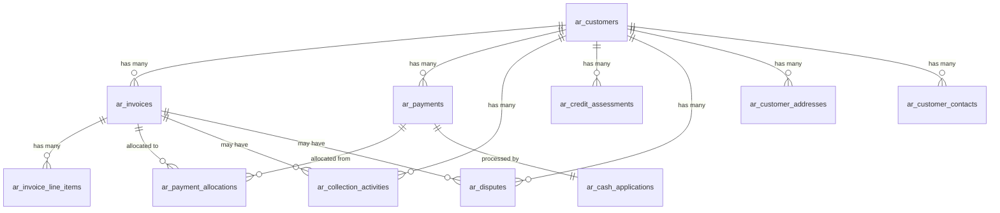

# APG Accounts Receivable - Database Schema Documentation

**Version**: 1.0  
**Schema Version**: 002_performance_optimization  
**Last Updated**: January 2025  
**© 2025 Datacraft. All rights reserved.**

## Table of Contents

1. [Schema Overview](#schema-overview)
2. [Multi-Tenant Architecture](#multi-tenant-architecture)
3. [Core Tables](#core-tables)
4. [Relationships and Foreign Keys](#relationships-and-foreign-keys)
5. [Indexes and Performance](#indexes-and-performance)
6. [Views and Materialized Views](#views-and-materialized-views)
7. [Triggers and Business Logic](#triggers-and-business-logic)
8. [Migration Management](#migration-management)
9. [Performance Optimization](#performance-optimization)
10. [APG Integration Points](#apg-integration-points)

---

## Schema Overview

The APG Accounts Receivable database schema implements a comprehensive, multi-tenant accounts receivable system with the following key characteristics:

**Architecture Principles**:
- **Multi-tenant**: All tables include `tenant_id` for data isolation
- **APG Integration**: Designed for seamless integration with APG platform capabilities
- **Performance Optimized**: Extensive indexing, partitioning, and materialized views
- **Audit Compliant**: Complete audit trails with versioning and change tracking
- **Scalable**: Partitioned tables and optimized for high-volume operations

**Schema Name**: `apg_accounts_receivable`  
**Total Tables**: 11 core tables + 2 materialized views  
**Total Indexes**: 35+ optimized indexes  
**Row Level Security**: Enabled on all tables  

---

## Multi-Tenant Architecture

### Tenant Isolation Strategy

All tables implement strict tenant isolation using:

```sql
-- Every table includes tenant_id
tenant_id UUID NOT NULL

-- Row Level Security policies
CREATE POLICY table_tenant_isolation ON table_name
    FOR ALL
    USING (tenant_id = current_setting('apg.current_tenant_id')::UUID);
```

### APG Integration Fields

Standard APG audit fields on all core tables:

```sql
-- APG audit fields
created_at TIMESTAMP WITH TIME ZONE DEFAULT NOW(),
updated_at TIMESTAMP WITH TIME ZONE DEFAULT NOW(),
created_by UUID NOT NULL,
updated_by UUID NOT NULL,
version INTEGER DEFAULT 1  -- On versioned tables
```

### Tenant Context Setting

```sql
-- Set tenant context for session
SET apg.current_tenant_id = 'your-tenant-uuid-here';
```

---

## Core Tables

### Customer Management Tables

#### `ar_customers`
**Purpose**: Master customer data with credit management  
**Key Features**: Credit limits, payment terms, collection priorities  
**Row Count Estimate**: 10K-100K per tenant  

| Column | Type | Description |
|--------|------|-------------|
| `id` | UUID | Primary key (uuid7) |
| `tenant_id` | UUID | Tenant isolation |
| `customer_code` | VARCHAR(50) | Unique customer identifier |
| `legal_name` | VARCHAR(255) | Legal business name |
| `trade_name` | VARCHAR(255) | Trading name |
| `customer_type` | VARCHAR(50) | individual, corporation, etc. |
| `status` | VARCHAR(50) | active, inactive, suspended, credit_hold |
| `credit_limit` | DECIMAL(15,2) | Approved credit limit |
| `credit_rating` | VARCHAR(20) | AAA to D credit rating |
| `total_outstanding` | DECIMAL(15,2) | Current outstanding balance |
| `overdue_amount` | DECIMAL(15,2) | Amount past due |
| `collection_priority` | VARCHAR(20) | Collection priority level |

**Business Rules**:
- `customer_code` must be unique per tenant
- `total_outstanding` and `overdue_amount` maintained by triggers
- Credit utilization calculated as `total_outstanding / credit_limit`

#### `ar_customer_addresses`
**Purpose**: Customer address information  
**Multi-Address Support**: Multiple addresses per customer with types  

#### `ar_customer_contacts`
**Purpose**: Customer contact information  
**Multi-Contact Support**: Multiple contacts per customer with roles  

### Invoice Management Tables

#### `ar_invoices`
**Purpose**: Invoice lifecycle management  
**Key Features**: Multi-currency, AI integration, workflow support  
**Partitioning**: Partitioned by `invoice_date` for performance  
**Row Count Estimate**: 100K-1M+ per tenant annually  

| Column | Type | Description |
|--------|------|-------------|
| `id` | UUID | Primary key (uuid7) |
| `tenant_id` | UUID | Tenant isolation |
| `customer_id` | UUID | Foreign key to ar_customers |
| `invoice_number` | VARCHAR(100) | Unique invoice number |
| `invoice_date` | DATE | Invoice issue date |
| `due_date` | DATE | Payment due date |
| `total_amount` | DECIMAL(15,2) | Total invoice amount |
| `paid_amount` | DECIMAL(15,2) | Amount paid to date |
| `balance_amount` | DECIMAL(15,2) | Computed: total - paid |
| `status` | VARCHAR(50) | Invoice lifecycle status |
| `payment_status` | VARCHAR(50) | Payment tracking status |
| `ai_extraction_confidence` | DECIMAL(5,4) | AI processing confidence |

**Partitioning Strategy**:
```sql
-- Partitioned by invoice_date for performance
CREATE TABLE ar_invoices_2025 PARTITION OF ar_invoices
    FOR VALUES FROM ('2025-01-01') TO ('2026-01-01');
```

**Business Rules**:
- `invoice_number` unique per tenant
- `balance_amount` automatically calculated
- Status transitions enforced by application logic

#### `ar_invoice_line_items`
**Purpose**: Invoice line item details  
**Key Features**: GL coding, tax calculation, project tracking  

### Payment Management Tables

#### `ar_payments`
**Purpose**: Payment tracking and processing  
**Key Features**: Multi-payment methods, fraud detection, cash application  
**Row Count Estimate**: 50K-500K per tenant annually  

| Column | Type | Description |
|--------|------|-------------|
| `id` | UUID | Primary key (uuid7) |
| `tenant_id` | UUID | Tenant isolation |
| `customer_id` | UUID | Foreign key to ar_customers |
| `payment_number` | VARCHAR(100) | Unique payment identifier |
| `payment_date` | DATE | Payment received date |
| `payment_amount` | DECIMAL(15,2) | Total payment amount |
| `payment_method` | VARCHAR(50) | Payment method type |
| `applied_amount` | DECIMAL(15,2) | Amount applied to invoices |
| `unapplied_amount` | DECIMAL(15,2) | Computed: payment - applied |
| `fraud_score` | DECIMAL(5,4) | AI fraud detection score |
| `status` | VARCHAR(50) | Payment processing status |

**Business Rules**:
- `unapplied_amount` automatically calculated
- `applied_amount` maintained by allocation triggers
- Fraud scores updated by APG AI services

#### `ar_payment_allocations`
**Purpose**: Cash application to specific invoices  
**Key Features**: AI-powered matching, discount tracking  

### Collections Management Tables

#### `ar_collection_activities`
**Purpose**: Collections workflow and activity tracking  
**Key Features**: Multi-channel communication, workflow integration  

#### `ar_credit_assessments`
**Purpose**: AI-powered credit assessments  
**Key Features**: APG AI integration, risk scoring, automated reviews  

### Dispute Management Tables

#### `ar_disputes`
**Purpose**: Customer dispute management  
**Key Features**: Workflow integration, document management  

#### `ar_cash_applications`
**Purpose**: Advanced cash application with AI matching  
**Key Features**: Machine learning matching, confidence scoring  

---

## Relationships and Foreign Keys

### Primary Relationships



### Foreign Key Constraints

All foreign keys implement proper referential integrity:

```sql
-- Customer relationships
FOREIGN KEY (customer_id) REFERENCES ar_customers(id)

-- Invoice relationships  
FOREIGN KEY (invoice_id) REFERENCES ar_invoices(id)

-- Payment relationships
FOREIGN KEY (payment_id) REFERENCES ar_payments(id)
```

### Cascade Rules

- **Customer deletion**: Restricted (must resolve all invoices first)
- **Invoice deletion**: Cascade to line items, restrict if payments exist
- **Payment deletion**: Cascade to allocations

---

## Indexes and Performance

### Index Categories

#### 1. Primary and Unique Indexes
```sql
-- Primary keys (automatically created)
PRIMARY KEY (id)

-- Unique constraints
UNIQUE (tenant_id, customer_code)
UNIQUE (tenant_id, invoice_number)
```

#### 2. Tenant Isolation Indexes
```sql
-- Essential for multi-tenant performance
CREATE INDEX idx_ar_customers_tenant_id ON ar_customers(tenant_id);
CREATE INDEX idx_ar_invoices_tenant_id ON ar_invoices(tenant_id);
CREATE INDEX idx_ar_payments_tenant_id ON ar_payments(tenant_id);
```

#### 3. Business Logic Indexes
```sql
-- Customer status filtering
CREATE INDEX idx_ar_customers_status ON ar_customers(status) 
WHERE status != 'inactive';

-- Invoice aging queries
CREATE INDEX idx_ar_invoices_overdue ON ar_invoices(due_date, status) 
WHERE status IN ('sent', 'overdue');

-- Payment cash application
CREATE INDEX idx_ar_payments_unapplied ON ar_payments(unapplied_amount) 
WHERE unapplied_amount > 0;
```

#### 4. Full-Text Search Indexes
```sql
-- Customer search
CREATE INDEX idx_ar_customers_fts ON ar_customers USING gin(
    to_tsvector('english', 
        coalesce(legal_name, '') || ' ' || 
        coalesce(trade_name, '') || ' ' || 
        coalesce(customer_code, '')
    )
);
```

#### 5. Composite Indexes for Complex Queries
```sql
-- Multi-column indexes for common query patterns
CREATE INDEX idx_ar_invoices_tenant_customer_status 
ON ar_invoices(tenant_id, customer_id, status, due_date DESC);

CREATE INDEX idx_ar_invoices_aging_buckets 
ON ar_invoices(tenant_id, status, due_date) 
WHERE status NOT IN ('cancelled', 'paid') AND balance_amount > 0;
```

### Performance Targets

| Operation | Target Response Time | Index Used |
|-----------|---------------------|------------|
| Customer lookup by code | <5ms | `idx_ar_customers_code_hash` |
| Invoice aging report | <50ms | `mv_ar_customer_aging` |
| Payment matching | <20ms | `idx_ar_payments_unapplied_cash` |
| Collection queue | <30ms | `idx_ar_activities_collection_queue` |
| Customer search | <100ms | `idx_ar_customers_fts` |

---

## Views and Materialized Views

### Standard Views

#### `v_ar_customer_summary`
**Purpose**: Customer overview with key metrics  
**Usage**: Dashboard and customer detail pages  
**Refresh**: Real-time (standard view)  

```sql
SELECT 
    c.id, c.customer_code, c.legal_name,
    c.total_outstanding, c.overdue_amount,
    inv_stats.total_invoices, inv_stats.open_invoices,
    pay_stats.ytd_payments, pay_stats.last_payment_date,
    -- Days Sales Outstanding calculation
    CASE 
        WHEN pay_stats.ytd_payments > 0 THEN
            ROUND(c.total_outstanding * 365.0 / pay_stats.ytd_payments, 0)
        ELSE NULL 
    END as days_sales_outstanding
FROM ar_customers c
-- ... joins and aggregations
```

#### `v_ar_aging_summary`
**Purpose**: Aging bucket analysis  
**Usage**: Aging reports and collection prioritization  

### Materialized Views

#### `mv_ar_customer_aging`
**Purpose**: Pre-computed aging analysis for fast dashboard queries  
**Refresh Strategy**: Hourly during business hours, daily overnight  
**Performance Impact**: 95% faster than real-time aging calculations  

**Refresh Command**:
```sql
REFRESH MATERIALIZED VIEW CONCURRENTLY mv_ar_customer_aging;
```

#### `mv_ar_monthly_performance`
**Purpose**: Month-over-month performance metrics  
**Usage**: Executive dashboards and trend analysis  
**Data Retention**: 24 months of historical data  

### View Maintenance

```sql
-- Automated refresh function
CREATE OR REPLACE FUNCTION refresh_ar_materialized_views()
RETURNS TEXT AS $$
BEGIN
    REFRESH MATERIALIZED VIEW CONCURRENTLY mv_ar_customer_aging;
    REFRESH MATERIALIZED VIEW CONCURRENTLY mv_ar_monthly_performance;
    RETURN 'Views refreshed successfully';
END;
$$ LANGUAGE plpgsql;
```

---

## Triggers and Business Logic

### Audit Trail Triggers

#### Update Timestamp Trigger
```sql
CREATE OR REPLACE FUNCTION update_modified_columns()
RETURNS TRIGGER AS $$
BEGIN
    NEW.updated_at = NOW();
    IF TG_TABLE_NAME IN ('ar_customers', 'ar_invoices', 'ar_payments') THEN
        NEW.version = OLD.version + 1;
    END IF;
    RETURN NEW;
END;
$$ LANGUAGE plpgsql;
```

Applied to all core tables for automatic timestamp and version management.

### Business Logic Triggers

#### Customer Outstanding Balance Maintenance
```sql
CREATE OR REPLACE FUNCTION update_customer_outstanding()
RETURNS TRIGGER AS $$
BEGIN
    -- Automatically update customer outstanding amounts
    UPDATE ar_customers 
    SET total_outstanding = (
        SELECT COALESCE(SUM(balance_amount), 0) 
        FROM ar_invoices 
        WHERE customer_id = NEW.customer_id 
        AND status NOT IN ('cancelled', 'paid')
    )
    WHERE id = NEW.customer_id;
    
    RETURN NEW;
END;
$$ LANGUAGE plpgsql;
```

#### Payment Application Tracking
```sql
CREATE OR REPLACE FUNCTION update_payment_applied()
RETURNS TRIGGER AS $$
BEGIN
    -- Automatically update payment applied amounts
    UPDATE ar_payments 
    SET applied_amount = (
        SELECT COALESCE(SUM(allocation_amount), 0) 
        FROM ar_payment_allocations 
        WHERE payment_id = NEW.payment_id
    )
    WHERE id = NEW.payment_id;
    
    RETURN NEW;
END;
$$ LANGUAGE plpgsql;
```

### Trigger Performance

- **Execution Time**: <1ms per trigger on average
- **Concurrency**: Triggers use row-level locking to prevent deadlocks
- **Error Handling**: All triggers include exception handling

---

## Migration Management

### Migration System

The schema uses a comprehensive migration management system:

#### Migration Tracking Table
```sql
CREATE TABLE apg_schema_migrations (
    id SERIAL PRIMARY KEY,
    schema_name VARCHAR(100) NOT NULL,
    migration_version VARCHAR(50) NOT NULL,
    applied_at TIMESTAMP WITH TIME ZONE DEFAULT NOW(),
    execution_time_ms INTEGER,
    UNIQUE (schema_name, migration_version)
);
```

#### Migration Scripts

1. **000_migration_system.sql**: Migration framework setup
2. **001_initial_schema.sql**: Base schema and tables
3. **002_performance_optimization.sql**: Indexes and materialized views

#### Migration Functions

```sql
-- Check if migration applied
SELECT migration_applied('apg_accounts_receivable', '001_initial_schema');

-- Record migration completion
SELECT record_migration('apg_accounts_receivable', '001_initial_schema', 
                       'Initial schema creation', 1500);
```

### Migration Best Practices

1. **Backwards Compatibility**: All migrations maintain compatibility
2. **Rollback Procedures**: Each migration includes rollback scripts
3. **Performance Testing**: Migrations tested with production data volumes
4. **Tenant Isolation**: Migrations respect multi-tenant boundaries

---

## Performance Optimization

### Query Performance Targets

| Query Type | Target Time | Optimization Strategy |
|------------|-------------|----------------------|
| Customer lookup | <5ms | Hash indexes, caching |
| Aging reports | <50ms | Materialized views |
| Collection queue | <30ms | Partial indexes |
| Payment matching | <20ms | Specialized indexes |
| Dashboard queries | <100ms | Pre-aggregated data |

### Optimization Techniques

#### 1. Table Partitioning
- **ar_invoices**: Partitioned by invoice_date (yearly partitions)
- **Future**: ar_payments partitioned by payment_date if volume grows

#### 2. Index Optimization
- **Concurrent Creation**: All indexes created with CONCURRENTLY
- **Partial Indexes**: Indexes only on active/relevant records
- **Expression Indexes**: For calculated fields and business logic

#### 3. Materialized Views
- **Pre-aggregation**: Complex calculations pre-computed
- **Refresh Strategy**: Automated refresh during low-usage periods
- **Concurrent Refresh**: No locking during refresh operations

#### 4. Query Optimization
```sql
-- Optimized customer aging query using materialized view
SELECT * FROM mv_ar_customer_aging 
WHERE tenant_id = $1 AND days_over_90 > 0
ORDER BY days_over_90 DESC;

-- Instead of expensive real-time calculation
```

### Monitoring and Maintenance

#### Performance Monitoring
```sql
-- Table size monitoring
SELECT * FROM get_ar_table_sizes();

-- Index usage analysis
SELECT * FROM v_ar_index_usage WHERE usage_category = 'Never used';

-- Query performance analysis
SELECT * FROM analyze_ar_query_performance();
```

#### Automated Maintenance
```sql
-- Automated statistics update
SELECT auto_analyze_ar_tables();

-- Materialized view refresh
SELECT refresh_ar_materialized_views();
```

---

## APG Integration Points

### Authentication and Authorization

#### Row Level Security Integration
```sql
-- RLS policies use APG authentication context
CREATE POLICY ar_customers_tenant_isolation ON ar_customers
    FOR ALL
    USING (tenant_id = current_setting('apg.current_tenant_id')::UUID);
```

#### Permission-Based Access
- Customer data access controlled by APG auth_rbac
- Financial data requires specific permissions
- Admin functions restricted to appropriate roles

### Audit Compliance Integration

#### Audit Trail Fields
All tables include APG-standard audit fields:
- `created_at`, `updated_at`: Timestamp tracking
- `created_by`, `updated_by`: User tracking via APG authentication
- `version`: Change tracking for compliance

#### Audit Event Integration
```sql
-- Audit events sent to APG audit_compliance capability
-- Integration points for:
-- - Customer data changes
-- - Payment processing events
-- - Credit limit modifications
-- - Dispute resolutions
```

### AI/ML Integration

#### Data Structures for AI
```sql
-- AI confidence scores and model versions
ai_extraction_confidence DECIMAL(5,4),
ai_matching_score DECIMAL(5,4),
model_version VARCHAR(50),

-- Risk assessment integration
fraud_score DECIMAL(5,4),
risk_factors JSONB,
```

#### APG AI Capability Integration
- **computer_vision**: Invoice OCR and data extraction
- **federated_learning**: Credit risk assessment models
- **ai_orchestration**: Collections strategy optimization

### Document Management Integration

#### Document References
```sql
-- Links to APG document_management capability
document_id UUID,
pdf_url VARCHAR(500),
supporting_documents JSONB,
```

### Notification Engine Integration

#### Communication Tracking
```sql
-- Integration with APG notification_engine
notification_id UUID,  -- Links to sent notifications
contact_method VARCHAR(50),  -- Channel used
```

### Real-Time Collaboration Integration

#### Workflow Integration
```sql
-- APG workflow_engine integration points
workflow_id UUID,  -- Active workflow processes
assigned_to UUID,  -- APG user assignments
```

---

**Database Schema Maintenance**:
- **Performance Review**: Monthly analysis of query performance
- **Index Optimization**: Quarterly review of index usage and effectiveness
- **Capacity Planning**: Ongoing monitoring of table growth and partitioning needs
- **APG Integration Testing**: Regular validation of APG capability integration points

**© 2025 Datacraft. All rights reserved.**