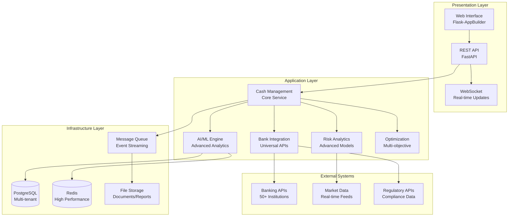
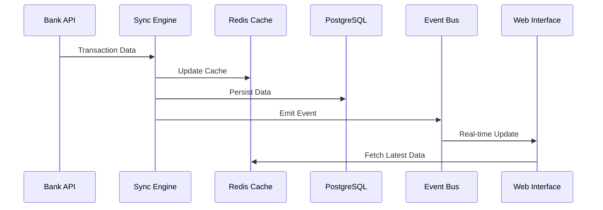
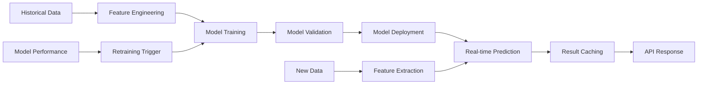
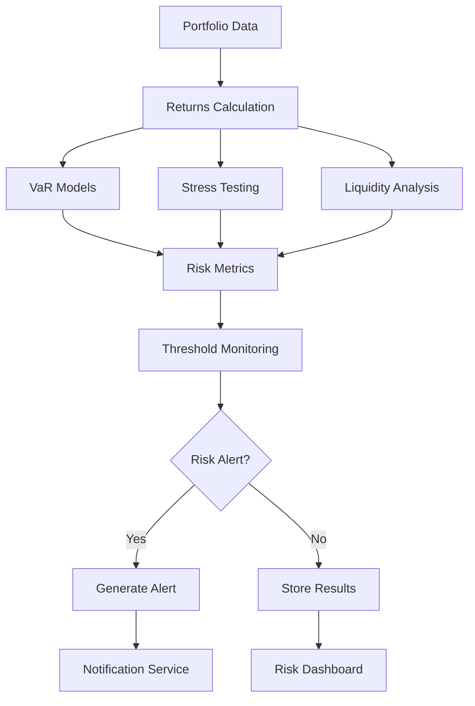
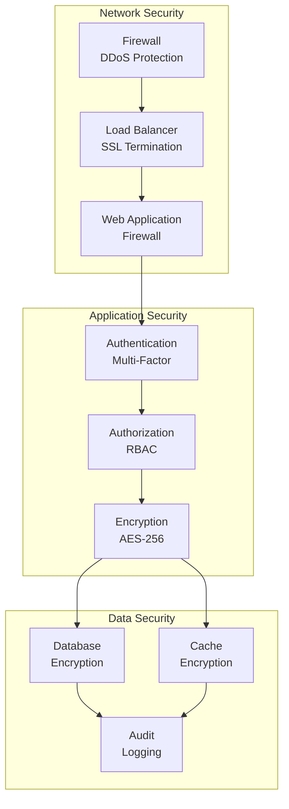
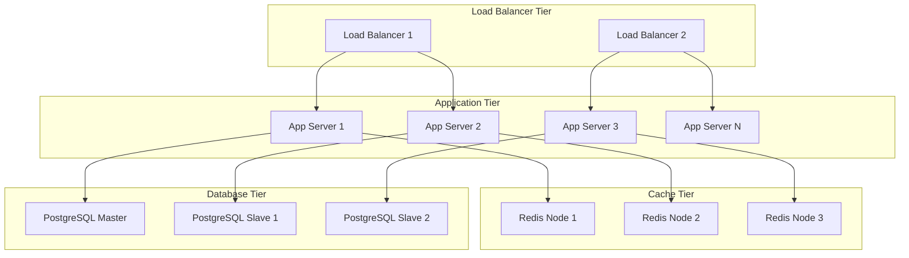

# APG Cash Management - System Architecture Overview

**Enterprise-Grade Architecture for World-Class Cash Management**

© 2025 Datacraft. All rights reserved.
Author: Nyimbi Odero | APG Platform Architect

---

## 🏗️ Architecture Philosophy

The APG Cash Management System is built on enterprise-grade architectural principles designed to deliver exceptional performance, scalability, and reliability for mission-critical treasury operations.

### Core Principles

1. **🎯 APG-Native Design**: Built from the ground up for the Advanced Platform for Growth
2. **⚡ Performance First**: Sub-second response times for all critical operations
3. **🔄 Horizontal Scalability**: Linear scaling from startup to Fortune 500
4. **🛡️ Security by Design**: Bank-grade security at every architectural layer
5. **🔧 Microservices Architecture**: Loosely coupled, independently deployable services
6. **📊 Data-Driven Intelligence**: AI/ML at the core of every decision

---

## 🏛️ High-Level Architecture



---

## 🧩 Component Architecture

### 1. Presentation Layer

#### Web Interface (Flask-AppBuilder)
- **Purpose**: Executive dashboards and user interfaces
- **Technology**: Flask-AppBuilder, Jinja2, Bootstrap
- **Features**: 
  - Role-based access control
  - Interactive dashboards
  - Real-time data visualization
  - Mobile-responsive design

#### REST API (FastAPI)
- **Purpose**: Programmatic access and integrations
- **Technology**: FastAPI, Pydantic, OAuth2
- **Features**:
  - Auto-generated OpenAPI documentation
  - Type validation and serialization
  - Rate limiting and throttling
  - Comprehensive error handling

#### WebSocket Gateway
- **Purpose**: Real-time updates and notifications
- **Technology**: Socket.IO, Redis Pub/Sub
- **Features**:
  - Live balance updates
  - Real-time alerts
  - Dashboard streaming
  - Multi-client synchronization

### 2. Application Layer

#### Cash Management Core Service
```python
class CashManagementService:
    """Core orchestration service for all cash management operations."""
    
    def __init__(self, tenant_id: str, cache_manager: CashCacheManager, 
                 event_manager: CashEventManager):
        self.tenant_id = tenant_id
        self.cache = cache_manager
        self.events = event_manager
        
    async def create_cash_account(self, account_data: Dict) -> Dict
    async def record_cash_flow(self, flow_data: Dict) -> Dict
    async def calculate_cash_position(self, date: datetime) -> Dict
    async def generate_cash_report(self, params: Dict) -> Dict
```

**Responsibilities**:
- Account lifecycle management
- Transaction processing and validation
- Cash position calculation
- Business rule enforcement
- Event orchestration

#### AI/ML Engine
```python
class AdvancedMLModelManager:
    """Advanced machine learning model management and prediction."""
    
    async def train_all_models(self, training_data: pd.DataFrame) -> Dict
    async def predict_with_uncertainty(self, data: pd.DataFrame) -> ForecastResult
    async def get_model_insights(self) -> Dict
```

**Capabilities**:
- 15+ ML algorithms (XGBoost, LSTM, Transformers)
- Ensemble model management
- Real-time prediction serving
- Model performance monitoring
- Automated retraining pipelines

#### Bank Integration Hub
```python
class BankAPIConnection:
    """Universal bank API integration with intelligent routing."""
    
    async def fetch_account_balance(self, account_id: str) -> Dict
    async def fetch_recent_transactions(self, account_id: str, days: int) -> List
    async def initiate_transfer(self, transfer_data: Dict) -> Dict
```

**Features**:
- Universal API abstraction
- Multi-protocol support (REST, SOAP, proprietary)
- Intelligent retry mechanisms
- Rate limiting and throttling
- Real-time connectivity monitoring

#### Risk Analytics Engine
```python
class AdvancedRiskAnalyticsEngine:
    """Comprehensive risk measurement and stress testing."""
    
    async def calculate_comprehensive_risk_metrics(self, portfolio_data: Dict, 
                                                   returns_data: np.ndarray) -> Dict
    async def run_comprehensive_stress_tests(self, portfolio_data: Dict) -> Dict
    async def get_risk_dashboard_data(self) -> Dict
```

**Capabilities**:
- Value at Risk (VaR) calculation
- Expected Shortfall analysis
- Monte Carlo simulations
- Historical stress testing
- Regulatory compliance monitoring

#### Optimization Engine
```python
class IntelligentCashFlowOptimizer:
    """Multi-objective optimization for cash allocation."""
    
    async def optimize_cash_allocation(self, accounts: List, objectives: List, 
                                       constraints: List) -> OptimizationResult
    async def generate_cash_allocation_recommendations(self, accounts: List, 
                                                       result: OptimizationResult) -> List
```

**Algorithms**:
- Linear and quadratic programming
- Genetic algorithms
- Differential evolution
- Multi-objective optimization
- Pareto frontier analysis

### 3. Infrastructure Layer

#### PostgreSQL Database
```sql
-- Multi-tenant partitioning strategy
CREATE TABLE cm_cash_accounts (
    id VARCHAR(50) PRIMARY KEY,
    tenant_id VARCHAR(50) NOT NULL,
    account_number VARCHAR(50) NOT NULL,
    current_balance DECIMAL(18,2) NOT NULL,
    created_at TIMESTAMP DEFAULT CURRENT_TIMESTAMP
) PARTITION BY HASH (tenant_id);

-- Time-series partitioning for high-volume data
CREATE TABLE cm_cash_flows (
    id VARCHAR(50) PRIMARY KEY,
    tenant_id VARCHAR(50) NOT NULL,
    transaction_date DATE NOT NULL,
    amount DECIMAL(18,2) NOT NULL
) PARTITION BY RANGE (transaction_date);
```

**Features**:
- Multi-tenant data isolation
- Hash and range partitioning
- Advanced indexing strategies
- Query optimization
- Automated backup and recovery

#### Redis Cache Layer
```python
class CashCacheManager:
    """High-performance caching with intelligent TTL management."""
    
    async def set(self, key: str, value: Any, ttl: int = 3600) -> bool
    async def get(self, key: str) -> Optional[Any]
    async def invalidate_pattern(self, pattern: str) -> bool
```

**Capabilities**:
- Multi-layer caching strategy
- Intelligent cache invalidation
- Distributed caching
- Performance monitoring
- Memory optimization

#### Event Streaming
```python
class CashEventManager:
    """Event-driven architecture with reliable message delivery."""
    
    async def emit_cash_flow_created(self, tenant_id: str, flow_data: Dict)
    async def emit_balance_updated(self, tenant_id: str, account_id: str, 
                                   old_balance: Decimal, new_balance: Decimal)
    async def emit_risk_alert(self, tenant_id: str, alert: RiskAlert)
```

**Features**:
- Asynchronous event processing
- Message durability and replay
- Event sourcing capabilities
- Dead letter queue handling
- Performance metrics

---

## 🔄 Data Flow Architecture

### 1. Real-Time Data Synchronization



### 2. AI/ML Prediction Pipeline



### 3. Risk Analytics Workflow



---

## 🔒 Security Architecture

### Defense in Depth Strategy



### Security Components

1. **Authentication & Authorization**
   - Multi-factor authentication (TOTP, SMS, hardware tokens)
   - Role-based access control (RBAC)
   - OAuth2 and JWT tokens
   - Session management

2. **Data Protection**
   - AES-256 encryption at rest
   - TLS 1.3 encryption in transit
   - Field-level encryption for sensitive data
   - Key management with HSM integration

3. **Audit & Compliance**
   - Comprehensive audit trails
   - Real-time security monitoring
   - Compliance reporting (SOX, GDPR, Basel III)
   - Threat detection and response

---

## 📈 Scalability & Performance

### Horizontal Scaling Strategy



### Performance Optimization

1. **Database Optimization**
   - Table partitioning by tenant and date
   - Advanced indexing strategies
   - Query optimization and caching
   - Connection pooling

2. **Caching Strategy**
   - Multi-layer caching (L1: Application, L2: Redis)
   - Intelligent cache invalidation
   - Cache warming strategies
   - Performance monitoring

3. **Application Optimization**
   - Asynchronous processing
   - Background task queues
   - Connection pooling
   - Memory optimization

---

## 🔧 Configuration Management

### Environment-Based Configuration

```yaml
# production.yaml
database:
  host: ${DATABASE_HOST}
  port: ${DATABASE_PORT}
  name: ${DATABASE_NAME}
  pool_size: 20
  max_overflow: 30

cache:
  host: ${REDIS_HOST}
  port: ${REDIS_PORT}
  pool_size: 50
  ttl_default: 3600

security:
  secret_key: ${SECRET_KEY}
  jwt_secret: ${JWT_SECRET_KEY}
  encryption_key: ${ENCRYPTION_KEY}

ai_ml:
  model_cache_size: 1000
  training_schedule: "0 2 * * 0"  # Weekly at 2 AM Sunday
  prediction_batch_size: 1000

risk:
  var_confidence_level: 0.95
  stress_test_frequency: "daily"
  alert_threshold: 0.05
```

### Feature Flags

```python
@feature_flag("advanced_ml_models")
async def get_ml_predictions(self, data: pd.DataFrame) -> Dict:
    """Get ML predictions with feature flag control."""
    if feature_enabled("advanced_ml_models"):
        return await self.advanced_ml_manager.predict_with_uncertainty(data)
    else:
        return await self.basic_ml_manager.predict(data)
```

---

## 📊 Monitoring & Observability

### Metrics Collection

```python
from prometheus_client import Counter, Histogram, Gauge

# Custom metrics
CASH_FLOW_COUNTER = Counter('cash_flows_total', 'Total cash flows processed')
PREDICTION_LATENCY = Histogram('ml_prediction_duration_seconds', 'ML prediction latency')
ACTIVE_ACCOUNTS = Gauge('active_accounts_total', 'Total active accounts')

@monitor_performance
async def record_cash_flow(self, flow_data: Dict) -> Dict:
    """Record cash flow with performance monitoring."""
    start_time = time.time()
    
    try:
        result = await self._process_cash_flow(flow_data)
        CASH_FLOW_COUNTER.inc()
        return result
    finally:
        PREDICTION_LATENCY.observe(time.time() - start_time)
```

### Health Checks

```python
@app.get("/health")
async def health_check():
    """Comprehensive health check endpoint."""
    
    health_status = {
        "status": "healthy",
        "timestamp": datetime.now().isoformat(),
        "version": "1.0.0",
        "components": {
            "database": await check_database_health(),
            "cache": await check_cache_health(),
            "bank_apis": await check_bank_api_health(),
            "ml_models": await check_ml_model_health()
        }
    }
    
    overall_healthy = all(
        component["status"] == "healthy" 
        for component in health_status["components"].values()
    )
    
    if not overall_healthy:
        health_status["status"] = "degraded"
    
    return health_status
```

---

## 🚀 Deployment Architecture

### Containerized Deployment

```dockerfile
# Dockerfile
FROM python:3.11-slim

WORKDIR /app

COPY requirements.txt .
RUN pip install --no-cache-dir -r requirements.txt

COPY . .

EXPOSE 8000

CMD ["uvicorn", "main:app", "--host", "0.0.0.0", "--port", "8000"]
```

### Kubernetes Deployment

```yaml
# deployment.yaml
apiVersion: apps/v1
kind: Deployment
metadata:
  name: apg-cash-management
spec:
  replicas: 3
  selector:
    matchLabels:
      app: apg-cash-management
  template:
    metadata:
      labels:
        app: apg-cash-management
    spec:
      containers:
      - name: app
        image: datacraft/apg-cash-management:1.0.0
        ports:
        - containerPort: 8000
        env:
        - name: DATABASE_URL
          valueFrom:
            secretKeyRef:
              name: database-secret
              key: url
        resources:
          requests:
            memory: "512Mi"
            cpu: "500m"
          limits:
            memory: "1Gi"
            cpu: "1000m"
```

---

## 🔄 Integration Patterns

### Event-Driven Integration

```python
class BankSyncEventHandler:
    """Handle bank synchronization events."""
    
    async def handle_account_balance_updated(self, event: BalanceUpdatedEvent):
        """Process balance update event."""
        
        # Update cache
        await self.cache.set(f"balance:{event.account_id}", event.new_balance)
        
        # Trigger risk calculation
        await self.risk_calculator.recalculate_portfolio_risk(event.tenant_id)
        
        # Update forecasting models
        await self.ml_manager.update_model_data(event.account_id, event.new_balance)
        
        # Emit notification
        await self.notification_service.send_balance_alert(event)
```

### API Integration Patterns

```python
class BankAPIAdapter:
    """Adapter pattern for bank API integration."""
    
    def __init__(self, bank_type: str):
        self.bank_type = bank_type
        self.client = self._create_bank_client(bank_type)
    
    async def fetch_transactions(self, account_id: str) -> List[Transaction]:
        """Fetch transactions with bank-specific implementation."""
        
        if self.bank_type == "CHASE":
            return await self._fetch_chase_transactions(account_id)
        elif self.bank_type == "WELLS_FARGO":
            return await self._fetch_wells_fargo_transactions(account_id)
        else:
            return await self._fetch_generic_transactions(account_id)
```

---

## 📚 Additional Resources

### Architecture Documentation
- [Database Schema Design](database-schema.md)
- [API Architecture](../api/architecture.md)
- [Security Architecture](security-architecture.md)
- [Performance Optimization](performance-optimization.md)

### Implementation Guides
- [Deployment Guide](../deployment/production.md)
- [Configuration Reference](../configuration/README.md)
- [Monitoring Setup](../admin/monitoring.md)
- [Troubleshooting Guide](../admin/troubleshooting.md)

---

**Architecture Review:** This document should be reviewed quarterly and updated with any significant architectural changes.

**Next Review Date:** April 27, 2025

---

*© 2025 Datacraft. All rights reserved.*