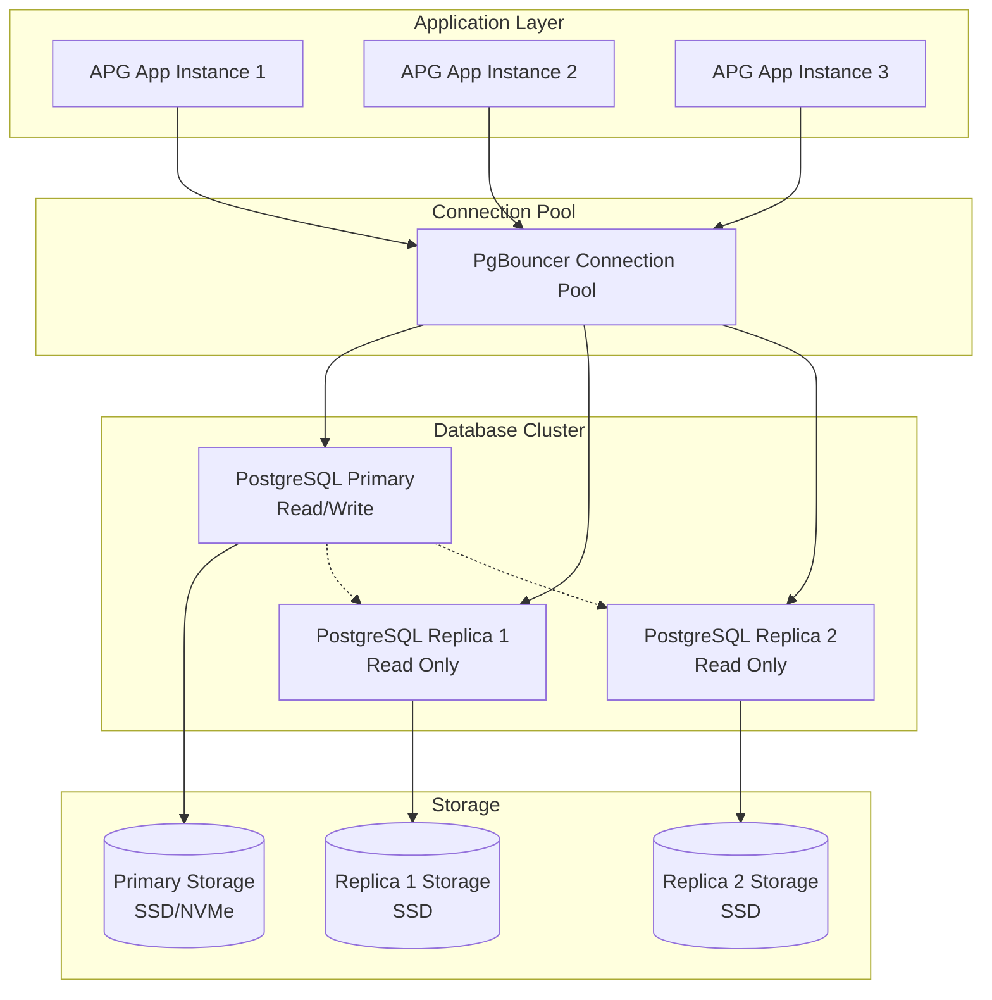

# APG Cash Management - Database Configuration Guide

**Enterprise Database Configuration for Scalable Cash Management**

© 2025 Datacraft. All rights reserved.
Author: Nyimbi Odero | APG Platform Architect

---

## 🗄️ Database Configuration Overview

The APG Cash Management System uses PostgreSQL as its primary database with advanced configuration for enterprise-scale performance, security, and reliability. This guide covers comprehensive database setup, optimization, and maintenance.

### 📋 Database Requirements

- **PostgreSQL Version**: 15.0+ (recommended 15.5+)
- **Minimum Hardware**: 16 GB RAM, 4 CPU cores, 1 TB SSD
- **Recommended Hardware**: 64+ GB RAM, 16+ CPU cores, 4+ TB NVMe SSD
- **Network**: Low-latency connection (< 5ms) between application and database
- **Backup Storage**: 3x database size for full backup retention

---

## 🏗️ Database Architecture

### Multi-Tenant Architecture



### Tenant Isolation Strategy

```sql
-- Tenant-based partitioning for cash accounts
CREATE TABLE cm_cash_accounts (
    id VARCHAR(50) PRIMARY KEY,
    tenant_id VARCHAR(50) NOT NULL,
    account_number VARCHAR(50) NOT NULL,
    current_balance DECIMAL(18,2) NOT NULL DEFAULT 0.00,
    created_at TIMESTAMP DEFAULT CURRENT_TIMESTAMP
) PARTITION BY HASH (tenant_id);

-- Create partitions for tenants
CREATE TABLE cm_cash_accounts_p0 PARTITION OF cm_cash_accounts
    FOR VALUES WITH (MODULUS 16, REMAINDER 0);
CREATE TABLE cm_cash_accounts_p1 PARTITION OF cm_cash_accounts
    FOR VALUES WITH (MODULUS 16, REMAINDER 1);
-- ... continue for all 16 partitions
```

---

## ⚙️ PostgreSQL Configuration

### 1. Core Configuration (postgresql.conf)

```ini
# postgresql.conf - APG Cash Management Configuration

#------------------------------------------------------------------------------
# CONNECTION AND AUTHENTICATION
#------------------------------------------------------------------------------

# Connection settings
listen_addresses = '*'
port = 5432
max_connections = 500
superuser_reserved_connections = 5

# Authentication
password_encryption = scram-sha-256
ssl = on
ssl_cert_file = '/etc/ssl/certs/server.crt'
ssl_key_file = '/etc/ssl/private/server.key'
ssl_ca_file = '/etc/ssl/certs/ca.crt'
ssl_crl_file = ''
ssl_ciphers = 'ECDHE-ECDSA-AES256-GCM-SHA384:ECDHE-RSA-AES256-GCM-SHA384:ECDHE-ECDSA-CHACHA20-POLY1305'
ssl_prefer_server_ciphers = on
ssl_ecdh_curve = 'prime256v1'
ssl_dh_params_file = '/etc/ssl/certs/dhparam.pem'

#------------------------------------------------------------------------------
# RESOURCE USAGE (except WAL)
#------------------------------------------------------------------------------

# Memory settings (for 64GB RAM server)
shared_buffers = 16GB                    # 25% of total RAM
effective_cache_size = 48GB              # 75% of total RAM
work_mem = 256MB                         # Per query operation
maintenance_work_mem = 2GB               # For maintenance operations
autovacuum_work_mem = 2GB               # For autovacuum workers

# Background writer
bgwriter_delay = 200ms
bgwriter_lru_maxpages = 100
bgwriter_lru_multiplier = 2.0
bgwriter_flush_after = 512kB

# Asynchronous I/O
effective_io_concurrency = 200           # For SSD storage
max_worker_processes = 16
max_parallel_workers_per_gather = 4
max_parallel_workers = 16
max_parallel_maintenance_workers = 4

#------------------------------------------------------------------------------
# WRITE-AHEAD LOG
#------------------------------------------------------------------------------

# WAL settings
wal_level = replica
wal_buffers = 64MB
wal_writer_delay = 200ms
wal_writer_flush_after = 1MB

# Checkpoints
checkpoint_timeout = 15min
checkpoint_completion_target = 0.9
checkpoint_flush_after = 256kB
checkpoint_warning = 30s

# WAL archiving and streaming
max_wal_size = 8GB
min_wal_size = 2GB
wal_keep_size = 16GB
wal_sender_timeout = 60s
wal_receiver_timeout = 60s

#------------------------------------------------------------------------------
# REPLICATION
#------------------------------------------------------------------------------

# Replication settings
max_wal_senders = 10
max_replication_slots = 10
hot_standby = on
hot_standby_feedback = on
wal_receiver_status_interval = 10s
max_standby_archive_delay = 30s
max_standby_streaming_delay = 30s

#------------------------------------------------------------------------------
# QUERY TUNING
#------------------------------------------------------------------------------

# Planner settings
random_page_cost = 1.1                  # For SSD storage
seq_page_cost = 1.0
cpu_tuple_cost = 0.01
cpu_index_tuple_cost = 0.005
cpu_operator_cost = 0.0025

# Statistics
default_statistics_target = 500         # Higher for better query plans
constraint_exclusion = partition
cursor_tuple_fraction = 0.1

# Parallel query settings
max_parallel_workers_per_gather = 4
parallel_tuple_cost = 0.1
parallel_setup_cost = 1000.0
min_parallel_table_scan_size = 8MB
min_parallel_index_scan_size = 512kB

#------------------------------------------------------------------------------
# REPORTING AND LOGGING
#------------------------------------------------------------------------------

# Logging configuration
log_destination = 'csvlog'
logging_collector = on
log_directory = '/var/log/postgresql'
log_filename = 'postgresql-%Y-%m-%d_%H%M%S.log'
log_file_mode = 0640
log_rotation_age = 1d
log_rotation_size = 1GB
log_truncate_on_rotation = off

# What to log
log_min_messages = warning
log_min_error_statement = error
log_min_duration_statement = 1000ms     # Log slow queries
log_checkpoints = on
log_connections = on
log_disconnections = on
log_lock_waits = on
log_temp_files = 100MB
log_autovacuum_min_duration = 0
log_error_verbosity = default
log_hostname = off
log_line_prefix = '%t [%p]: [%l-1] user=%u,db=%d,app=%a,client=%h '
log_statement = 'ddl'
log_timezone = 'UTC'

#------------------------------------------------------------------------------
# PROCESS TITLE
#------------------------------------------------------------------------------

cluster_name = 'apg-cash-management-prod'
update_process_title = on

#------------------------------------------------------------------------------
# STATISTICS
#------------------------------------------------------------------------------

# Statistics collection
track_activities = on
track_counts = on
track_io_timing = on
track_functions = all
track_activity_query_size = 4096
stats_temp_directory = '/var/run/postgresql/stats_temp'

# Performance monitoring
shared_preload_libraries = 'pg_stat_statements,auto_explain,pg_prewarm'
pg_stat_statements.max = 10000
pg_stat_statements.track = all
pg_stat_statements.track_utility = on
pg_stat_statements.save = on

# Auto explain for slow queries
auto_explain.log_min_duration = 5000ms
auto_explain.log_analyze = on
auto_explain.log_buffers = on
auto_explain.log_timing = on
auto_explain.log_triggers = on
auto_explain.log_verbose = on
auto_explain.log_nested_statements = on

#------------------------------------------------------------------------------
# AUTOVACUUM
#------------------------------------------------------------------------------

# Autovacuum settings
autovacuum = on
autovacuum_max_workers = 6
autovacuum_naptime = 15s
autovacuum_vacuum_threshold = 1000
autovacuum_vacuum_insert_threshold = 10000
autovacuum_analyze_threshold = 500
autovacuum_vacuum_scale_factor = 0.1
autovacuum_vacuum_insert_scale_factor = 0.1
autovacuum_analyze_scale_factor = 0.05
autovacuum_freeze_max_age = 200000000
autovacuum_multixact_freeze_max_age = 400000000
autovacuum_vacuum_cost_delay = 10ms
autovacuum_vacuum_cost_limit = 2000

#------------------------------------------------------------------------------
# LOCK MANAGEMENT
#------------------------------------------------------------------------------

deadlock_timeout = 1s
max_locks_per_transaction = 256
max_pred_locks_per_transaction = 64
max_pred_locks_per_relation = -2
max_pred_locks_per_page = 2

#------------------------------------------------------------------------------
# VERSION AND PLATFORM COMPATIBILITY
#------------------------------------------------------------------------------

# Locale and formatting
datestyle = 'iso, mdy'
timezone = 'UTC'
lc_messages = 'en_US.UTF-8'
lc_monetary = 'en_US.UTF-8'
lc_numeric = 'en_US.UTF-8'
lc_time = 'en_US.UTF-8'
default_text_search_config = 'pg_catalog.english'

#------------------------------------------------------------------------------
# CUSTOMIZED OPTIONS
#------------------------------------------------------------------------------

# APG Cash Management specific settings
statement_timeout = 300s                # 5 minutes max query time
lock_timeout = 60s                      # 1 minute max lock wait
idle_in_transaction_session_timeout = 600s  # 10 minutes idle transaction timeout
tcp_keepalives_idle = 600               # 10 minutes
tcp_keepalives_interval = 30            # 30 seconds
tcp_keepalives_count = 3

# Memory and disk settings
temp_file_limit = 20GB
max_files_per_process = 4000
huge_pages = try

# JIT compilation (for complex queries)
jit = on
jit_above_cost = 100000
jit_inline_above_cost = 500000
jit_optimize_above_cost = 500000

#------------------------------------------------------------------------------
# EXTENSIONS
#------------------------------------------------------------------------------

# Required extensions for APG Cash Management
# Load during database initialization:
# CREATE EXTENSION IF NOT EXISTS "uuid-ossp";
# CREATE EXTENSION IF NOT EXISTS "pg_stat_statements";
# CREATE EXTENSION IF NOT EXISTS "pg_trgm";
# CREATE EXTENSION IF NOT EXISTS "btree_gin";
# CREATE EXTENSION IF NOT EXISTS "btree_gist";
# CREATE EXTENSION IF NOT EXISTS "pgcrypto";
# CREATE EXTENSION IF NOT EXISTS "pg_prewarm";
```

### 2. Client Authentication (pg_hba.conf)

```ini
# pg_hba.conf - APG Cash Management Authentication

# TYPE  DATABASE        USER            ADDRESS                 METHOD

# Local connections
local   all             all                                     peer
local   replication     all                                     peer

# APG Application connections
host    apg_cash_production   apg_user        10.0.0.0/8        scram-sha-256
host    apg_cash_production   apg_readonly    10.0.0.0/8        scram-sha-256

# Replication connections
host    replication     replicator      10.0.0.0/8              scram-sha-256
host    replication     replicator      ::1/128                 scram-sha-256

# Monitoring connections
host    all             monitoring      10.0.0.0/8              scram-sha-256

# Admin connections (restrict to specific IPs)
host    all             postgres        192.168.1.100/32        scram-sha-256
hostssl all             postgres        0.0.0.0/0               scram-sha-256

# Backup connections
host    all             backup_user     10.0.0.0/8              scram-sha-256

# Deny all other connections
host    all             all             0.0.0.0/0               reject
host    all             all             ::0/0                   reject
```

---

## 🔐 Database Security Configuration

### 1. User Management

```sql
-- database_setup.sql
-- APG Cash Management Database Setup

-- Create database
CREATE DATABASE apg_cash_production
    WITH ENCODING 'UTF8'
    LC_COLLATE = 'en_US.UTF-8'
    LC_CTYPE = 'en_US.UTF-8'
    TEMPLATE = template0;

-- Connect to the database
\c apg_cash_production;

-- Create extensions
CREATE EXTENSION IF NOT EXISTS "uuid-ossp";
CREATE EXTENSION IF NOT EXISTS "pg_stat_statements";
CREATE EXTENSION IF NOT EXISTS "pg_trgm";
CREATE EXTENSION IF NOT EXISTS "btree_gin";
CREATE EXTENSION IF NOT EXISTS "btree_gist";
CREATE EXTENSION IF NOT EXISTS "pgcrypto";
CREATE EXTENSION IF NOT EXISTS "pg_prewarm";

-- Create schemas
CREATE SCHEMA IF NOT EXISTS cash_management;
CREATE SCHEMA IF NOT EXISTS analytics;
CREATE SCHEMA IF NOT EXISTS audit;
CREATE SCHEMA IF NOT EXISTS ml_models;

-- Create roles
CREATE ROLE apg_readonly;
CREATE ROLE apg_readwrite;
CREATE ROLE apg_admin;

-- Create users
CREATE USER apg_user WITH PASSWORD 'secure_password_here' IN ROLE apg_readwrite;
CREATE USER apg_readonly_user WITH PASSWORD 'readonly_password_here' IN ROLE apg_readonly;
CREATE USER monitoring WITH PASSWORD 'monitoring_password_here' IN ROLE apg_readonly;
CREATE USER backup_user WITH PASSWORD 'backup_password_here' IN ROLE apg_readonly;
CREATE USER replicator WITH REPLICATION PASSWORD 'replication_password_here';

-- Grant schema permissions
GRANT USAGE ON SCHEMA cash_management TO apg_readonly, apg_readwrite;
GRANT USAGE ON SCHEMA analytics TO apg_readonly, apg_readwrite;
GRANT USAGE ON SCHEMA audit TO apg_readonly, apg_readwrite, apg_admin;
GRANT USAGE ON SCHEMA ml_models TO apg_readonly, apg_readwrite;

-- Grant table permissions for readonly role
GRANT SELECT ON ALL TABLES IN SCHEMA cash_management TO apg_readonly;
GRANT SELECT ON ALL TABLES IN SCHEMA analytics TO apg_readonly;
GRANT SELECT ON ALL TABLES IN SCHEMA audit TO apg_readonly;
GRANT SELECT ON ALL TABLES IN SCHEMA ml_models TO apg_readonly;

-- Grant table permissions for readwrite role
GRANT SELECT, INSERT, UPDATE, DELETE ON ALL TABLES IN SCHEMA cash_management TO apg_readwrite;
GRANT SELECT, INSERT, UPDATE, DELETE ON ALL TABLES IN SCHEMA analytics TO apg_readwrite;
GRANT SELECT, INSERT ON ALL TABLES IN SCHEMA audit TO apg_readwrite;
GRANT SELECT, INSERT, UPDATE, DELETE ON ALL TABLES IN SCHEMA ml_models TO apg_readwrite;

-- Grant sequence permissions
GRANT USAGE, SELECT ON ALL SEQUENCES IN SCHEMA cash_management TO apg_readwrite;
GRANT USAGE, SELECT ON ALL SEQUENCES IN SCHEMA analytics TO apg_readwrite;
GRANT USAGE, SELECT ON ALL SEQUENCES IN SCHEMA ml_models TO apg_readwrite;

-- Set default privileges for future objects
ALTER DEFAULT PRIVILEGES IN SCHEMA cash_management GRANT SELECT ON TABLES TO apg_readonly;
ALTER DEFAULT PRIVILEGES IN SCHEMA cash_management GRANT SELECT, INSERT, UPDATE, DELETE ON TABLES TO apg_readwrite;
ALTER DEFAULT PRIVILEGES IN SCHEMA cash_management GRANT USAGE, SELECT ON SEQUENCES TO apg_readwrite;

-- Row Level Security policies will be defined per table as needed
```

### 2. Encryption Configuration

```sql
-- encryption_setup.sql
-- APG Cash Management Encryption Setup

-- Enable row-level security on sensitive tables
ALTER TABLE cash_management.cm_cash_accounts ENABLE ROW LEVEL SECURITY;
ALTER TABLE cash_management.cm_cash_flows ENABLE ROW LEVEL SECURITY;
ALTER TABLE cash_management.cm_bank_connections ENABLE ROW LEVEL SECURITY;

-- Create encryption functions
CREATE OR REPLACE FUNCTION encrypt_sensitive_data(data TEXT, encryption_key TEXT)
RETURNS TEXT AS $$
BEGIN
    RETURN encode(pgp_sym_encrypt(data, encryption_key), 'base64');
END;
$$ LANGUAGE plpgsql SECURITY DEFINER;

CREATE OR REPLACE FUNCTION decrypt_sensitive_data(encrypted_data TEXT, encryption_key TEXT)
RETURNS TEXT AS $$
BEGIN
    RETURN pgp_sym_decrypt(decode(encrypted_data, 'base64'), encryption_key);
EXCEPTION
    WHEN OTHERS THEN
        RETURN NULL;
END;
$$ LANGUAGE plpgsql SECURITY DEFINER;

-- Create audit trigger function
CREATE OR REPLACE FUNCTION audit_trigger_function()
RETURNS TRIGGER AS $$
BEGIN
    IF TG_OP = 'INSERT' THEN
        INSERT INTO audit.audit_log (
            table_name, operation, old_values, new_values, 
            user_name, transaction_id, timestamp
        ) VALUES (
            TG_TABLE_NAME, TG_OP, NULL, row_to_json(NEW),
            current_user, txid_current(), now()
        );
        RETURN NEW;
    ELSIF TG_OP = 'UPDATE' THEN
        INSERT INTO audit.audit_log (
            table_name, operation, old_values, new_values,
            user_name, transaction_id, timestamp
        ) VALUES (
            TG_TABLE_NAME, TG_OP, row_to_json(OLD), row_to_json(NEW),
            current_user, txid_current(), now()
        );
        RETURN NEW;
    ELSIF TG_OP = 'DELETE' THEN
        INSERT INTO audit.audit_log (
            table_name, operation, old_values, new_values,
            user_name, transaction_id, timestamp
        ) VALUES (
            TG_TABLE_NAME, TG_OP, row_to_json(OLD), NULL,
            current_user, txid_current(), now()
        );
        RETURN OLD;
    END IF;
    RETURN NULL;
END;
$$ LANGUAGE plpgsql SECURITY DEFINER;
```

---

## 📈 Performance Optimization

### 1. Indexing Strategy

```sql
-- indexes.sql
-- APG Cash Management Optimized Indexes

-- Tenant-based indexes for partitioned tables
CREATE INDEX CONCURRENTLY idx_cash_accounts_tenant_id 
    ON cash_management.cm_cash_accounts (tenant_id);
CREATE INDEX CONCURRENTLY idx_cash_accounts_account_number 
    ON cash_management.cm_cash_accounts (tenant_id, account_number);
CREATE INDEX CONCURRENTLY idx_cash_accounts_balance 
    ON cash_management.cm_cash_accounts (tenant_id, current_balance DESC);
CREATE INDEX CONCURRENTLY idx_cash_accounts_created_at 
    ON cash_management.cm_cash_accounts (tenant_id, created_at DESC);

-- Cash flows indexes with time-series optimization
CREATE INDEX CONCURRENTLY idx_cash_flows_tenant_account_date 
    ON cash_management.cm_cash_flows (tenant_id, account_id, transaction_date DESC);
CREATE INDEX CONCURRENTLY idx_cash_flows_amount_date 
    ON cash_management.cm_cash_flows (tenant_id, amount, transaction_date DESC);
CREATE INDEX CONCURRENTLY idx_cash_flows_category 
    ON cash_management.cm_cash_flows (tenant_id, category, transaction_date DESC);
CREATE INDEX CONCURRENTLY idx_cash_flows_counterparty 
    ON cash_management.cm_cash_flows USING GIN (tenant_id, counterparty gin_trgm_ops);

-- Forecasting model indexes
CREATE INDEX CONCURRENTLY idx_forecasts_tenant_model_date 
    ON analytics.cm_forecasts (tenant_id, model_type, forecast_date DESC);
CREATE INDEX CONCURRENTLY idx_forecasts_accuracy 
    ON analytics.cm_forecasts (tenant_id, accuracy_score DESC);

-- Risk analytics indexes
CREATE INDEX CONCURRENTLY idx_risk_metrics_tenant_date 
    ON analytics.cm_risk_metrics (tenant_id, calculation_date DESC);
CREATE INDEX CONCURRENTLY idx_risk_metrics_var 
    ON analytics.cm_risk_metrics (tenant_id, var_95 DESC);

-- Optimization recommendations indexes
CREATE INDEX CONCURRENTLY idx_optimizations_tenant_date 
    ON analytics.cm_optimizations (tenant_id, optimization_date DESC);
CREATE INDEX CONCURRENTLY idx_optimizations_objective_value 
    ON analytics.cm_optimizations (tenant_id, objective_value DESC);

-- Bank integration indexes
CREATE INDEX CONCURRENTLY idx_bank_transactions_sync_status 
    ON cash_management.cm_bank_transactions (tenant_id, sync_status, last_sync_attempt);
CREATE INDEX CONCURRENTLY idx_bank_connections_status 
    ON cash_management.cm_bank_connections (tenant_id, connection_status, last_test_date);

-- Audit log indexes
CREATE INDEX CONCURRENTLY idx_audit_log_table_timestamp 
    ON audit.audit_log (table_name, timestamp DESC);
CREATE INDEX CONCURRENTLY idx_audit_log_user_timestamp 
    ON audit.audit_log (user_name, timestamp DESC);
CREATE INDEX CONCURRENTLY idx_audit_log_transaction_id 
    ON audit.audit_log (transaction_id);

-- Partial indexes for active records
CREATE INDEX CONCURRENTLY idx_cash_accounts_active 
    ON cash_management.cm_cash_accounts (tenant_id, account_number) 
    WHERE is_active = true;
CREATE INDEX CONCURRENTLY idx_bank_connections_active 
    ON cash_management.cm_bank_connections (tenant_id, bank_id) 
    WHERE is_active = true;

-- Composite indexes for complex queries
CREATE INDEX CONCURRENTLY idx_cash_flows_analysis 
    ON cash_management.cm_cash_flows (tenant_id, account_id, category, transaction_date DESC, amount);
CREATE INDEX CONCURRENTLY idx_forecasts_performance 
    ON analytics.cm_forecasts (tenant_id, model_type, forecast_date DESC) 
    INCLUDE (accuracy_score, mae, rmse);

-- Expression indexes for computed columns
CREATE INDEX CONCURRENTLY idx_cash_flows_month_year 
    ON cash_management.cm_cash_flows (tenant_id, EXTRACT(YEAR FROM transaction_date), EXTRACT(MONTH FROM transaction_date));
CREATE INDEX CONCURRENTLY idx_cash_flows_abs_amount 
    ON cash_management.cm_cash_flows (tenant_id, ABS(amount) DESC);

-- Statistics targets for better query planning
ALTER TABLE cash_management.cm_cash_flows ALTER COLUMN amount SET STATISTICS 1000;
ALTER TABLE cash_management.cm_cash_flows ALTER COLUMN transaction_date SET STATISTICS 1000;
ALTER TABLE cash_management.cm_cash_accounts ALTER COLUMN current_balance SET STATISTICS 1000;
ALTER TABLE analytics.cm_forecasts ALTER COLUMN accuracy_score SET STATISTICS 1000;
```

### 2. Table Partitioning

```sql
-- partitioning.sql
-- APG Cash Management Advanced Partitioning

-- Time-based partitioning for cash flows (monthly partitions)
CREATE TABLE cash_management.cm_cash_flows (
    id VARCHAR(50) PRIMARY KEY,
    tenant_id VARCHAR(50) NOT NULL,
    account_id VARCHAR(50) NOT NULL,
    amount DECIMAL(18,2) NOT NULL,
    transaction_date DATE NOT NULL,
    description TEXT,
    category VARCHAR(100),
    counterparty VARCHAR(200),
    created_at TIMESTAMP DEFAULT CURRENT_TIMESTAMP,
    updated_at TIMESTAMP DEFAULT CURRENT_TIMESTAMP
) PARTITION BY RANGE (transaction_date);

-- Create monthly partitions for current and future years
DO $$
DECLARE
    start_date DATE;
    end_date DATE;
    partition_name TEXT;
BEGIN
    -- Create partitions for 2024, 2025, and 2026
    FOR year_val IN 2024..2026 LOOP
        FOR month_val IN 1..12 LOOP
            start_date := make_date(year_val, month_val, 1);
            end_date := start_date + INTERVAL '1 month';
            partition_name := 'cm_cash_flows_' || year_val || '_' || lpad(month_val::text, 2, '0');
            
            EXECUTE format('
                CREATE TABLE cash_management.%I PARTITION OF cash_management.cm_cash_flows
                FOR VALUES FROM (%L) TO (%L)',
                partition_name, start_date, end_date
            );
            
            -- Create indexes on each partition
            EXECUTE format('
                CREATE INDEX %I ON cash_management.%I (tenant_id, account_id, transaction_date DESC)',
                'idx_' || partition_name || '_tenant_account_date', partition_name
            );
        END LOOP;
    END LOOP;
END $$;

-- Hybrid partitioning for large tables (hash + range)
CREATE TABLE analytics.cm_ml_features (
    id VARCHAR(50) PRIMARY KEY,
    tenant_id VARCHAR(50) NOT NULL,
    feature_date DATE NOT NULL,
    feature_type VARCHAR(100) NOT NULL,
    feature_values JSONB,
    created_at TIMESTAMP DEFAULT CURRENT_TIMESTAMP
) PARTITION BY HASH (tenant_id);

-- Create hash partitions
CREATE TABLE analytics.cm_ml_features_h0 PARTITION OF analytics.cm_ml_features
    FOR VALUES WITH (MODULUS 8, REMAINDER 0)
    PARTITION BY RANGE (feature_date);
CREATE TABLE analytics.cm_ml_features_h1 PARTITION OF analytics.cm_ml_features
    FOR VALUES WITH (MODULUS 8, REMAINDER 1)
    PARTITION BY RANGE (feature_date);
-- Continue for all 8 hash partitions...

-- Create range sub-partitions for each hash partition
DO $$
DECLARE
    hash_partition TEXT;
    start_date DATE;
    end_date DATE;
    partition_name TEXT;
BEGIN
    FOR hash_num IN 0..7 LOOP
        hash_partition := 'cm_ml_features_h' || hash_num;
        
        FOR year_val IN 2024..2026 LOOP
            FOR quarter_val IN 1..4 LOOP
                start_date := make_date(year_val, (quarter_val - 1) * 3 + 1, 1);
                end_date := start_date + INTERVAL '3 months';
                partition_name := hash_partition || '_' || year_val || '_q' || quarter_val;
                
                EXECUTE format('
                    CREATE TABLE analytics.%I PARTITION OF analytics.%I
                    FOR VALUES FROM (%L) TO (%L)',
                    partition_name, hash_partition, start_date, end_date
                );
            END LOOP;
        END LOOP;
    END LOOP;
END $$;

-- Automated partition management function
CREATE OR REPLACE FUNCTION manage_partitions()
RETURNS VOID AS $$
DECLARE
    current_month DATE;
    future_month DATE;
    partition_name TEXT;
    table_name TEXT;
BEGIN
    current_month := date_trunc('month', CURRENT_DATE);
    future_month := current_month + INTERVAL '3 months';
    
    -- Create future partitions for cash flows
    WHILE current_month <= future_month LOOP
        partition_name := 'cm_cash_flows_' || 
                         EXTRACT(YEAR FROM current_month) || '_' || 
                         lpad(EXTRACT(MONTH FROM current_month)::text, 2, '0');
        
        -- Check if partition exists
        IF NOT EXISTS (
            SELECT 1 FROM pg_tables 
            WHERE schemaname = 'cash_management' 
            AND tablename = partition_name
        ) THEN
            EXECUTE format('
                CREATE TABLE cash_management.%I PARTITION OF cash_management.cm_cash_flows
                FOR VALUES FROM (%L) TO (%L)',
                partition_name, 
                current_month, 
                current_month + INTERVAL '1 month'
            );
            
            EXECUTE format('
                CREATE INDEX %I ON cash_management.%I (tenant_id, account_id, transaction_date DESC)',
                'idx_' || partition_name || '_tenant_account_date', 
                partition_name
            );
        END IF;
        
        current_month := current_month + INTERVAL '1 month';
    END LOOP;
    
    -- Drop old partitions (older than 7 years for compliance)
    FOR table_name IN 
        SELECT tablename FROM pg_tables 
        WHERE schemaname = 'cash_management' 
        AND tablename LIKE 'cm_cash_flows_%'
        AND tablename < 'cm_cash_flows_' || (EXTRACT(YEAR FROM CURRENT_DATE) - 7)
    LOOP
        EXECUTE format('DROP TABLE IF EXISTS cash_management.%I', table_name);
    END LOOP;
END;
$$ LANGUAGE plpgsql;

-- Schedule partition management (add to cron or use pg_cron extension)
-- SELECT cron.schedule('manage-partitions', '0 1 * * *', 'SELECT manage_partitions();');
```

---

## 📊 Monitoring and Maintenance

### 1. Database Monitoring Views

```sql
-- monitoring_views.sql
-- APG Cash Management Database Monitoring

-- Create monitoring schema
CREATE SCHEMA IF NOT EXISTS monitoring;

-- Active connections view
CREATE OR REPLACE VIEW monitoring.active_connections AS
SELECT 
    pid,
    usename,
    application_name,
    client_addr,
    client_hostname,
    client_port,
    backend_start,
    xact_start,
    query_start,
    state_change,
    state,
    backend_xid,
    backend_xmin,
    query,
    backend_type
FROM pg_stat_activity
WHERE state != 'idle'
ORDER BY backend_start;

-- Long running queries view
CREATE OR REPLACE VIEW monitoring.long_running_queries AS
SELECT 
    pid,
    now() - pg_stat_activity.query_start AS duration,
    query,
    state,
    usename,
    application_name,
    client_addr
FROM pg_stat_activity 
WHERE (now() - pg_stat_activity.query_start) > interval '5 minutes'
    AND state != 'idle'
ORDER BY duration DESC;

-- Table size and bloat analysis
CREATE OR REPLACE VIEW monitoring.table_sizes AS
SELECT 
    schemaname,
    tablename,
    attname,
    n_distinct,
    correlation,
    most_common_vals,
    pg_size_pretty(pg_total_relation_size(schemaname||'.'||tablename)) AS total_size,
    pg_size_pretty(pg_relation_size(schemaname||'.'||tablename)) AS table_size,
    pg_size_pretty(pg_indexes_size(schemaname||'.'||tablename)) AS index_size
FROM pg_stats 
JOIN pg_tables ON pg_stats.tablename = pg_tables.tablename
WHERE schemaname IN ('cash_management', 'analytics', 'audit')
ORDER BY pg_total_relation_size(schemaname||'.'||tablename) DESC;

-- Index usage statistics
CREATE OR REPLACE VIEW monitoring.index_usage AS
SELECT 
    schemaname,
    tablename,
    indexname,
    idx_tup_read,
    idx_tup_fetch,
    idx_scan,
    pg_size_pretty(pg_relation_size(indexrelid)) AS index_size,
    CASE 
        WHEN idx_scan = 0 THEN 'Never used'
        WHEN idx_scan < 50 THEN 'Rarely used'
        WHEN idx_scan < 500 THEN 'Moderately used'
        ELSE 'Heavily used'
    END AS usage_category
FROM pg_stat_user_indexes
ORDER BY idx_scan DESC;

-- Replication status view
CREATE OR REPLACE VIEW monitoring.replication_status AS
SELECT 
    client_addr,
    client_hostname,
    client_port,
    state,
    sent_lsn,
    write_lsn,
    flush_lsn,
    replay_lsn,
    write_lag,
    flush_lag,
    replay_lag,
    sync_priority,
    sync_state,
    reply_time
FROM pg_stat_replication;

-- Backup and WAL status
CREATE OR REPLACE VIEW monitoring.wal_status AS
SELECT 
    pg_current_wal_lsn() AS current_wal_lsn,
    pg_walfile_name(pg_current_wal_lsn()) AS current_wal_file,
    pg_size_pretty(pg_wal_lsn_diff(pg_current_wal_lsn(), '0/0')) AS wal_bytes,
    COUNT(*) AS wal_files
FROM pg_ls_waldir()
WHERE name ~ '^[0-9A-F]{24}$';

-- Performance metrics view
CREATE OR REPLACE VIEW monitoring.performance_metrics AS
SELECT 
    'Database Size' AS metric,
    pg_size_pretty(pg_database_size(current_database())) AS value,
    NULL AS per_second
UNION ALL
SELECT 
    'Transactions Committed',
    xact_commit::text,
    (xact_commit / EXTRACT(EPOCH FROM (now() - stats_reset)))::bigint::text || '/sec'
FROM pg_stat_database WHERE datname = current_database()
UNION ALL
SELECT 
    'Transactions Rolled Back',
    xact_rollback::text,
    (xact_rollback / EXTRACT(EPOCH FROM (now() - stats_reset)))::bigint::text || '/sec'
FROM pg_stat_database WHERE datname = current_database()
UNION ALL
SELECT 
    'Blocks Read',
    blks_read::text,
    (blks_read / EXTRACT(EPOCH FROM (now() - stats_reset)))::bigint::text || '/sec'
FROM pg_stat_database WHERE datname = current_database()
UNION ALL
SELECT 
    'Blocks Hit',
    blks_hit::text,
    (blks_hit / EXTRACT(EPOCH FROM (now() - stats_reset)))::bigint::text || '/sec'
FROM pg_stat_database WHERE datname = current_database()
UNION ALL
SELECT 
    'Cache Hit Ratio',
    ROUND(100.0 * blks_hit / (blks_hit + blks_read), 2)::text || '%',
    NULL
FROM pg_stat_database WHERE datname = current_database() AND (blks_hit + blks_read) > 0;

-- Create monitoring functions
CREATE OR REPLACE FUNCTION monitoring.get_slow_queries(duration_threshold INTERVAL DEFAULT '1 minute')
RETURNS TABLE (
    duration INTERVAL,
    query TEXT,
    state TEXT,
    username TEXT,
    application TEXT,
    client_address INET
) AS $$
BEGIN
    RETURN QUERY
    SELECT 
        now() - pg_stat_activity.query_start AS duration,
        pg_stat_activity.query,
        pg_stat_activity.state,
        pg_stat_activity.usename,
        pg_stat_activity.application_name,
        pg_stat_activity.client_addr
    FROM pg_stat_activity 
    WHERE (now() - pg_stat_activity.query_start) > duration_threshold
        AND pg_stat_activity.state != 'idle'
    ORDER BY (now() - pg_stat_activity.query_start) DESC;
END;
$$ LANGUAGE plpgsql SECURITY DEFINER;

-- Grant access to monitoring views
GRANT USAGE ON SCHEMA monitoring TO monitoring;
GRANT SELECT ON ALL TABLES IN SCHEMA monitoring TO monitoring;
GRANT EXECUTE ON ALL FUNCTIONS IN SCHEMA monitoring TO monitoring;
```

### 2. Automated Maintenance Scripts

```sql
-- maintenance_procedures.sql
-- APG Cash Management Automated Maintenance

-- Daily maintenance procedure
CREATE OR REPLACE FUNCTION maintenance.daily_maintenance()
RETURNS TEXT AS $$
DECLARE
    result_msg TEXT := '';
    rec RECORD;
BEGIN
    result_msg := 'Daily maintenance started at ' || now() || E'\n';
    
    -- Update table statistics for query planner
    result_msg := result_msg || 'Updating statistics...' || E'\n';
    ANALYZE;
    
    -- Reindex small tables that are heavily updated
    FOR rec IN 
        SELECT schemaname, tablename 
        FROM pg_stat_user_tables 
        WHERE schemaname IN ('cash_management', 'analytics')
        AND n_tup_upd > 1000
        AND pg_relation_size(schemaname||'.'||tablename) < 1024*1024*100  -- Less than 100MB
    LOOP
        EXECUTE 'REINDEX TABLE ' || rec.schemaname || '.' || rec.tablename;
        result_msg := result_msg || 'Reindexed ' || rec.schemaname || '.' || rec.tablename || E'\n';
    END LOOP;
    
    -- Clean up old audit logs (keep 7 years)
    DELETE FROM audit.audit_log 
    WHERE timestamp < now() - INTERVAL '7 years';
    result_msg := result_msg || 'Cleaned old audit logs' || E'\n';
    
    -- Update partition constraints if needed
    PERFORM manage_partitions();
    result_msg := result_msg || 'Updated partitions' || E'\n';
    
    result_msg := result_msg || 'Daily maintenance completed at ' || now();
    
    -- Log maintenance activity
    INSERT INTO maintenance.maintenance_log (
        maintenance_type, start_time, end_time, details
    ) VALUES (
        'daily', clock_timestamp(), clock_timestamp(), result_msg
    );
    
    RETURN result_msg;
END;
$$ LANGUAGE plpgsql;

-- Weekly maintenance procedure
CREATE OR REPLACE FUNCTION maintenance.weekly_maintenance()
RETURNS TEXT AS $$
DECLARE
    result_msg TEXT := '';
    rec RECORD;
BEGIN
    result_msg := 'Weekly maintenance started at ' || now() || E'\n';
    
    -- Deep analysis of all tables
    result_msg := result_msg || 'Running VACUUM ANALYZE on all tables...' || E'\n';
    FOR rec IN 
        SELECT schemaname, tablename 
        FROM pg_tables 
        WHERE schemaname IN ('cash_management', 'analytics', 'audit', 'ml_models')
    LOOP
        EXECUTE 'VACUUM ANALYZE ' || rec.schemaname || '.' || rec.tablename;
        result_msg := result_msg || 'Processed ' || rec.schemaname || '.' || rec.tablename || E'\n';
    END LOOP;
    
    -- Check for unused indexes
    result_msg := result_msg || 'Checking for unused indexes...' || E'\n';
    FOR rec IN 
        SELECT schemaname, indexname, tablename, idx_scan
        FROM pg_stat_user_indexes 
        WHERE idx_scan = 0 
        AND schemaname IN ('cash_management', 'analytics')
        AND indexname NOT LIKE '%_pkey'  -- Don't touch primary keys
    LOOP
        result_msg := result_msg || 'Unused index found: ' || rec.schemaname || '.' || rec.indexname || 
                     ' on table ' || rec.tablename || E'\n';
    END LOOP;
    
    -- Check table bloat and recommend actions
    result_msg := result_msg || 'Checking table bloat...' || E'\n';
    FOR rec IN
        SELECT schemaname, tablename, n_dead_tup, n_live_tup,
               CASE WHEN n_live_tup > 0 THEN round(100.0 * n_dead_tup / n_live_tup, 2) ELSE 0 END AS bloat_ratio
        FROM pg_stat_user_tables
        WHERE schemaname IN ('cash_management', 'analytics')
        AND n_dead_tup > 1000
    LOOP
        IF rec.bloat_ratio > 20 THEN
            result_msg := result_msg || 'High bloat detected in ' || rec.schemaname || '.' || 
                         rec.tablename || ' (' || rec.bloat_ratio || '% dead tuples)' || E'\n';
        END IF;
    END LOOP;
    
    -- Reset statistics for a fresh start
    SELECT pg_stat_reset();
    result_msg := result_msg || 'Statistics reset for new monitoring period' || E'\n';
    
    result_msg := result_msg || 'Weekly maintenance completed at ' || now();
    
    -- Log maintenance activity
    INSERT INTO maintenance.maintenance_log (
        maintenance_type, start_time, end_time, details
    ) VALUES (
        'weekly', clock_timestamp(), clock_timestamp(), result_msg
    );
    
    RETURN result_msg;
END;
$$ LANGUAGE plpgsql;

-- Create maintenance log table
CREATE TABLE IF NOT EXISTS maintenance.maintenance_log (
    id SERIAL PRIMARY KEY,
    maintenance_type VARCHAR(50) NOT NULL,
    start_time TIMESTAMP NOT NULL,
    end_time TIMESTAMP NOT NULL,
    details TEXT,
    created_at TIMESTAMP DEFAULT CURRENT_TIMESTAMP
);

-- Performance optimization procedure
CREATE OR REPLACE FUNCTION maintenance.optimize_performance()
RETURNS TEXT AS $$
DECLARE
    result_msg TEXT := '';
    rec RECORD;
    index_name TEXT;
BEGIN
    result_msg := 'Performance optimization started at ' || now() || E'\n';
    
    -- Update planner statistics targets for frequently queried columns
    FOR rec IN
        SELECT schemaname, tablename, attname, n_distinct, correlation
        FROM pg_stats
        WHERE schemaname IN ('cash_management', 'analytics')
        AND (n_distinct > 1000 OR abs(correlation) < 0.1)
    LOOP
        EXECUTE format('ALTER TABLE %I.%I ALTER COLUMN %I SET STATISTICS 1000', 
                      rec.schemaname, rec.tablename, rec.attname);
        result_msg := result_msg || 'Updated statistics target for ' || 
                     rec.schemaname || '.' || rec.tablename || '.' || rec.attname || E'\n';
    END LOOP;
    
    -- Identify and suggest missing indexes
    result_msg := result_msg || 'Analyzing query patterns for missing indexes...' || E'\n';
    
    -- This would typically analyze pg_stat_statements for common query patterns
    -- and suggest indexes, but for now we'll just log the analysis
    result_msg := result_msg || 'Query pattern analysis completed' || E'\n';
    
    -- Update auto-vacuum settings for heavily updated tables
    FOR rec IN
        SELECT schemaname, tablename, n_tup_upd, n_tup_del
        FROM pg_stat_user_tables
        WHERE schemaname IN ('cash_management', 'analytics')
        AND (n_tup_upd > 10000 OR n_tup_del > 1000)
    LOOP
        -- More aggressive auto-vacuum for heavily updated tables
        EXECUTE format(
            'ALTER TABLE %I.%I SET (autovacuum_vacuum_scale_factor = 0.05, autovacuum_analyze_scale_factor = 0.025)',
            rec.schemaname, rec.tablename
        );
        result_msg := result_msg || 'Updated autovacuum settings for ' || 
                     rec.schemaname || '.' || rec.tablename || E'\n';
    END LOOP;
    
    result_msg := result_msg || 'Performance optimization completed at ' || now();
    
    RETURN result_msg;
END;
$$ LANGUAGE plpgsql;
```

---

## 💾 Backup and Recovery

### 1. Backup Configuration

```bash
#!/bin/bash
# backup_database.sh
# APG Cash Management Database Backup Script

set -euo pipefail

# Configuration
BACKUP_DIR="/opt/apg-backups/database"
RETENTION_DAYS=90
COMPRESSION_LEVEL=6
ENCRYPTION_KEY_FILE="/etc/apg/backup-encryption.key"

# Database configuration
DB_HOST="localhost"
DB_PORT="5432"
DB_NAME="apg_cash_production"
DB_USER="backup_user"
PGPASSFILE="/etc/apg/.pgpass"

# Timestamp
TIMESTAMP=$(date +%Y%m%d_%H%M%S)
BACKUP_FILE="apg_cash_backup_${TIMESTAMP}.sql.gz.enc"

echo "🗄️ APG Cash Management Database Backup"
echo "======================================"
echo "Started at: $(date)"
echo "Backup file: ${BACKUP_FILE}"

# Create backup directory
mkdir -p "${BACKUP_DIR}"

# Set environment
export PGPASSFILE="${PGPASSFILE}"

# Create backup with compression and encryption
echo "📦 Creating database backup..."
pg_dump -h "${DB_HOST}" -p "${DB_PORT}" -U "${DB_USER}" -d "${DB_NAME}" \
    --format=custom \
    --compress="${COMPRESSION_LEVEL}" \
    --verbose \
    --no-password \
    --exclude-table-data="audit.audit_log" \
    --exclude-table-data="monitoring.*" \
| gzip -c \
| openssl enc -aes-256-cbc -salt -pbkdf2 -iter 100000 -pass file:"${ENCRYPTION_KEY_FILE}" \
> "${BACKUP_DIR}/${BACKUP_FILE}"

# Verify backup integrity
echo "✅ Verifying backup integrity..."
openssl enc -aes-256-cbc -d -pbkdf2 -iter 100000 -pass file:"${ENCRYPTION_KEY_FILE}" \
    -in "${BACKUP_DIR}/${BACKUP_FILE}" \
| gunzip \
| pg_restore --list > /dev/null

if [ $? -eq 0 ]; then
    echo "✅ Backup verification successful"
else
    echo "❌ Backup verification failed"
    exit 1
fi

# Create metadata file
cat > "${BACKUP_DIR}/${BACKUP_FILE}.meta" << EOF
{
    "backup_file": "${BACKUP_FILE}",
    "timestamp": "${TIMESTAMP}",
    "database": "${DB_NAME}",
    "host": "${DB_HOST}",
    "port": "${DB_PORT}",
    "user": "${DB_USER}",
    "backup_type": "full",
    "compression": "gzip",
    "encryption": "aes-256-cbc",
    "size_bytes": $(stat -c%s "${BACKUP_DIR}/${BACKUP_FILE}"),
    "created_at": "$(date -Iseconds)",
    "retention_until": "$(date -d "+${RETENTION_DAYS} days" -Iseconds)"
}
EOF

# WAL backup
echo "📜 Backing up WAL files..."
WAL_BACKUP_DIR="${BACKUP_DIR}/wal/${TIMESTAMP}"
mkdir -p "${WAL_BACKUP_DIR}"

# Copy current WAL files
cp /var/lib/postgresql/15/main/pg_wal/0* "${WAL_BACKUP_DIR}/" 2>/dev/null || true

# Clean old backups
echo "🧹 Cleaning old backups..."
find "${BACKUP_DIR}" -name "apg_cash_backup_*.sql.gz.enc" -type f -mtime +${RETENTION_DAYS} -delete
find "${BACKUP_DIR}" -name "*.meta" -type f -mtime +${RETENTION_DAYS} -delete
find "${BACKUP_DIR}/wal" -type d -mtime +${RETENTION_DAYS} -exec rm -rf {} + 2>/dev/null || true

# Upload to cloud storage (if configured)
if [ -n "${AWS_S3_BUCKET:-}" ]; then
    echo "☁️ Uploading to cloud storage..."
    aws s3 cp "${BACKUP_DIR}/${BACKUP_FILE}" \
        "s3://${AWS_S3_BUCKET}/database-backups/${BACKUP_FILE}" \
        --storage-class STANDARD_IA
    
    aws s3 cp "${BACKUP_DIR}/${BACKUP_FILE}.meta" \
        "s3://${AWS_S3_BUCKET}/database-backups/${BACKUP_FILE}.meta"
fi

# Log backup completion
echo "✅ Backup completed successfully"
echo "📊 Backup statistics:"
echo "   • File: ${BACKUP_FILE}"
echo "   • Size: $(du -h "${BACKUP_DIR}/${BACKUP_FILE}" | cut -f1)"
echo "   • Duration: $(($(date +%s) - $(date -d "${TIMESTAMP:0:8} ${TIMESTAMP:9:2}:${TIMESTAMP:11:2}:${TIMESTAMP:13:2}" +%s))) seconds"
echo "Finished at: $(date)"

# Send notification (if configured)
if command -v mail &> /dev/null && [ -n "${BACKUP_NOTIFY_EMAIL:-}" ]; then
    echo "Database backup completed successfully for ${DB_NAME}" | \
    mail -s "APG Cash Management - Backup Success" "${BACKUP_NOTIFY_EMAIL}"
fi
```

### 2. Recovery Procedures

```bash
#!/bin/bash
# restore_database.sh
# APG Cash Management Database Recovery Script

set -euo pipefail

# Configuration
BACKUP_DIR="/opt/apg-backups/database"
ENCRYPTION_KEY_FILE="/etc/apg/backup-encryption.key"

# Database configuration
DB_HOST="localhost"
DB_PORT="5432"
DB_NAME="apg_cash_production"
DB_USER="postgres"
PGPASSFILE="/etc/apg/.pgpass"

# Parameters
BACKUP_FILE="$1"
RECOVERY_MODE="${2:-full}"  # full, schema-only, data-only

if [ -z "${BACKUP_FILE}" ]; then
    echo "❌ Usage: $0 <backup_file> [recovery_mode]"
    echo "Available backups:"
    ls -la "${BACKUP_DIR}"/*.sql.gz.enc 2>/dev/null || echo "No backups found"
    exit 1
fi

echo "🔄 APG Cash Management Database Recovery"
echo "======================================="
echo "Backup file: ${BACKUP_FILE}"
echo "Recovery mode: ${RECOVERY_MODE}"
echo "Started at: $(date)"

# Verify backup file exists
if [ ! -f "${BACKUP_DIR}/${BACKUP_FILE}" ]; then
    echo "❌ Backup file not found: ${BACKUP_DIR}/${BACKUP_FILE}"
    exit 1
fi

# Set environment
export PGPASSFILE="${PGPASSFILE}"

# Create temporary directory for restoration
TEMP_DIR=$(mktemp -d)
trap "rm -rf ${TEMP_DIR}" EXIT

# Decrypt and decompress backup
echo "🔓 Decrypting and decompressing backup..."
openssl enc -aes-256-cbc -d -pbkdf2 -iter 100000 -pass file:"${ENCRYPTION_KEY_FILE}" \
    -in "${BACKUP_DIR}/${BACKUP_FILE}" \
| gunzip > "${TEMP_DIR}/backup.sql"

# Verify backup integrity
echo "✅ Verifying backup integrity..."
pg_restore --list "${TEMP_DIR}/backup.sql" > /dev/null

if [ $? -ne 0 ]; then
    echo "❌ Backup file is corrupted or invalid"
    exit 1
fi

# Stop application connections (if in production)
echo "⚠️ WARNING: This will terminate all connections to the database!"
read -p "Continue? (yes/no): " confirm
if [ "${confirm}" != "yes" ]; then
    echo "❌ Recovery cancelled by user"
    exit 1
fi

# Terminate active connections
echo "🛑 Terminating active connections..."
psql -h "${DB_HOST}" -p "${DB_PORT}" -U "${DB_USER}" -d postgres -c "
    SELECT pg_terminate_backend(pid) 
    FROM pg_stat_activity 
    WHERE datname = '${DB_NAME}' AND pid <> pg_backend_pid();"

# Drop and recreate database (for full recovery)
if [ "${RECOVERY_MODE}" == "full" ]; then
    echo "🗑️ Dropping existing database..."
    psql -h "${DB_HOST}" -p "${DB_PORT}" -U "${DB_USER}" -d postgres -c "
        DROP DATABASE IF EXISTS ${DB_NAME};"
    
    echo "🏗️ Creating new database..."
    psql -h "${DB_HOST}" -p "${DB_PORT}" -U "${DB_USER}" -d postgres -c "
        CREATE DATABASE ${DB_NAME} 
        WITH ENCODING 'UTF8' 
        LC_COLLATE = 'en_US.UTF-8' 
        LC_CTYPE = 'en_US.UTF-8' 
        TEMPLATE = template0;"
fi

# Restore database
echo "📥 Restoring database..."
case "${RECOVERY_MODE}" in
    "full")
        pg_restore -h "${DB_HOST}" -p "${DB_PORT}" -U "${DB_USER}" -d "${DB_NAME}" \
            --verbose --clean --if-exists --create --exit-on-error \
            "${TEMP_DIR}/backup.sql"
        ;;
    "schema-only")
        pg_restore -h "${DB_HOST}" -p "${DB_PORT}" -U "${DB_USER}" -d "${DB_NAME}" \
            --verbose --clean --if-exists --schema-only --exit-on-error \
            "${TEMP_DIR}/backup.sql"
        ;;
    "data-only")
        pg_restore -h "${DB_HOST}" -p "${DB_PORT}" -U "${DB_USER}" -d "${DB_NAME}" \
            --verbose --data-only --exit-on-error \
            "${TEMP_DIR}/backup.sql"
        ;;
    *)
        echo "❌ Invalid recovery mode: ${RECOVERY_MODE}"
        exit 1
        ;;
esac

# Post-recovery tasks
echo "🔧 Running post-recovery tasks..."

# Update statistics
psql -h "${DB_HOST}" -p "${DB_PORT}" -U "${DB_USER}" -d "${DB_NAME}" -c "ANALYZE;"

# Rebuild indexes (if needed)
if [ "${RECOVERY_MODE}" == "full" ]; then
    echo "🔨 Rebuilding indexes..."
    psql -h "${DB_HOST}" -p "${DB_PORT}" -U "${DB_USER}" -d "${DB_NAME}" -c "REINDEX DATABASE ${DB_NAME};"
fi

# Update sequences (for data-only recovery)
if [ "${RECOVERY_MODE}" == "data-only" ]; then
    echo "🔢 Updating sequences..."
    psql -h "${DB_HOST}" -p "${DB_PORT}" -U "${DB_USER}" -d "${DB_NAME}" << 'EOF'
DO $$
DECLARE
    seq_record RECORD;
    max_id BIGINT;
BEGIN
    FOR seq_record IN 
        SELECT schemaname, sequencename, tablename, columnname
        FROM pg_sequences 
        JOIN information_schema.columns ON 
            column_default LIKE '%' || sequencename || '%'
        WHERE schemaname IN ('cash_management', 'analytics', 'audit')
    LOOP
        EXECUTE format('SELECT COALESCE(MAX(%I), 0) + 1 FROM %I.%I', 
                      seq_record.columnname, seq_record.schemaname, seq_record.tablename) 
                INTO max_id;
        
        EXECUTE format('ALTER SEQUENCE %I.%I RESTART WITH %s', 
                      seq_record.schemaname, seq_record.sequencename, max_id);
    END LOOP;
END $$;
EOF
fi

# Verify recovery
echo "✅ Verifying recovery..."
RECORD_COUNT=$(psql -h "${DB_HOST}" -p "${DB_PORT}" -U "${DB_USER}" -d "${DB_NAME}" -t -c "
    SELECT COUNT(*) FROM cash_management.cm_cash_accounts;")

echo "📊 Recovery verification:"
echo "   • Cash accounts restored: ${RECORD_COUNT}"

# Log recovery completion
echo "✅ Database recovery completed successfully"
echo "📊 Recovery statistics:"
echo "   • Backup file: ${BACKUP_FILE}"
echo "   • Recovery mode: ${RECOVERY_MODE}"
echo "   • Duration: $SECONDS seconds"
echo "Finished at: $(date)"

# Send notification (if configured)
if command -v mail &> /dev/null && [ -n "${RECOVERY_NOTIFY_EMAIL:-}" ]; then
    echo "Database recovery completed successfully for ${DB_NAME}" | \
    mail -s "APG Cash Management - Recovery Success" "${RECOVERY_NOTIFY_EMAIL}"
fi
```

---

## 🔧 Configuration Management

### Environment-Specific Configurations

```bash
#!/bin/bash
# configure_database.sh
# APG Cash Management Database Configuration Script

set -euo pipefail

ENVIRONMENT="$1"
DB_HOST="$2"
DB_PORT="$3"

if [ -z "${ENVIRONMENT}" ] || [ -z "${DB_HOST}" ] || [ -z "${DB_PORT}" ]; then
    echo "❌ Usage: $0 <environment> <db_host> <db_port>"
    echo "Environments: development, staging, production"
    exit 1
fi

echo "⚙️ APG Cash Management Database Configuration"
echo "Environment: ${ENVIRONMENT}"
echo "Host: ${DB_HOST}:${DB_PORT}"

# Generate environment-specific configuration
case "${ENVIRONMENT}" in
    "development")
        cat > postgresql.conf << 'EOF'
# Development Configuration
shared_buffers = 256MB
effective_cache_size = 1GB
work_mem = 16MB
maintenance_work_mem = 256MB
log_min_duration_statement = 100ms
log_statement = 'all'
log_connections = on
log_disconnections = on
checkpoint_timeout = 5min
wal_level = minimal
max_wal_senders = 0
hot_standby = off
EOF
        ;;
    "staging")
        cat > postgresql.conf << 'EOF'
# Staging Configuration
shared_buffers = 4GB
effective_cache_size = 12GB
work_mem = 64MB
maintenance_work_mem = 1GB
log_min_duration_statement = 500ms
log_statement = 'ddl'
checkpoint_timeout = 10min
wal_level = replica
max_wal_senders = 3
hot_standby = on
EOF
        ;;
    "production")
        cat > postgresql.conf << 'EOF'
# Production Configuration - included in main configuration above
EOF
        ;;
esac

echo "✅ Configuration generated for ${ENVIRONMENT} environment"
```

---

**Next Review Date:** April 27, 2025

*© 2025 Datacraft. All rights reserved.*