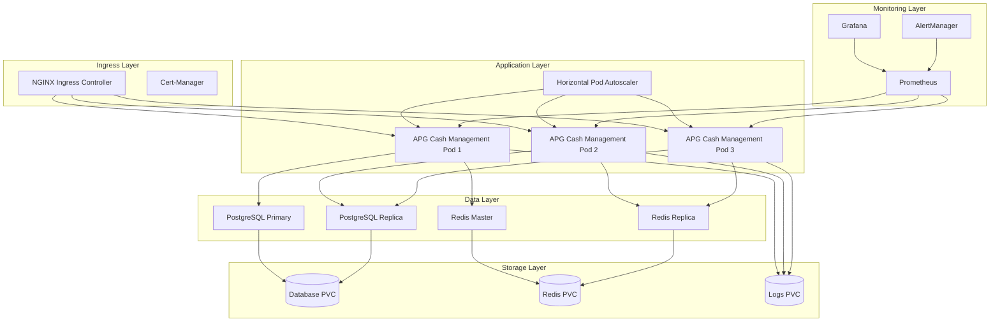

# APG Cash Management - Kubernetes Deployment Guide

**Enterprise Kubernetes Deployment for Scalable Cash Management**

© 2025 Datacraft. All rights reserved.
Author: Nyimbi Odero | APG Platform Architect

---

## ☸️ Kubernetes Deployment Overview

This guide provides comprehensive instructions for deploying the APG Cash Management System on Kubernetes clusters, supporting both on-premises and cloud deployments with enterprise-grade scalability, security, and observability.

### 📋 Prerequisites

- Kubernetes cluster v1.25+
- kubectl configured and connected to cluster
- Helm 3.8+
- Persistent volume provisioner
- Ingress controller (NGINX, Traefik, or cloud provider)
- Cert-manager for SSL certificates
- Prometheus operator (recommended)

---

## 🏗️ Kubernetes Architecture

### Cluster Architecture Overview



---

## 📦 Namespace and RBAC

### 1. Namespace Definition

```yaml
# k8s/namespace.yaml
apiVersion: v1
kind: Namespace
metadata:
  name: apg-cash-management
  labels:
    name: apg-cash-management
    environment: production
    component: financial-services
  annotations:
    description: "APG Cash Management System - Production Environment"
---
apiVersion: v1
kind: ResourceQuota
metadata:
  name: apg-cash-management-quota
  namespace: apg-cash-management
spec:
  hard:
    requests.cpu: "20"
    requests.memory: 40Gi
    limits.cpu: "40"
    limits.memory: 80Gi
    persistentvolumeclaims: "10"
    services: "20"
    secrets: "50"
    configmaps: "50"
---
apiVersion: v1
kind: LimitRange
metadata:
  name: apg-cash-management-limits
  namespace: apg-cash-management
spec:
  limits:
  - type: Container
    default:
      cpu: "1"
      memory: "2Gi"
    defaultRequest:
      cpu: "500m"
      memory: "1Gi"
    max:
      cpu: "4"
      memory: "8Gi"
    min:
      cpu: "100m"
      memory: "128Mi"
```

### 2. Service Account and RBAC

```yaml
# k8s/rbac.yaml
apiVersion: v1
kind: ServiceAccount
metadata:
  name: apg-cash-management
  namespace: apg-cash-management
  labels:
    app: apg-cash-management
---
apiVersion: rbac.authorization.k8s.io/v1
kind: Role
metadata:
  namespace: apg-cash-management
  name: apg-cash-management-role
rules:
- apiGroups: [""]
  resources: ["pods", "services", "endpoints", "configmaps", "secrets"]
  verbs: ["get", "list", "watch"]
- apiGroups: ["apps"]
  resources: ["deployments", "replicasets"]
  verbs: ["get", "list", "watch"]
- apiGroups: ["metrics.k8s.io"]
  resources: ["pods", "nodes"]
  verbs: ["get", "list"]
---
apiVersion: rbac.authorization.k8s.io/v1
kind: RoleBinding
metadata:
  name: apg-cash-management-binding
  namespace: apg-cash-management
subjects:
- kind: ServiceAccount
  name: apg-cash-management
  namespace: apg-cash-management
roleRef:
  kind: Role
  name: apg-cash-management-role
  apiGroup: rbac.authorization.k8s.io
```

---

## 🔐 Secrets and ConfigMaps

### 1. Secrets Management

```yaml
# k8s/secrets.yaml
apiVersion: v1
kind: Secret
metadata:
  name: apg-cash-management-secrets
  namespace: apg-cash-management
type: Opaque
data:
  # Base64 encoded values
  database-url: <BASE64_ENCODED_DATABASE_URL>
  redis-url: <BASE64_ENCODED_REDIS_URL>
  secret-key: <BASE64_ENCODED_SECRET_KEY>
  jwt-secret-key: <BASE64_ENCODED_JWT_SECRET>
  encryption-key: <BASE64_ENCODED_ENCRYPTION_KEY>
  postgres-password: <BASE64_ENCODED_POSTGRES_PASSWORD>
  redis-password: <BASE64_ENCODED_REDIS_PASSWORD>
---
apiVersion: v1
kind: Secret
metadata:
  name: apg-cash-management-bank-secrets
  namespace: apg-cash-management
type: Opaque
data:
  chase-api-key: <BASE64_ENCODED_CHASE_API_KEY>
  wells-fargo-api-key: <BASE64_ENCODED_WELLS_FARGO_API_KEY>
  bank-of-america-api-key: <BASE64_ENCODED_BOA_API_KEY>
  citi-api-key: <BASE64_ENCODED_CITI_API_KEY>
---
apiVersion: v1
kind: Secret
metadata:
  name: apg-cash-management-tls
  namespace: apg-cash-management
type: kubernetes.io/tls
data:
  tls.crt: <BASE64_ENCODED_CERTIFICATE>
  tls.key: <BASE64_ENCODED_PRIVATE_KEY>
```

### 2. Configuration Management

```yaml
# k8s/configmap.yaml
apiVersion: v1
kind: ConfigMap
metadata:
  name: apg-cash-management-config
  namespace: apg-cash-management
data:
  # Application Configuration
  APG_ENVIRONMENT: "production"
  APG_LOG_LEVEL: "INFO"
  APG_DEBUG: "false"
  
  # Database Configuration
  DATABASE_POOL_SIZE: "50"
  DATABASE_MAX_OVERFLOW: "100"
  DATABASE_POOL_TIMEOUT: "30"
  DATABASE_POOL_RECYCLE: "3600"
  
  # Redis Configuration
  REDIS_POOL_SIZE: "100"
  REDIS_SOCKET_TIMEOUT: "30"
  REDIS_SOCKET_CONNECT_TIMEOUT: "30"
  
  # Performance Configuration
  UVICORN_WORKERS: "4"
  UVICORN_MAX_REQUESTS: "10000"
  UVICORN_KEEPALIVE: "300"
  UVICORN_TIMEOUT_KEEP_ALIVE: "5"
  
  # AI/ML Configuration
  ML_MODEL_CACHE_SIZE: "2000"
  ML_PREDICTION_BATCH_SIZE: "5000"
  ML_TRAINING_SCHEDULE: "0 2 * * 0"
  
  # Risk Analytics
  RISK_VAR_CONFIDENCE_LEVEL: "0.95"
  RISK_STRESS_TEST_FREQUENCY: "daily"
  RISK_ALERT_THRESHOLD: "0.05"
  RISK_MONTE_CARLO_SIMULATIONS: "100000"
  
  # Bank Integration
  BANK_API_TIMEOUT: "30"
  BANK_SYNC_FREQUENCY: "300"
  BANK_RETRY_ATTEMPTS: "3"
  BANK_RATE_LIMIT_REQUESTS: "1000"
  BANK_RATE_LIMIT_WINDOW: "3600"
  
  # Monitoring Configuration
  PROMETHEUS_METRICS_PORT: "8001"
  
  # Feature Flags
  FEATURE_ADVANCED_ML_MODELS: "true"
  FEATURE_REAL_TIME_OPTIMIZATION: "true"
  FEATURE_ADVANCED_RISK_ANALYTICS: "true"
  FEATURE_BLOCKCHAIN_INTEGRATION: "false"
  FEATURE_MOBILE_API: "true"
---
apiVersion: v1
kind: ConfigMap
metadata:
  name: apg-cash-management-postgres-config
  namespace: apg-cash-management
data:
  postgresql.conf: |
    # PostgreSQL Configuration for APG Cash Management
    listen_addresses = '*'
    port = 5432
    max_connections = 200
    shared_buffers = 1GB
    effective_cache_size = 3GB
    work_mem = 32MB
    maintenance_work_mem = 256MB
    wal_level = replica
    max_wal_size = 2GB
    min_wal_size = 256MB
    checkpoint_completion_target = 0.9
    wal_buffers = 32MB
    max_wal_senders = 5
    hot_standby = on
    log_min_duration_statement = 1000ms
    log_connections = on
    log_disconnections = on
    shared_preload_libraries = 'pg_stat_statements'
  
  pg_hba.conf: |
    # PostgreSQL Client Authentication Configuration
    local   all             all                                     trust
    host    all             all             127.0.0.1/32            md5
    host    all             all             ::1/128                 md5
    host    all             all             0.0.0.0/0               md5
    host    replication     replicator      0.0.0.0/0               md5
---
apiVersion: v1
kind: ConfigMap
metadata:
  name: apg-cash-management-redis-config
  namespace: apg-cash-management
data:
  redis.conf: |
    # Redis Configuration for APG Cash Management
    bind 0.0.0.0
    port 6379
    timeout 300
    tcp-keepalive 300
    loglevel notice
    save 900 1
    save 300 10
    save 60 10000
    maxmemory 1gb
    maxmemory-policy allkeys-lru
    maxmemory-samples 5
    lazyfree-lazy-eviction yes
    lazyfree-lazy-expire yes
    lazyfree-lazy-server-del yes
    io-threads 2
    io-threads-do-reads yes
```

---

## 💾 Persistent Storage

### 1. Storage Classes

```yaml
# k8s/storage.yaml
apiVersion: storage.k8s.io/v1
kind: StorageClass
metadata:
  name: apg-ssd-fast
  annotations:
    storageclass.kubernetes.io/is-default-class: "false"
provisioner: kubernetes.io/gce-pd  # Adjust for your cloud provider
parameters:
  type: pd-ssd
  replication-type: regional-pd
  zones: us-central1-a,us-central1-b,us-central1-c
allowVolumeExpansion: true
volumeBindingMode: WaitForFirstConsumer
reclaimPolicy: Retain
---
apiVersion: storage.k8s.io/v1
kind: StorageClass
metadata:
  name: apg-ssd-standard
provisioner: kubernetes.io/gce-pd
parameters:
  type: pd-standard
  replication-type: regional-pd
allowVolumeExpansion: true
volumeBindingMode: WaitForFirstConsumer
reclaimPolicy: Retain
```

### 2. Persistent Volume Claims

```yaml
# k8s/pvc.yaml
apiVersion: v1
kind: PersistentVolumeClaim
metadata:
  name: postgres-primary-pvc
  namespace: apg-cash-management
  labels:
    app: postgres
    role: primary
spec:
  accessModes:
    - ReadWriteOnce
  storageClassName: apg-ssd-fast
  resources:
    requests:
      storage: 500Gi
---
apiVersion: v1
kind: PersistentVolumeClaim
metadata:
  name: postgres-replica-pvc
  namespace: apg-cash-management
  labels:
    app: postgres
    role: replica
spec:
  accessModes:
    - ReadWriteOnce
  storageClassName: apg-ssd-fast
  resources:
    requests:
      storage: 500Gi
---
apiVersion: v1
kind: PersistentVolumeClaim
metadata:
  name: redis-master-pvc
  namespace: apg-cash-management
  labels:
    app: redis
    role: master
spec:
  accessModes:
    - ReadWriteOnce
  storageClassName: apg-ssd-fast
  resources:
    requests:
      storage: 100Gi
---
apiVersion: v1
kind: PersistentVolumeClaim
metadata:
  name: redis-replica-pvc
  namespace: apg-cash-management
  labels:
    app: redis
    role: replica
spec:
  accessModes:
    - ReadWriteOnce
  storageClassName: apg-ssd-fast
  resources:
    requests:
      storage: 100Gi
---
apiVersion: v1
kind: PersistentVolumeClaim
metadata:
  name: apg-logs-pvc
  namespace: apg-cash-management
  labels:
    app: apg-cash-management
    component: logs
spec:
  accessModes:
    - ReadWriteMany
  storageClassName: apg-ssd-standard
  resources:
    requests:
      storage: 50Gi
```

---

## 🗄️ Database Deployments

### 1. PostgreSQL Primary

```yaml
# k8s/postgres-primary.yaml
apiVersion: apps/v1
kind: StatefulSet
metadata:
  name: postgres-primary
  namespace: apg-cash-management
  labels:
    app: postgres
    role: primary
spec:
  serviceName: postgres-primary-service
  replicas: 1
  selector:
    matchLabels:
      app: postgres
      role: primary
  template:
    metadata:
      labels:
        app: postgres
        role: primary
    spec:
      serviceAccountName: apg-cash-management
      containers:
      - name: postgres
        image: postgres:15-alpine
        env:
        - name: POSTGRES_DB
          value: "apg_cash_production"
        - name: POSTGRES_USER
          value: "apg_user"
        - name: POSTGRES_PASSWORD
          valueFrom:
            secretKeyRef:
              name: apg-cash-management-secrets
              key: postgres-password
        - name: POSTGRES_REPLICATION_USER
          value: "replicator"
        - name: POSTGRES_REPLICATION_PASSWORD
          valueFrom:
            secretKeyRef:
              name: apg-cash-management-secrets
              key: postgres-password
        - name: PGDATA
          value: /var/lib/postgresql/data/pgdata
        ports:
        - containerPort: 5432
          name: postgres
        volumeMounts:
        - name: postgres-storage
          mountPath: /var/lib/postgresql/data
        - name: postgres-config
          mountPath: /etc/postgresql
          readOnly: true
        - name: postgres-init
          mountPath: /docker-entrypoint-initdb.d
          readOnly: true
        resources:
          requests:
            cpu: "2"
            memory: "4Gi"
          limits:
            cpu: "4"
            memory: "8Gi"
        livenessProbe:
          exec:
            command:
            - pg_isready
            - -U
            - apg_user
            - -d
            - apg_cash_production
          initialDelaySeconds: 30
          periodSeconds: 10
          timeoutSeconds: 5
          failureThreshold: 3
        readinessProbe:
          exec:
            command:
            - pg_isready
            - -U
            - apg_user
            - -d
            - apg_cash_production
          initialDelaySeconds: 5
          periodSeconds: 5
          timeoutSeconds: 3
          failureThreshold: 3
      volumes:
      - name: postgres-config
        configMap:
          name: apg-cash-management-postgres-config
      - name: postgres-init
        configMap:
          name: postgres-init-scripts
          defaultMode: 0755
  volumeClaimTemplates:
  - metadata:
      name: postgres-storage
    spec:
      accessModes: ["ReadWriteOnce"]
      storageClassName: apg-ssd-fast
      resources:
        requests:
          storage: 500Gi
---
apiVersion: v1
kind: Service
metadata:
  name: postgres-primary-service
  namespace: apg-cash-management
  labels:
    app: postgres
    role: primary
spec:
  ports:
  - port: 5432
    targetPort: 5432
    name: postgres
  selector:
    app: postgres
    role: primary
  type: ClusterIP
```

### 2. PostgreSQL Replica

```yaml
# k8s/postgres-replica.yaml
apiVersion: apps/v1
kind: StatefulSet
metadata:
  name: postgres-replica
  namespace: apg-cash-management
  labels:
    app: postgres
    role: replica
spec:
  serviceName: postgres-replica-service
  replicas: 2
  selector:
    matchLabels:
      app: postgres
      role: replica
  template:
    metadata:
      labels:
        app: postgres
        role: replica
    spec:
      serviceAccountName: apg-cash-management
      initContainers:
      - name: setup-replica
        image: postgres:15-alpine
        env:
        - name: PGPASSWORD
          valueFrom:
            secretKeyRef:
              name: apg-cash-management-secrets
              key: postgres-password
        command:
        - /bin/bash
        - -c
        - |
          if [ ! -f /var/lib/postgresql/data/PG_VERSION ]; then
            pg_basebackup -h postgres-primary-service -D /var/lib/postgresql/data -U replicator -W
            echo "standby_mode = 'on'" >> /var/lib/postgresql/data/recovery.conf
            echo "primary_conninfo = 'host=postgres-primary-service port=5432 user=replicator'" >> /var/lib/postgresql/data/recovery.conf
          fi
        volumeMounts:
        - name: postgres-storage
          mountPath: /var/lib/postgresql/data
      containers:
      - name: postgres
        image: postgres:15-alpine
        env:
        - name: POSTGRES_USER
          value: "apg_user"
        - name: POSTGRES_PASSWORD
          valueFrom:
            secretKeyRef:
              name: apg-cash-management-secrets
              key: postgres-password
        - name: PGDATA
          value: /var/lib/postgresql/data/pgdata
        ports:
        - containerPort: 5432
          name: postgres
        volumeMounts:
        - name: postgres-storage
          mountPath: /var/lib/postgresql/data
        - name: postgres-config
          mountPath: /etc/postgresql
          readOnly: true
        resources:
          requests:
            cpu: "1"
            memory: "2Gi"
          limits:
            cpu: "2"
            memory: "4Gi"
        livenessProbe:
          exec:
            command:
            - pg_isready
            - -U
            - apg_user
          initialDelaySeconds: 30
          periodSeconds: 10
          timeoutSeconds: 5
          failureThreshold: 3
        readinessProbe:
          exec:
            command:
            - pg_isready
            - -U
            - apg_user
          initialDelaySeconds: 5
          periodSeconds: 5
          timeoutSeconds: 3
          failureThreshold: 3
      volumes:
      - name: postgres-config
        configMap:
          name: apg-cash-management-postgres-config
  volumeClaimTemplates:
  - metadata:
      name: postgres-storage
    spec:
      accessModes: ["ReadWriteOnce"]
      storageClassName: apg-ssd-fast
      resources:
        requests:
          storage: 500Gi
---
apiVersion: v1
kind: Service
metadata:
  name: postgres-replica-service
  namespace: apg-cash-management
  labels:
    app: postgres
    role: replica
spec:
  ports:
  - port: 5432
    targetPort: 5432
    name: postgres
  selector:
    app: postgres
    role: replica
  type: ClusterIP
```

---

## 🔴 Redis Deployments

### 1. Redis Master

```yaml
# k8s/redis-master.yaml
apiVersion: apps/v1
kind: StatefulSet
metadata:
  name: redis-master
  namespace: apg-cash-management
  labels:
    app: redis
    role: master
spec:
  serviceName: redis-master-service
  replicas: 1
  selector:
    matchLabels:
      app: redis
      role: master
  template:
    metadata:
      labels:
        app: redis
        role: master
    spec:
      serviceAccountName: apg-cash-management
      containers:
      - name: redis
        image: redis:7-alpine
        command:
        - redis-server
        - /etc/redis/redis.conf
        env:
        - name: REDIS_PASSWORD
          valueFrom:
            secretKeyRef:
              name: apg-cash-management-secrets
              key: redis-password
        ports:
        - containerPort: 6379
          name: redis
        volumeMounts:
        - name: redis-storage
          mountPath: /data
        - name: redis-config
          mountPath: /etc/redis
          readOnly: true
        resources:
          requests:
            cpu: "500m"
            memory: "1Gi"
          limits:
            cpu: "1"
            memory: "2Gi"
        livenessProbe:
          exec:
            command:
            - redis-cli
            - ping
          initialDelaySeconds: 30
          periodSeconds: 10
          timeoutSeconds: 5
          failureThreshold: 3
        readinessProbe:
          exec:
            command:
            - redis-cli
            - ping
          initialDelaySeconds: 5
          periodSeconds: 5
          timeoutSeconds: 3
          failureThreshold: 3
      volumes:
      - name: redis-config
        configMap:
          name: apg-cash-management-redis-config
  volumeClaimTemplates:
  - metadata:
      name: redis-storage
    spec:
      accessModes: ["ReadWriteOnce"]
      storageClassName: apg-ssd-fast
      resources:
        requests:
          storage: 100Gi
---
apiVersion: v1
kind: Service
metadata:
  name: redis-master-service
  namespace: apg-cash-management
  labels:
    app: redis
    role: master
spec:
  ports:
  - port: 6379
    targetPort: 6379
    name: redis
  selector:
    app: redis
    role: master
  type: ClusterIP
```

### 2. Redis Replica

```yaml
# k8s/redis-replica.yaml
apiVersion: apps/v1
kind: StatefulSet
metadata:
  name: redis-replica
  namespace: apg-cash-management
  labels:
    app: redis
    role: replica
spec:
  serviceName: redis-replica-service
  replicas: 2
  selector:
    matchLabels:
      app: redis
      role: replica
  template:
    metadata:
      labels:
        app: redis
        role: replica
    spec:
      serviceAccountName: apg-cash-management
      containers:
      - name: redis
        image: redis:7-alpine
        command:
        - redis-server
        - /etc/redis/redis.conf
        - --replicaof
        - redis-master-service
        - "6379"
        env:
        - name: REDIS_PASSWORD
          valueFrom:
            secretKeyRef:
              name: apg-cash-management-secrets
              key: redis-password
        ports:
        - containerPort: 6379
          name: redis
        volumeMounts:
        - name: redis-storage
          mountPath: /data
        - name: redis-config
          mountPath: /etc/redis
          readOnly: true
        resources:
          requests:
            cpu: "250m"
            memory: "512Mi"
          limits:
            cpu: "500m"
            memory: "1Gi"
        livenessProbe:
          exec:
            command:
            - redis-cli
            - ping
          initialDelaySeconds: 30
          periodSeconds: 10
          timeoutSeconds: 5
          failureThreshold: 3
        readinessProbe:
          exec:
            command:
            - redis-cli
            - ping
          initialDelaySeconds: 5
          periodSeconds: 5
          timeoutSeconds: 3
          failureThreshold: 3
      volumes:
      - name: redis-config
        configMap:
          name: apg-cash-management-redis-config
  volumeClaimTemplates:
  - metadata:
      name: redis-storage
    spec:
      accessModes: ["ReadWriteOnce"]
      storageClassName: apg-ssd-fast
      resources:
        requests:
          storage: 100Gi
---
apiVersion: v1
kind: Service
metadata:
  name: redis-replica-service
  namespace: apg-cash-management
  labels:
    app: redis
    role: replica
spec:
  ports:
  - port: 6379
    targetPort: 6379
    name: redis
  selector:
    app: redis
    role: replica
  type: ClusterIP
```

---

## 🚀 Application Deployment

### 1. APG Cash Management Deployment

```yaml
# k8s/apg-cash-management.yaml
apiVersion: apps/v1
kind: Deployment
metadata:
  name: apg-cash-management
  namespace: apg-cash-management
  labels:
    app: apg-cash-management
    version: v1.0.0
spec:
  replicas: 3
  strategy:
    type: RollingUpdate
    rollingUpdate:
      maxSurge: 1
      maxUnavailable: 0
  selector:
    matchLabels:
      app: apg-cash-management
  template:
    metadata:
      labels:
        app: apg-cash-management
        version: v1.0.0
      annotations:
        prometheus.io/scrape: "true"
        prometheus.io/port: "8001"
        prometheus.io/path: "/metrics"
    spec:
      serviceAccountName: apg-cash-management
      securityContext:
        runAsNonRoot: true
        runAsUser: 1000
        runAsGroup: 1000
        fsGroup: 1000
      initContainers:
      - name: migration
        image: datacraft/apg-cash-management:1.0.0
        command: ["python", "manage.py", "migrate"]
        env:
        - name: DATABASE_URL
          valueFrom:
            secretKeyRef:
              name: apg-cash-management-secrets
              key: database-url
        envFrom:
        - configMapRef:
            name: apg-cash-management-config
        - secretRef:
            name: apg-cash-management-secrets
        resources:
          requests:
            cpu: "100m"
            memory: "256Mi"
          limits:
            cpu: "500m"
            memory: "512Mi"
      containers:
      - name: apg-cash-management
        image: datacraft/apg-cash-management:1.0.0
        ports:
        - containerPort: 8000
          name: http
        - containerPort: 8001
          name: metrics
        env:
        - name: DATABASE_URL
          valueFrom:
            secretKeyRef:
              name: apg-cash-management-secrets
              key: database-url
        - name: REDIS_URL
          valueFrom:
            secretKeyRef:
              name: apg-cash-management-secrets
              key: redis-url
        envFrom:
        - configMapRef:
            name: apg-cash-management-config
        - secretRef:
            name: apg-cash-management-secrets
        - secretRef:
            name: apg-cash-management-bank-secrets
        volumeMounts:
        - name: logs
          mountPath: /app/logs
        - name: ml-models
          mountPath: /app/ml-models
        - name: temp
          mountPath: /tmp
        resources:
          requests:
            cpu: "1"
            memory: "2Gi"
          limits:
            cpu: "2"
            memory: "4Gi"
        livenessProbe:
          httpGet:
            path: /health
            port: 8000
            scheme: HTTP
          initialDelaySeconds: 60
          periodSeconds: 30
          timeoutSeconds: 10
          failureThreshold: 3
          successThreshold: 1
        readinessProbe:
          httpGet:
            path: /health/ready
            port: 8000
            scheme: HTTP
          initialDelaySeconds: 30
          periodSeconds: 10
          timeoutSeconds: 5
          failureThreshold: 3
          successThreshold: 1
        startupProbe:
          httpGet:
            path: /health
            port: 8000
            scheme: HTTP
          initialDelaySeconds: 10
          periodSeconds: 10
          timeoutSeconds: 5
          failureThreshold: 30
          successThreshold: 1
        securityContext:
          allowPrivilegeEscalation: false
          readOnlyRootFilesystem: true
          capabilities:
            drop:
            - ALL
      volumes:
      - name: logs
        persistentVolumeClaim:
          claimName: apg-logs-pvc
      - name: ml-models
        emptyDir:
          sizeLimit: 10Gi
      - name: temp
        emptyDir:
          sizeLimit: 1Gi
      nodeSelector:
        node-type: application
      tolerations:
      - key: "application"
        operator: "Equal"
        value: "true"
        effect: "NoSchedule"
      affinity:
        podAntiAffinity:
          preferredDuringSchedulingIgnoredDuringExecution:
          - weight: 100
            podAffinityTerm:
              labelSelector:
                matchLabels:
                  app: apg-cash-management
              topologyKey: kubernetes.io/hostname
        nodeAffinity:
          preferredDuringSchedulingIgnoredDuringExecution:
          - weight: 100
            preference:
              matchExpressions:
              - key: node-type
                operator: In
                values:
                - application
---
apiVersion: v1
kind: Service
metadata:
  name: apg-cash-management-service
  namespace: apg-cash-management
  labels:
    app: apg-cash-management
  annotations:
    prometheus.io/scrape: "true"
    prometheus.io/port: "8001"
    prometheus.io/path: "/metrics"
spec:
  type: ClusterIP
  ports:
  - port: 8000
    targetPort: 8000
    protocol: TCP
    name: http
  - port: 8001
    targetPort: 8001
    protocol: TCP
    name: metrics
  selector:
    app: apg-cash-management
```

### 2. Horizontal Pod Autoscaler

```yaml
# k8s/hpa.yaml
apiVersion: autoscaling/v2
kind: HorizontalPodAutoscaler
metadata:
  name: apg-cash-management-hpa
  namespace: apg-cash-management
spec:
  scaleTargetRef:
    apiVersion: apps/v1
    kind: Deployment
    name: apg-cash-management
  minReplicas: 3
  maxReplicas: 20
  metrics:
  - type: Resource
    resource:
      name: cpu
      target:
        type: Utilization
        averageUtilization: 70
  - type: Resource
    resource:
      name: memory
      target:
        type: Utilization
        averageUtilization: 80
  - type: Pods
    pods:
      metric:
        name: http_requests_per_second
      target:
        type: AverageValue
        averageValue: "100"
  behavior:
    scaleUp:
      stabilizationWindowSeconds: 300
      policies:
      - type: Percent
        value: 100
        periodSeconds: 15
      - type: Pods
        value: 4
        periodSeconds: 15
      selectPolicy: Max
    scaleDown:
      stabilizationWindowSeconds: 900
      policies:
      - type: Percent
        value: 10
        periodSeconds: 60
      selectPolicy: Min
```

---

## 🌐 Ingress and Networking

### 1. Ingress Controller

```yaml
# k8s/ingress.yaml
apiVersion: networking.k8s.io/v1
kind: Ingress
metadata:
  name: apg-cash-management-ingress
  namespace: apg-cash-management
  annotations:
    kubernetes.io/ingress.class: "nginx"
    cert-manager.io/cluster-issuer: "letsencrypt-prod"
    nginx.ingress.kubernetes.io/ssl-redirect: "true"
    nginx.ingress.kubernetes.io/force-ssl-redirect: "true"
    nginx.ingress.kubernetes.io/ssl-protocols: "TLSv1.2 TLSv1.3"
    nginx.ingress.kubernetes.io/ssl-ciphers: "ECDHE-ECDSA-AES256-GCM-SHA384:ECDHE-RSA-AES256-GCM-SHA384"
    nginx.ingress.kubernetes.io/configuration-snippet: |
      more_set_headers "Strict-Transport-Security: max-age=31536000; includeSubDomains; preload";
      more_set_headers "X-Frame-Options: SAMEORIGIN";
      more_set_headers "X-Content-Type-Options: nosniff";
      more_set_headers "X-XSS-Protection: 1; mode=block";
      more_set_headers "Referrer-Policy: strict-origin-when-cross-origin";
    nginx.ingress.kubernetes.io/rate-limit: "1000"
    nginx.ingress.kubernetes.io/rate-limit-window: "1m"
    nginx.ingress.kubernetes.io/limit-connections: "50"
    nginx.ingress.kubernetes.io/proxy-body-size: "50m"
    nginx.ingress.kubernetes.io/proxy-connect-timeout: "30"
    nginx.ingress.kubernetes.io/proxy-send-timeout: "60"
    nginx.ingress.kubernetes.io/proxy-read-timeout: "60"
spec:
  tls:
  - hosts:
    - apg-cash-management.datacraft.co.ke
    - api.apg-cash-management.datacraft.co.ke
    secretName: apg-cash-management-tls
  rules:
  - host: apg-cash-management.datacraft.co.ke
    http:
      paths:
      - path: /
        pathType: Prefix
        backend:
          service:
            name: apg-cash-management-service
            port:
              number: 8000
  - host: api.apg-cash-management.datacraft.co.ke
    http:
      paths:
      - path: /
        pathType: Prefix
        backend:
          service:
            name: apg-cash-management-service
            port:
              number: 8000
---
apiVersion: networking.k8s.io/v1
kind: NetworkPolicy
metadata:
  name: apg-cash-management-netpol
  namespace: apg-cash-management
spec:
  podSelector:
    matchLabels:
      app: apg-cash-management
  policyTypes:
  - Ingress
  - Egress
  ingress:
  - from:
    - namespaceSelector:
        matchLabels:
          name: ingress-nginx
    ports:
    - protocol: TCP
      port: 8000
  - from:
    - namespaceSelector:
        matchLabels:
          name: monitoring
    ports:
    - protocol: TCP
      port: 8001
  egress:
  - to:
    - podSelector:
        matchLabels:
          app: postgres
    ports:
    - protocol: TCP
      port: 5432
  - to:
    - podSelector:
        matchLabels:
          app: redis
    ports:
    - protocol: TCP
      port: 6379
  - to: []
    ports:
    - protocol: TCP
      port: 53
    - protocol: UDP
      port: 53
    - protocol: TCP
      port: 443
    - protocol: TCP
      port: 80
```

---

## 📊 Monitoring and Observability

### 1. ServiceMonitor for Prometheus

```yaml
# k8s/monitoring.yaml
apiVersion: monitoring.coreos.com/v1
kind: ServiceMonitor
metadata:
  name: apg-cash-management-monitor
  namespace: apg-cash-management
  labels:
    app: apg-cash-management
    release: prometheus
spec:
  selector:
    matchLabels:
      app: apg-cash-management
  endpoints:
  - port: metrics
    interval: 30s
    path: /metrics
    honorLabels: true
---
apiVersion: monitoring.coreos.com/v1
kind: PrometheusRule
metadata:
  name: apg-cash-management-alerts
  namespace: apg-cash-management
  labels:
    app: apg-cash-management
    release: prometheus
spec:
  groups:
  - name: apg-cash-management.rules
    rules:
    - alert: APGCashManagementDown
      expr: up{job="apg-cash-management-service"} == 0
      for: 5m
      labels:
        severity: critical
      annotations:
        summary: "APG Cash Management service is down"
        description: "APG Cash Management service has been down for more than 5 minutes"
    
    - alert: APGHighResponseTime
      expr: histogram_quantile(0.95, rate(http_request_duration_seconds_bucket{job="apg-cash-management-service"}[5m])) > 1
      for: 10m
      labels:
        severity: warning
      annotations:
        summary: "High response time detected"
        description: "95th percentile response time is above 1 second"
    
    - alert: APGHighErrorRate
      expr: rate(http_requests_total{job="apg-cash-management-service",status=~"5.."}[5m]) > 0.1
      for: 5m
      labels:
        severity: critical
      annotations:
        summary: "High error rate detected"
        description: "Error rate is above 10%"
    
    - alert: APGDatabaseConnectionsHigh
      expr: pg_stat_activity_count{datname="apg_cash_production"} > 180
      for: 5m
      labels:
        severity: warning
      annotations:
        summary: "Database connections are high"
        description: "Database has more than 180 active connections"
    
    - alert: APGRedisMemoryUsageHigh
      expr: redis_memory_used_bytes / redis_memory_max_bytes > 0.9
      for: 2m
      labels:
        severity: critical
      annotations:
        summary: "Redis memory usage is critical"
        description: "Redis memory usage is above 90%"
```

---

## 🚀 Deployment Scripts

### 1. Deployment Script

```bash
#!/bin/bash
# k8s/deploy.sh

set -euo pipefail

NAMESPACE="apg-cash-management"
RELEASE_NAME="apg-cash-management"
ENVIRONMENT="production"

echo "🚀 APG Cash Management - Kubernetes Deployment"
echo "=============================================="

# Check prerequisites
echo "🔍 Checking prerequisites..."
if ! command -v kubectl &> /dev/null; then
    echo "❌ kubectl is not installed"
    exit 1
fi

if ! command -v helm &> /dev/null; then
    echo "❌ helm is not installed"
    exit 1
fi

# Check cluster connectivity
if ! kubectl cluster-info &> /dev/null; then
    echo "❌ Cannot connect to Kubernetes cluster"
    exit 1
fi

echo "✅ Prerequisites check passed"

# Create namespace
echo "📁 Creating namespace..."
kubectl apply -f namespace.yaml

# Apply RBAC
echo "🔐 Applying RBAC configuration..."
kubectl apply -f rbac.yaml

# Create secrets (ensure secrets are properly encoded)
echo "🔒 Creating secrets..."
if [[ -f secrets.yaml ]]; then
    kubectl apply -f secrets.yaml
else
    echo "⚠️  Warning: secrets.yaml not found. Please create secrets manually."
fi

# Apply ConfigMaps
echo "⚙️  Applying configuration..."
kubectl apply -f configmap.yaml

# Apply storage resources
echo "💾 Creating persistent storage..."
kubectl apply -f storage.yaml
kubectl apply -f pvc.yaml

# Wait for PVCs to be bound
echo "⏳ Waiting for PVCs to be bound..."
kubectl wait --for=condition=Bound pvc --all -n $NAMESPACE --timeout=300s

# Deploy PostgreSQL
echo "🗄️ Deploying PostgreSQL..."
kubectl apply -f postgres-primary.yaml
kubectl apply -f postgres-replica.yaml

# Wait for PostgreSQL to be ready
echo "⏳ Waiting for PostgreSQL to be ready..."
kubectl wait --for=condition=Ready pod -l app=postgres,role=primary -n $NAMESPACE --timeout=600s

# Deploy Redis
echo "🔴 Deploying Redis..."
kubectl apply -f redis-master.yaml
kubectl apply -f redis-replica.yaml

# Wait for Redis to be ready
echo "⏳ Waiting for Redis to be ready..."
kubectl wait --for=condition=Ready pod -l app=redis,role=master -n $NAMESPACE --timeout=300s

# Deploy application
echo "🚀 Deploying APG Cash Management..."
kubectl apply -f apg-cash-management.yaml

# Wait for application to be ready
echo "⏳ Waiting for application to be ready..."
kubectl wait --for=condition=Available deployment/apg-cash-management -n $NAMESPACE --timeout=600s

# Apply HPA
echo "📈 Configuring autoscaling..."
kubectl apply -f hpa.yaml

# Apply networking
echo "🌐 Configuring networking..."
kubectl apply -f ingress.yaml

# Apply monitoring
echo "📊 Configuring monitoring..."
kubectl apply -f monitoring.yaml

# Display deployment status
echo ""
echo "🎉 Deployment completed successfully!"
echo "========================================"

echo "📊 Deployment Status:"
kubectl get all -n $NAMESPACE

echo ""
echo "🔗 Service URLs:"
echo "   • Application: https://apg-cash-management.datacraft.co.ke"
echo "   • API: https://api.apg-cash-management.datacraft.co.ke"

echo ""
echo "📝 Next steps:"
echo "   1. Verify SSL certificates are issued"
echo "   2. Configure DNS records"
echo "   3. Setup monitoring alerts"
echo "   4. Perform load testing"
echo "   5. Configure backup automation"

# Check pod status
echo ""
echo "🏥 Health Check:"
kubectl get pods -n $NAMESPACE
```

### 2. Upgrade Script

```bash
#!/bin/bash
# k8s/upgrade.sh

set -euo pipefail

NAMESPACE="apg-cash-management"
NEW_VERSION="$1"

if [[ -z "$NEW_VERSION" ]]; then
    echo "❌ Usage: $0 <new-version>"
    exit 1
fi

echo "🔄 APG Cash Management - Rolling Upgrade to v$NEW_VERSION"
echo "========================================================"

# Update image version
echo "📝 Updating deployment image..."
kubectl set image deployment/apg-cash-management apg-cash-management=datacraft/apg-cash-management:$NEW_VERSION -n $NAMESPACE

# Monitor rollout
echo "👀 Monitoring rollout progress..."
kubectl rollout status deployment/apg-cash-management -n $NAMESPACE --timeout=600s

# Verify deployment
echo "✅ Verifying deployment..."
kubectl get pods -n $NAMESPACE -l app=apg-cash-management

# Health check
echo "🏥 Performing health check..."
sleep 30
kubectl run health-check --rm -i --restart=Never --image=curlimages/curl -- curl -f http://apg-cash-management-service:8000/health

echo "🎉 Upgrade completed successfully!"
```

---

## 🔧 Helm Chart

### 1. Chart.yaml

```yaml
# helm/Chart.yaml
apiVersion: v2
name: apg-cash-management
description: APG Cash Management System - World-Class Enterprise Treasury Platform
type: application
version: 1.0.0
appVersion: "1.0.0"
keywords:
  - cash-management
  - treasury
  - fintech
  - enterprise
home: https://www.datacraft.co.ke
sources:
  - https://github.com/datacraft/apg-cash-management
maintainers:
  - name: Nyimbi Odero
    email: nyimbi@gmail.com
    url: https://www.datacraft.co.ke
icon: https://www.datacraft.co.ke/assets/apg-logo.png
dependencies:
  - name: postgresql
    version: "12.x.x"
    repository: "https://charts.bitnami.com/bitnami"
    condition: postgresql.enabled
  - name: redis
    version: "17.x.x"
    repository: "https://charts.bitnami.com/bitnami"
    condition: redis.enabled
  - name: prometheus
    version: "15.x.x"
    repository: "https://prometheus-community.github.io/helm-charts"
    condition: monitoring.prometheus.enabled
```

### 2. values.yaml

```yaml
# helm/values.yaml
# APG Cash Management Helm Chart Values

# Global configuration
global:
  imageRegistry: "docker.io"
  imagePullSecrets: []
  storageClass: "apg-ssd-fast"

# Application configuration
app:
  name: apg-cash-management
  version: "1.0.0"
  
  image:
    repository: datacraft/apg-cash-management
    tag: "1.0.0"
    pullPolicy: IfNotPresent
  
  replicaCount: 3
  
  resources:
    requests:
      cpu: "1"
      memory: "2Gi"
    limits:
      cpu: "2"
      memory: "4Gi"
  
  autoscaling:
    enabled: true
    minReplicas: 3
    maxReplicas: 20
    targetCPUUtilizationPercentage: 70
    targetMemoryUtilizationPercentage: 80

# Service configuration
service:
  type: ClusterIP
  port: 8000
  metricsPort: 8001

# Ingress configuration
ingress:
  enabled: true
  className: "nginx"
  annotations:
    cert-manager.io/cluster-issuer: "letsencrypt-prod"
    nginx.ingress.kubernetes.io/ssl-redirect: "true"
    nginx.ingress.kubernetes.io/rate-limit: "1000"
  hosts:
    - host: apg-cash-management.datacraft.co.ke
      paths:
        - path: /
          pathType: Prefix
  tls:
    - secretName: apg-cash-management-tls
      hosts:
        - apg-cash-management.datacraft.co.ke

# PostgreSQL configuration
postgresql:
  enabled: true
  auth:
    postgresPassword: "changeme"
    username: "apg_user"
    password: "changeme"
    database: "apg_cash_production"
  primary:
    persistence:
      enabled: true
      storageClass: "apg-ssd-fast"
      size: 500Gi
    resources:
      requests:
        cpu: "2"
        memory: "4Gi"
      limits:
        cpu: "4"
        memory: "8Gi"
  readReplicas:
    replicaCount: 2
    persistence:
      enabled: true
      storageClass: "apg-ssd-fast"
      size: 500Gi

# Redis configuration
redis:
  enabled: true
  auth:
    enabled: true
    password: "changeme"
  master:
    persistence:
      enabled: true
      storageClass: "apg-ssd-fast"
      size: 100Gi
    resources:
      requests:
        cpu: "500m"
        memory: "1Gi"
      limits:
        cpu: "1"
        memory: "2Gi"
  replica:
    replicaCount: 2
    persistence:
      enabled: true
      storageClass: "apg-ssd-fast"
      size: 100Gi

# Monitoring configuration
monitoring:
  enabled: true
  prometheus:
    enabled: true
  grafana:
    enabled: true
  serviceMonitor:
    enabled: true
    interval: 30s

# Security configuration
security:
  podSecurityContext:
    runAsNonRoot: true
    runAsUser: 1000
    runAsGroup: 1000
    fsGroup: 1000
  securityContext:
    allowPrivilegeEscalation: false
    readOnlyRootFilesystem: true
    capabilities:
      drop:
      - ALL

# Environment variables
env:
  APG_ENVIRONMENT: "production"
  APG_LOG_LEVEL: "INFO"
  APG_DEBUG: "false"
  UVICORN_WORKERS: "4"
  ML_MODEL_CACHE_SIZE: "2000"
  RISK_VAR_CONFIDENCE_LEVEL: "0.95"

# Secrets (use external secret management in production)
secrets:
  secretKey: ""
  jwtSecretKey: ""
  encryptionKey: ""
  bankApiKeys: {}

# Persistence
persistence:
  logs:
    enabled: true
    storageClass: "apg-ssd-standard"
    size: 50Gi
    accessMode: ReadWriteMany
```

---

**Next Review Date:** April 27, 2025

*© 2025 Datacraft. All rights reserved.*