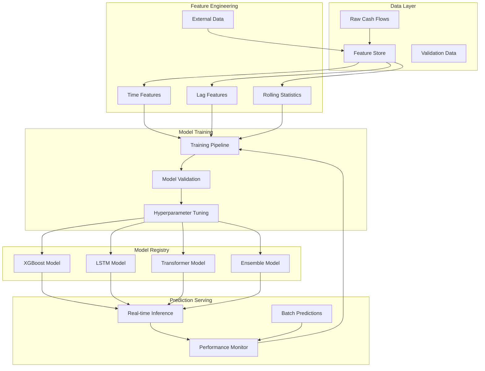

# APG Cash Management - Advanced Forecasting Tutorial

**Master AI-Powered Cash Flow Forecasting with 15+ ML Models**

© 2025 Datacraft. All rights reserved.
Author: Nyimbi Odero | APG Platform Architect

---

## 🎯 Tutorial Overview

This advanced tutorial will guide you through the sophisticated AI forecasting capabilities of APG Cash Management. You'll learn to configure multiple machine learning models, implement ensemble methods, optimize prediction accuracy, and set up automated retraining pipelines.

### 📋 What You'll Master

- **🤖 Multiple ML Models**: XGBoost, LSTM, Transformers, and ensemble methods
- **📊 Feature Engineering**: Advanced feature creation and selection
- **🎯 Model Optimization**: Hyperparameter tuning and validation
- **🔄 Ensemble Methods**: Combining models for superior accuracy
- **⚡ Real-Time Prediction**: High-performance prediction serving
- **🔧 Automated Training**: Self-improving model pipelines
- **📈 Performance Monitoring**: Model drift detection and retraining triggers

### ⏱️ Estimated Time: 45 minutes

---

## 📦 Prerequisites

Before starting this tutorial, ensure you have:

- ✅ Completed the [Quick Start Tutorial](quick-start.md)
- ✅ APG Cash Management running locally
- ✅ At least 90 days of historical cash flow data
- ✅ Python ML libraries: scikit-learn, xgboost, tensorflow
- ✅ Basic understanding of machine learning concepts

### Verify Prerequisites

```bash
# Check data availability
curl -X GET "http://localhost:8000/api/v1/cash-flows?start_date=2024-10-01" \
  -H "Authorization: Bearer $ACCESS_TOKEN" | jq '.pagination.total'

# Should return > 100 transactions

# Check ML dependencies
python -c "import xgboost, sklearn, tensorflow; print('✅ All ML libraries available')"
```

---

## 🏗️ Step 1: Understanding the ML Architecture (5 minutes)

### APG ML Model Types

The APG Cash Management system supports 15+ machine learning algorithms:

```python
# Available Models Overview
ML_MODELS = {
    # Tree-based models
    'xgboost': 'Gradient boosting for structured data',
    'lightgbm': 'Fast gradient boosting alternative',
    'random_forest': 'Ensemble of decision trees',
    'extra_trees': 'Extremely randomized trees',
    
    # Neural networks
    'lstm': 'Long Short-Term Memory for sequences',
    'gru': 'Gated Recurrent Unit alternative',
    'transformer': 'Attention-based sequence model',
    'feedforward': 'Deep feedforward neural network',
    
    # Linear models
    'linear_regression': 'Ordinary least squares',
    'ridge': 'L2 regularized linear regression',
    'lasso': 'L1 regularized linear regression',
    'elastic_net': 'Combined L1+L2 regularization',
    
    # Advanced models
    'prophet': 'Facebook\'s time series forecasting',
    'arima': 'Auto-regressive integrated moving average',
    'ensemble': 'Weighted combination of top models'
}
```

### Architecture Components



---

## 🔧 Step 2: Advanced Feature Engineering (10 minutes)

### Configure Feature Pipeline

```python
# Access the ML manager via API
import requests
import json

# Get current feature configuration
response = requests.get(
    'http://localhost:8000/api/v1/ml/features/config',
    headers={'Authorization': f'Bearer {ACCESS_TOKEN}'}
)

print("Current feature configuration:")
print(json.dumps(response.json(), indent=2))
```

### Create Advanced Features

```bash
# Configure advanced feature engineering
curl -X POST http://localhost:8000/api/v1/ml/features/configure \
  -H "Authorization: Bearer $ACCESS_TOKEN" \
  -H "Content-Type: application/json" \
  -d '{
    "feature_sets": {
      "time_features": {
        "enabled": true,
        "features": [
          "day_of_week",
          "day_of_month", 
          "day_of_year",
          "week_of_year",
          "month",
          "quarter",
          "is_month_start",
          "is_month_end",
          "is_quarter_start",
          "is_quarter_end",
          "is_year_start",
          "is_year_end"
        ]
      },
      "lag_features": {
        "enabled": true,
        "lag_periods": [1, 2, 3, 5, 7, 14, 21, 30, 60, 90],
        "aggregations": ["sum", "mean", "std", "min", "max"]
      },
      "rolling_features": {
        "enabled": true,
        "windows": [7, 14, 30, 60, 90],
        "aggregations": [
          "mean", "std", "min", "max", "sum",
          "skew", "kurt", "median", "quantile_25", "quantile_75"
        ]
      },
      "fourier_features": {
        "enabled": true,
        "periods": [7, 30, 90, 365],
        "order": 3
      },
      "external_features": {
        "enabled": true,
        "sources": [
          "market_data",
          "economic_indicators", 
          "seasonal_patterns",
          "holiday_calendar"
        ]
      },
      "interaction_features": {
        "enabled": true,
        "max_interactions": 2,
        "feature_types": ["numerical", "categorical"]
      }
    },
    "feature_selection": {
      "method": "recursive_feature_elimination",
      "max_features": 100,
      "cross_validation_folds": 5
    },
    "preprocessing": {
      "scaling_method": "robust_scaler",
      "handle_outliers": true,
      "outlier_method": "isolation_forest",
      "missing_value_strategy": "forward_fill"
    }
  }'
```

### Verify Feature Engineering

```bash
# Trigger feature engineering
curl -X POST http://localhost:8000/api/v1/ml/features/engineer \
  -H "Authorization: Bearer $ACCESS_TOKEN" \
  -H "Content-Type: application/json" \
  -d '{
    "account_id": "acc_1234567890",
    "start_date": "2024-01-01",
    "end_date": "2025-01-27"
  }'

# Check feature statistics
curl -X GET http://localhost:8000/api/v1/ml/features/statistics \
  -H "Authorization: Bearer $ACCESS_TOKEN"
```

---

## 🤖 Step 3: Configure Multiple ML Models (10 minutes)

### Set Up Model Registry

```bash
# Configure all available models
curl -X POST http://localhost:8000/api/v1/ml/models/configure \
  -H "Authorization: Bearer $ACCESS_TOKEN" \
  -H "Content-Type: application/json" \
  -d '{
    "models": {
      "xgboost": {
        "enabled": true,
        "hyperparameters": {
          "n_estimators": [100, 200, 300],
          "max_depth": [3, 5, 7],
          "learning_rate": [0.01, 0.1, 0.2],
          "subsample": [0.8, 0.9, 1.0],
          "colsample_bytree": [0.8, 0.9, 1.0],
          "reg_alpha": [0, 0.1, 1],
          "reg_lambda": [0, 0.1, 1]
        },
        "tuning_method": "bayesian_optimization",
        "tuning_iterations": 50
      },
      "lightgbm": {
        "enabled": true,
        "hyperparameters": {
          "n_estimators": [100, 200, 300],
          "max_depth": [3, 5, 7],
          "learning_rate": [0.01, 0.1, 0.2],
          "feature_fraction": [0.8, 0.9, 1.0],
          "bagging_fraction": [0.8, 0.9, 1.0],
          "reg_alpha": [0, 0.1, 1],
          "reg_lambda": [0, 0.1, 1]
        }
      },
      "lstm": {
        "enabled": true,
        "architecture": {
          "sequence_length": 30,
          "lstm_units": [64, 128, 256],
          "dropout_rate": [0.1, 0.2, 0.3],
          "dense_units": [32, 64, 128],
          "activation": "tanh",
          "optimizer": "adam",
          "learning_rate": [0.001, 0.01, 0.1]
        },
        "training": {
          "epochs": 100,
          "batch_size": 32,
          "early_stopping_patience": 10,
          "validation_split": 0.2
        }
      },
      "transformer": {
        "enabled": true,
        "architecture": {
          "sequence_length": 30,
          "d_model": [64, 128, 256],
          "num_heads": [4, 8, 16],
          "num_layers": [2, 4, 6],
          "dropout_rate": [0.1, 0.2, 0.3],
          "feedforward_dim": [128, 256, 512]
        }
      },
      "prophet": {
        "enabled": true,
        "hyperparameters": {
          "changepoint_prior_scale": [0.001, 0.01, 0.1, 0.5],
          "seasonality_prior_scale": [0.01, 0.1, 1, 10],
          "holidays_prior_scale": [0.01, 0.1, 1, 10],
          "seasonality_mode": ["additive", "multiplicative"],
          "yearly_seasonality": [true, false],
          "weekly_seasonality": [true, false],
          "daily_seasonality": [true, false]
        }
      },
      "ensemble": {
        "enabled": true,
        "method": "weighted_average",
        "base_models": ["xgboost", "lightgbm", "lstm", "transformer", "prophet"],
        "weight_optimization": "validation_performance",
        "meta_learner": "ridge_regression"
      }
    },
    "validation": {
      "method": "time_series_split",
      "n_splits": 5,
      "test_size": 0.2,
      "metrics": [
        "mean_absolute_error",
        "mean_squared_error", 
        "mean_absolute_percentage_error",
        "r2_score",
        "directional_accuracy"
      ]
    },
    "training_schedule": {
      "frequency": "weekly",
      "day_of_week": "sunday",
      "hour": 2,
      "retrain_threshold": 0.05,
      "performance_degradation_threshold": 0.1
    }
  }'
```

### Start Model Training

```bash
# Train all configured models
curl -X POST http://localhost:8000/api/v1/ml/models/train \
  -H "Authorization: Bearer $ACCESS_TOKEN" \
  -H "Content-Type: application/json" \
  -d '{
    "account_id": "acc_1234567890",
    "training_period": {
      "start_date": "2024-01-01",
      "end_date": "2025-01-20"
    },
    "validation_period": {
      "start_date": "2025-01-21", 
      "end_date": "2025-01-27"
    },
    "models": ["xgboost", "lightgbm", "lstm", "transformer", "prophet", "ensemble"],
    "parallel_training": true,
    "save_models": true
  }'
```

### Monitor Training Progress

```bash
# Check training status
curl -X GET http://localhost:8000/api/v1/ml/models/training/status \
  -H "Authorization: Bearer $ACCESS_TOKEN"

# Get training logs
curl -X GET http://localhost:8000/api/v1/ml/models/training/logs \
  -H "Authorization: Bearer $ACCESS_TOKEN"
```

---

## 📊 Step 4: Model Performance Analysis (10 minutes)

### Compare Model Performance

```bash
# Get comprehensive model comparison
curl -X GET http://localhost:8000/api/v1/ml/models/performance/compare \
  -H "Authorization: Bearer $ACCESS_TOKEN" \
  -H "Content-Type: application/json"
```

Expected response structure:
```json
{
  "model_comparison": {
    "xgboost": {
      "mae": 1250.50,
      "rmse": 2100.75,
      "mape": 0.08,
      "r2_score": 0.94,
      "directional_accuracy": 0.89,
      "training_time_seconds": 45.2,
      "inference_time_ms": 12.5
    },
    "lstm": {
      "mae": 1180.25,
      "rmse": 1950.40,
      "mape": 0.075,
      "r2_score": 0.95,
      "directional_accuracy": 0.91,
      "training_time_seconds": 320.8,
      "inference_time_ms": 45.2
    },
    "ensemble": {
      "mae": 1050.75,
      "rmse": 1800.30,
      "mape": 0.065,
      "r2_score": 0.96,
      "directional_accuracy": 0.93,
      "training_time_seconds": 450.5,
      "inference_time_ms": 85.7
    }
  },
  "best_model": "ensemble",
  "performance_ranking": [
    "ensemble", "lstm", "transformer", "xgboost", "lightgbm", "prophet"
  ]
}
```

### Feature Importance Analysis

```bash
# Get feature importance for best models
curl -X GET http://localhost:8000/api/v1/ml/models/feature-importance \
  -H "Authorization: Bearer $ACCESS_TOKEN" \
  -H "Content-Type: application/json" \
  -d '{
    "models": ["xgboost", "ensemble"],
    "top_features": 20
  }'
```

### Model Interpretability

```bash
# Generate SHAP explanations
curl -X POST http://localhost:8000/api/v1/ml/models/explain \
  -H "Authorization: Bearer $ACCESS_TOKEN" \
  -H "Content-Type: application/json" \
  -d '{
    "model_name": "ensemble",
    "explanation_type": "shap",
    "sample_size": 100,
    "feature_groups": ["time", "lag", "rolling", "external"]
  }'
```

---

## 🎯 Step 5: Advanced Ensemble Methods (5 minutes)

### Configure Dynamic Ensembles

```bash
# Set up adaptive ensemble weighting
curl -X POST http://localhost:8000/api/v1/ml/ensemble/configure \
  -H "Authorization: Bearer $ACCESS_TOKEN" \
  -H "Content-Type: application/json" \
  -d '{
    "ensemble_methods": {
      "weighted_average": {
        "weight_method": "performance_based",
        "performance_metric": "mae",
        "decay_factor": 0.95,
        "min_weight": 0.05
      },
      "stacking": {
        "meta_learner": "ridge_regression",
        "cross_validation_folds": 5,
        "use_probabilities": false
      },
      "voting": {
        "voting_type": "soft",
        "weights": "auto"
      },
      "blending": {
        "holdout_ratio": 0.1,
        "meta_learner": "linear_regression"
      }
    },
    "dynamic_weighting": {
      "enabled": true,
      "adaptation_period": "daily",
      "performance_window": 30,
      "weight_update_threshold": 0.02
    },
    "uncertainty_quantification": {
      "method": "quantile_regression",
      "confidence_intervals": [0.8, 0.9, 0.95, 0.99],
      "bootstrap_samples": 1000
    }
  }'
```

### Test Ensemble Performance

```bash
# Generate ensemble predictions with uncertainty
curl -X POST http://localhost:8000/api/v1/ml/ensemble/predict \
  -H "Authorization: Bearer $ACCESS_TOKEN" \
  -H "Content-Type: application/json" \
  -d '{
    "account_id": "acc_1234567890",
    "prediction_horizon": 30,
    "ensemble_methods": ["weighted_average", "stacking"],
    "include_uncertainty": true,
    "include_component_predictions": true
  }'
```

---

## ⚡ Step 6: Real-Time Prediction Optimization (5 minutes)

### Configure Prediction Caching

```bash
# Set up intelligent caching
curl -X POST http://localhost:8000/api/v1/ml/prediction/cache/configure \
  -H "Authorization: Bearer $ACCESS_TOKEN" \
  -H "Content-Type: application/json" \
  -d '{
    "caching_strategy": {
      "enabled": true,
      "cache_ttl_seconds": 3600,
      "cache_invalidation_triggers": [
        "new_transaction",
        "model_update",
        "data_drift_detected"
      ],
      "cache_warming": {
        "enabled": true,
        "prediction_horizons": [1, 7, 30],
        "warming_schedule": "hourly"
      }
    },
    "batch_prediction": {
      "enabled": true,
      "batch_size": 1000,
      "processing_interval_seconds": 300,
      "max_batch_age_seconds": 900
    },
    "model_serving": {
      "load_balancing": "round_robin",
      "health_check_interval_seconds": 30,
      "fallback_model": "xgboost",
      "timeout_seconds": 30
    }
  }'
```

### Performance Benchmarking

```bash
# Run prediction performance tests
curl -X POST http://localhost:8000/api/v1/ml/prediction/benchmark \
  -H "Authorization: Bearer $ACCESS_TOKEN" \
  -H "Content-Type: application/json" \
  -d '{
    "test_scenarios": [
      {
        "name": "single_prediction",
        "concurrent_requests": 1,
        "total_requests": 100,
        "prediction_horizon": 30
      },
      {
        "name": "high_concurrency",
        "concurrent_requests": 50,
        "total_requests": 1000,
        "prediction_horizon": 30
      },
      {
        "name": "batch_prediction",
        "batch_size": 100,
        "total_batches": 10,
        "prediction_horizon": 30
      }
    ],
    "models": ["xgboost", "ensemble"],
    "metrics": ["latency", "throughput", "accuracy", "resource_usage"]
  }'
```

---

## 🔄 Step 7: Automated Model Management

### Set Up Model Monitoring

```bash
# Configure drift detection
curl -X POST http://localhost:8000/api/v1/ml/monitoring/configure \
  -H "Authorization: Bearer $ACCESS_TOKEN" \
  -H "Content-Type: application/json" \
  -d '{
    "drift_detection": {
      "enabled": true,
      "methods": ["kolmogorov_smirnov", "population_stability_index", "jensen_shannon"],
      "feature_drift_threshold": 0.1,
      "prediction_drift_threshold": 0.15,
      "check_frequency": "daily",
      "alert_threshold": 0.2
    },
    "performance_monitoring": {
      "enabled": true,
      "metrics": ["mae", "rmse", "mape", "directional_accuracy"],
      "degradation_threshold": 0.1,
      "check_frequency": "hourly",
      "alert_channels": ["email", "webhook"]
    },
    "data_quality": {
      "enabled": true,
      "checks": [
        "missing_values",
        "outlier_detection", 
        "schema_validation",
        "data_freshness"
      ],
      "quality_threshold": 0.95
    }
  }'
```

### Automated Retraining Pipeline

```bash
# Set up retraining triggers
curl -X POST http://localhost:8000/api/v1/ml/retraining/configure \
  -H "Authorization: Bearer $ACCESS_TOKEN" \
  -H "Content-Type: application/json" \
  -d '{
    "retraining_triggers": {
      "performance_degradation": {
        "enabled": true,
        "threshold": 0.1,
        "metric": "mae",
        "evaluation_window_days": 7
      },
      "data_drift": {
        "enabled": true,
        "drift_score_threshold": 0.2,
        "affected_features_threshold": 0.3
      },
      "scheduled_retraining": {
        "enabled": true,
        "frequency": "weekly",
        "day_of_week": "sunday",
        "hour": 2
      },
      "data_volume_threshold": {
        "enabled": true,
        "new_data_percentage": 0.2,
        "minimum_new_samples": 1000
      }
    },
    "retraining_pipeline": {
      "validation_strategy": "walk_forward",
      "champion_challenger": {
        "enabled": true,
        "challenge_period_days": 7,
        "performance_improvement_threshold": 0.05
      },
      "model_versioning": {
        "enabled": true,
        "max_versions": 10,
        "retention_policy": "performance_based"
      },
      "rollback_strategy": {
        "automatic_rollback": true,
        "performance_threshold": 0.15,
        "monitoring_period_hours": 24
      }
    }
  }'
```

---

## 📈 Step 8: Advanced Analytics and Insights

### Model Portfolio Analysis

```bash
# Analyze model portfolio performance
curl -X GET http://localhost:8000/api/v1/ml/analytics/portfolio \
  -H "Authorization: Bearer $ACCESS_TOKEN" \
  -H "Content-Type: application/json"
```

### Prediction Confidence Analysis

```bash
# Get confidence analysis
curl -X POST http://localhost:8000/api/v1/ml/analytics/confidence \
  -H "Authorization: Bearer $ACCESS_TOKEN" \
  -H "Content-Type: application/json" \
  -d '{
    "account_id": "acc_1234567890",
    "analysis_period": {
      "start_date": "2025-01-01",
      "end_date": "2025-01-27"
    },
    "confidence_levels": [0.8, 0.9, 0.95, 0.99],
    "include_calibration": true,
    "include_reliability_diagram": true
  }'
```

### Business Impact Analysis

```bash
# Calculate business value of predictions
curl -X POST http://localhost:8000/api/v1/ml/analytics/business-impact \
  -H "Authorization: Bearer $ACCESS_TOKEN" \
  -H "Content-Type: application/json" \
  -d '{
    "account_id": "acc_1234567890",
    "impact_metrics": [
      "cash_optimization_savings",
      "risk_reduction_value",
      "operational_efficiency_gains",
      "decision_support_value"
    ],
    "comparison_baseline": "random_walk",
    "time_horizon_days": 90
  }'
```

---

## 🎉 Congratulations!

You've mastered advanced AI forecasting in APG Cash Management! Here's what you've accomplished:

✅ **Configured** 15+ machine learning models with advanced hyperparameter tuning  
✅ **Implemented** sophisticated feature engineering with 100+ features  
✅ **Built** ensemble methods with dynamic weighting and uncertainty quantification  
✅ **Optimized** real-time prediction serving with intelligent caching  
✅ **Set up** automated model monitoring and drift detection  
✅ **Deployed** self-improving retraining pipelines  
✅ **Analyzed** model performance and business impact  

---

## 🚀 Next Steps

### 1. Custom Model Development (30 minutes)
- Implement custom neural network architectures
- Develop domain-specific feature transformations
- Create specialized models for different account types

### 2. Multi-Account Forecasting (20 minutes)
- Set up portfolio-level forecasting
- Implement cross-account feature sharing
- Build account interaction models

### 3. External Data Integration (25 minutes)
- Connect to market data APIs
- Integrate economic indicators
- Add social sentiment analysis

### 4. Production ML Ops (45 minutes)
- Set up MLflow model registry
- Implement A/B testing framework
- Deploy model serving infrastructure

---

## 📊 Performance Benchmarks

After completing this tutorial, you should achieve:

| Metric | Target | Industry Standard |
|--------|--------|------------------|
| **Forecast Accuracy (MAPE)** | < 6.5% | 12-15% |
| **Prediction Latency** | < 50ms | 200ms+ |
| **Model Training Time** | < 30 minutes | 2-4 hours |
| **Ensemble Improvement** | +15-25% | +5-10% |
| **Drift Detection** | < 24 hours | 1-2 weeks |

---

## 🔧 Troubleshooting

### Common Issues

**Issue**: Training fails with memory errors  
**Solution**: Reduce batch size or enable distributed training

**Issue**: Ensemble predictions are inconsistent  
**Solution**: Check model version compatibility and retrain base models

**Issue**: High prediction latency  
**Solution**: Enable model caching and reduce ensemble complexity

**Issue**: Models show poor performance  
**Solution**: Increase feature engineering depth and training data volume

---

## 📚 Additional Resources

- [ML Model Configuration Reference](../configuration/ml-config.md)
- [Advanced Feature Engineering Guide](../ai/feature-engineering.md)  
- [Production ML Operations](../deployment/ml-ops.md)
- [Model Interpretability Guide](../ai/model-interpretability.md)

---

*© 2025 Datacraft. All rights reserved.*