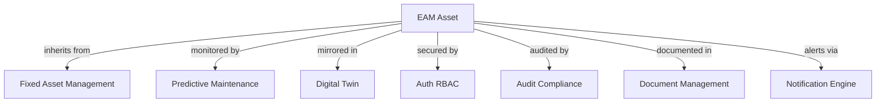

# Enterprise Asset Management (EAM) Capability Specification

## Executive Summary

The Enterprise Asset Management (EAM) capability provides comprehensive lifecycle management for physical and digital assets within the APG platform ecosystem. This capability seamlessly integrates with existing APG capabilities including Fixed Asset Management, Predictive Maintenance, Digital Twin systems, CRM, and Audit Compliance to deliver a unified, intelligent asset management solution.

**Business Value Proposition within APG Ecosystem:**
- **Unified Asset View**: Single source of truth for all enterprise assets across financial, operational, and predictive maintenance systems
- **AI-Driven Optimization**: Leverages APG's AI orchestration and predictive maintenance for intelligent asset lifecycle decisions
- **Regulatory Compliance**: Integrates with APG's audit compliance for regulatory adherence including ASC 842, IFRS 16, Sarbanes-Oxley
- **Real-time Intelligence**: Connects with APG's digital twin and IoT management for live asset monitoring and performance optimization
- **Cost Optimization**: Reduces total cost of ownership through predictive maintenance, optimal replacement timing, and resource efficiency
- **Risk Mitigation**: Proactive risk management through integrated failure prediction and safety monitoring

## APG Platform Integration Context

### Core APG Capability Dependencies

**MANDATORY Dependencies:**
- **auth_rbac**: Multi-tenant security, role-based access control, and user authentication
- **audit_compliance**: Complete audit trails, regulatory compliance tracking, and data governance  
- **fixed_asset_management**: Financial asset tracking, depreciation, and GL integration
- **predictive_maintenance**: AI-driven failure prediction, health monitoring, and maintenance optimization
- **digital_twin_marketplace**: Real-time asset mirroring, simulation, and performance analytics
- **document_management**: Asset documentation, manuals, warranties, and compliance certificates
- **notification_engine**: Automated alerts, escalations, and stakeholder communications

**Strategic Integrations:**
- **customer_relationship_management**: Asset-customer relationships, service history, and contract management
- **ai_orchestration**: Machine learning model management and intelligent decision support
- **iot_management**: Sensor integration, real-time data collection, and edge computing
- **real_time_collaboration**: Team coordination, expert consultation, and knowledge sharing
- **financial_management**: Budget planning, cost allocation, and financial reporting
- **procurement_purchasing**: Asset sourcing, vendor management, and purchase workflows

### APG Composition Engine Registration

```python
# APG Composition Registration
{
    "capability_id": "general_cross_functional.enterprise_asset_management",
    "version": "1.0.0",
    "composition_type": "core_business_capability",
    "dependencies": [
        "auth_rbac",
        "audit_compliance", 
        "fixed_asset_management",
        "predictive_maintenance",
        "digital_twin_marketplace",
        "document_management",
        "notification_engine"
    ],
    "provides_services": [
        "asset_lifecycle_management",
        "maintenance_optimization",
        "asset_performance_analytics",
        "regulatory_compliance_reporting",
        "cost_optimization_insights"
    ],
    "data_models": ["EAMAsset", "EAMLocation", "EAMWorkOrder", "EAMInventory", "EAMContract"]
}
```

## Detailed Functional Requirements

### 1. Asset Master Data Management

**APG User Stories:**

**US-EAM-001**: As an Asset Manager, I want to create and maintain comprehensive asset records that automatically integrate with APG's Fixed Asset Management for financial tracking and Predictive Maintenance for operational monitoring.

**US-EAM-002**: As a Compliance Officer, I want all asset changes to be automatically logged in APG's Audit Compliance system with full traceability and regulatory reporting capabilities.

**US-EAM-003**: As an Operations Manager, I want asset hierarchies that connect with APG's Digital Twin systems to enable real-time monitoring and simulation of asset performance.

**Acceptance Criteria:**
- Asset master data synchronizes bidirectionally with APG Fixed Asset Management
- All asset transactions logged in APG Audit Compliance with regulatory tags
- Asset hierarchies support parent-child relationships with unlimited depth
- Integration with APG Digital Twin for real-time asset mirroring
- Multi-tenant data isolation following APG security patterns
- Support for 50+ asset types with configurable attributes
- Automated asset numbering with organization-specific schemes
- Asset location tracking with GPS coordinates and facility integration

### 2. Work Order Management

**APG User Stories:**

**US-EAM-004**: As a Maintenance Technician, I want to receive intelligent work orders generated from APG's Predictive Maintenance system with complete asset context and historical information.

**US-EAM-005**: As a Supervisor, I want work order scheduling that integrates with APG's Real-time Collaboration for team coordination and expert consultation capabilities.

**US-EAM-006**: As a Plant Manager, I want work order analytics that connect with APG's AI Orchestration for continuous improvement and optimization recommendations.

**Acceptance Criteria:**
- Automatic work order generation from APG Predictive Maintenance alerts
- Integration with APG Real-time Collaboration for team assignment and communication
- Mobile-responsive work order interface for field technicians
- Parts and inventory integration with APG Procurement systems
- Labor time tracking with APG HR system integration
- Work order templates with best practice workflows
- Real-time status updates and progress tracking
- Cost tracking and budget variance analysis

### 3. Preventive Maintenance Scheduling

**APG User Stories:**

**US-EAM-007**: As a Maintenance Planner, I want PM schedules that dynamically adjust based on asset condition data from APG's IoT Management and Predictive Maintenance systems.

**US-EAM-008**: As a Reliability Engineer, I want maintenance optimization recommendations from APG's AI Orchestration based on asset performance trends and cost analysis.

**Acceptance Criteria:**
- Calendar-based and meter-based PM scheduling
- Integration with APG IoT Management for condition-based triggers
- AI-driven schedule optimization using APG AI Orchestration
- Resource capacity planning and constraint management  
- Maintenance route optimization for efficiency
- Seasonal and operational pattern considerations
- Compliance-driven maintenance scheduling for regulated assets
- Performance KPI tracking and continuous improvement

### 4. Inventory and Parts Management

**APG User Stories:**

**US-EAM-009**: As a Storekeeper, I want inventory management that integrates with APG's Procurement systems for automated reordering and vendor management.

**US-EAM-010**: As a Maintenance Manager, I want parts forecasting powered by APG's AI capabilities to optimize inventory levels and reduce stockouts.

**Acceptance Criteria:**
- Integration with APG Procurement for automated purchasing workflows
- AI-powered demand forecasting using APG machine learning capabilities
- Barcode/RFID tracking with mobile scanning capabilities
- Multi-location inventory with transfer and allocation logic
- Vendor catalog integration and price comparison
- Obsolescence management and alternative parts identification
- Kit and assembly management for complex repairs
- Inventory valuation and financial reporting integration

### 5. Asset Performance Analytics

**APG User Stories:**

**US-EAM-011**: As an Operations Director, I want comprehensive asset performance dashboards powered by APG's Digital Twin and Predictive Maintenance data for strategic decision making.

**US-EAM-012**: As a Financial Controller, I want asset lifecycle cost analysis that integrates with APG's Financial Management for accurate TCO calculations and budgeting.

**Acceptance Criteria:**
- Real-time performance dashboards using APG visualization capabilities
- Integration with APG Digital Twin for live asset monitoring
- Predictive analytics powered by APG AI Orchestration
- TCO analysis with APG Financial Management integration
- Benchmarking and comparative analysis across asset classes
- Regulatory reporting compliance with automatic generation
- Energy efficiency and sustainability metrics tracking
- Mobile executive dashboards for key performance indicators

## Technical Architecture within APG Platform

### APG-Integrated Data Architecture

**Entity Relationship with APG Capabilities:**



**Data Model Prefix**: `EA` (Enterprise Asset)

**Core Models:**
- `EAAsset`: Master asset registry with APG capability linkages
- `EALocation`: Hierarchical location structure with GPS/facilities integration
- `EAWorkOrder`: Work management with APG workflow integration
- `EAInventory`: Parts and materials with APG procurement integration
- `EAContract`: Service contracts with APG CRM integration
- `EAPerformance`: Analytics and KPIs with APG reporting integration

### APG Service Integration Architecture

**Service Layer Pattern:**
```python
# APG-Integrated Service Architecture
@async_service
class EAMAssetService:
    def __init__(self):
        self.fixed_asset_service = self.get_apg_service('fixed_asset_management')
        self.predictive_maintenance_service = self.get_apg_service('predictive_maintenance')
        self.digital_twin_service = self.get_apg_service('digital_twin_marketplace')
        self.audit_service = self.get_apg_service('audit_compliance')
        self.notification_service = self.get_apg_service('notification_engine')
    
    async def create_asset(self, asset_data: EAAssetCreate) -> EAAsset:
        # Create in EAM with full APG integration
        pass
```

### APG UI Integration Patterns

**Flask-AppBuilder Integration:**
- Extends APG's existing UI framework with consistent styling
- Integrates with APG's navigation and menu systems
- Leverages APG's real-time collaboration features
- Mobile-responsive design compatible with APG patterns
- Dashboard integration with APG's visualization capabilities

### APG API Compatibility

**REST API Design:**
- Follows APG's API versioning and authentication patterns
- Integrates with APG's rate limiting and security middleware
- Supports APG's multi-tenant request routing
- Compatible with APG's API gateway and documentation systems
- WebSocket integration for real-time updates via APG infrastructure

## AI/ML Integration with APG Capabilities

### APG AI Orchestration Integration

**Intelligent Asset Management Features:**
- Asset failure prediction using APG's federated learning capabilities
- Maintenance optimization through APG's reinforcement learning systems
- Resource allocation optimization via APG's intelligent orchestration
- Energy efficiency optimization using APG's AI-driven recommendations
- Parts demand forecasting through APG's time series analytics

### APG Predictive Maintenance Enhancement

**Enhanced Predictive Capabilities:**
- Asset health scoring integration with real-time sensor data
- Remaining useful life calculations with confidence intervals
- Risk-based maintenance prioritization using business impact models
- Maintenance effectiveness analysis with continuous learning
- Cost-benefit optimization for maintenance vs. replacement decisions

## Security Framework using APG Infrastructure

### APG Auth RBAC Integration

**Role-Based Security Model:**
- **Asset Administrator**: Full asset lifecycle management
- **Maintenance Manager**: Work order and PM management
- **Maintenance Technician**: Work execution and updates
- **Inventory Manager**: Parts and materials management  
- **Operations Viewer**: Read-only dashboard access
- **Compliance Auditor**: Audit trail and reporting access

**Multi-Tenant Security:**
- Tenant-isolated data with APG's proven security patterns
- Row-level security for asset visibility controls
- Field-level encryption for sensitive asset information
- API security through APG's OAuth 2.0 / JWT implementation

### APG Audit Compliance Integration

**Comprehensive Audit Trail:**
- All asset changes logged with APG's audit infrastructure
- Regulatory compliance tracking (ASC 842, IFRS 16, SOX)
- Data retention policies aligned with APG compliance requirements
- Automated compliance reporting with APG's reporting engine
- Digital signatures and approval workflows via APG systems

## Performance Requirements within APG Architecture

### Scalability within APG Multi-Tenant Environment

**Performance Benchmarks:**
- Support 1M+ assets per tenant within APG's architecture
- Sub-second response times for asset queries using APG's caching
- Real-time updates with <100ms latency via APG's messaging infrastructure
- 99.9% uptime SLA aligned with APG platform guarantees
- Horizontal scaling using APG's containerized deployment patterns

### APG-Compatible Caching and Optimization

**Performance Optimization:**
- Redis caching integration with APG's caching infrastructure
- Database query optimization using APG's proven patterns
- CDN integration for asset images and documentation
- Background job processing via APG's async task infrastructure
- Real-time data synchronization with APG's event streaming

## UI/UX Design Following APG Patterns

### APG Flask-AppBuilder Integration

**Consistent User Experience:**
- Seamless integration with APG's existing navigation and layout
- Responsive design compatible with APG's mobile framework
- Accessibility compliance following APG's WCAG 2.1 AA standards
- Theming and branding consistency with APG platform
- Multi-language support using APG's internationalization infrastructure

### Advanced UI Features with APG Capabilities

**Enhanced User Interface:**
- Interactive asset hierarchy visualization using APG's 3D visualization
- Real-time asset monitoring dashboards with APG's collaboration features
- Mobile work order management with offline capability
- Asset QR code scanning and NFC integration
- Augmented reality for asset identification and maintenance guidance

## API Architecture Compatible with APG

### APG-Integrated REST API Design

**API Specifications:**
- OpenAPI 3.0 specification following APG standards
- JWT authentication integration with APG's auth infrastructure
- Rate limiting using APG's API gateway
- Comprehensive error handling with APG's error patterns
- API versioning strategy aligned with APG platform

**Key Endpoints with APG Integration:**
```yaml
# Asset Management Endpoints
GET /api/v1/assets - List assets with APG tenant filtering
POST /api/v1/assets - Create asset with APG audit logging  
GET /api/v1/assets/{id} - Get asset with APG permission checking
PUT /api/v1/assets/{id} - Update asset with APG change tracking
DELETE /api/v1/assets/{id} - Soft delete with APG compliance

# Work Order Management with APG Integration
GET /api/v1/work-orders - List work orders with APG collaboration
POST /api/v1/work-orders - Create work order with APG notifications
PUT /api/v1/work-orders/{id}/complete - Complete with APG audit trail
```

## Background Processing using APG Patterns

### APG Async Infrastructure Integration

**Background Job Categories:**
- **Asset Synchronization**: Sync with APG Fixed Asset Management and Digital Twin
- **Predictive Analytics**: ML model execution using APG AI Orchestration
- **Report Generation**: Automated reporting via APG reporting infrastructure
- **Data Import/Export**: Bulk operations with APG data management patterns
- **Notification Processing**: Alert distribution via APG notification engine

### APG Event-Driven Architecture

**Event Integration:**
- Asset lifecycle events published to APG event streaming
- Maintenance completion events triggering downstream APG processes
- Performance threshold events integrating with APG alerting systems
- Inventory level events connecting with APG procurement workflows

## Monitoring Integration with APG Infrastructure

### APG Observability Integration

**Monitoring and Alerting:**
- Application metrics collection via APG's observability infrastructure
- Custom business metrics dashboards using APG's visualization capabilities
- Health checks integration with APG's monitoring systems
- Log aggregation and analysis through APG's logging infrastructure
- Performance tracking and optimization via APG's performance monitoring

### APG Business Intelligence Integration

**Analytics and Reporting:**
- Asset performance KPIs integrated with APG's BI platform
- Predictive analytics dashboards using APG's ML capabilities
- Cost analysis and optimization reports via APG's financial reporting
- Regulatory compliance reporting through APG's compliance infrastructure
- Executive dashboards with APG's real-time collaboration features

## Deployment within APG Infrastructure

### APG Containerized Deployment

**Container Architecture:**
- Docker containers following APG's proven containerization patterns
- Kubernetes deployment using APG's orchestration infrastructure
- Horizontal pod autoscaling aligned with APG's scaling policies
- Health checks and liveness probes compatible with APG monitoring
- Rolling updates and blue-green deployments via APG's CI/CD pipeline

### APG Cloud-Native Deployment

**Cloud Integration:**
- Multi-cloud deployment compatibility with APG's cloud strategy
- Infrastructure as Code using APG's Terraform modules
- Auto-scaling groups and load balancers via APG's cloud infrastructure
- Disaster recovery and backup strategies aligned with APG's DR policies
- Cost optimization through APG's cloud cost management tools

## Testing Strategy for APG Integration

### APG-Compatible Testing Framework

**Testing Approach:**
- Unit tests following APG's async testing patterns (no `@pytest.mark.asyncio`)
- Integration tests with real APG capability connections (no mocks except LLM)
- UI tests using APG's Flask-AppBuilder testing infrastructure
- Performance tests within APG's multi-tenant architecture
- Security tests leveraging APG's security testing frameworks
- End-to-end tests covering APG capability composition scenarios

**Testing Infrastructure:**
- Test data generation using APG's data generation patterns
- CI/CD integration with APG's testing pipeline
- Automated test reporting via APG's quality assurance systems
- Test environment provisioning using APG's infrastructure automation

## Success Criteria and KPIs

### APG Integration Success Metrics

**Technical KPIs:**
- **Integration Completeness**: 100% successful integration with core APG capabilities
- **Performance Compliance**: <2s response times within APG's multi-tenant architecture
- **Security Validation**: Pass all APG security and compliance tests
- **Scalability Verification**: Support APG's scalability requirements (1M+ assets/tenant)
- **API Compatibility**: 100% compliance with APG API standards and patterns

**Business KPIs:**
- **Asset Utilization Improvement**: 20% increase through predictive optimization
- **Maintenance Cost Reduction**: 15% decrease through AI-driven scheduling
- **Compliance Efficiency**: 90% reduction in compliance reporting time
- **User Productivity**: 40% improvement in maintenance team efficiency
- **Total Cost of Ownership**: 25% reduction through lifecycle optimization

### APG Marketplace Integration Success

**Marketplace Metrics:**
- Successful registration with APG marketplace with complete metadata
- Integration with APG CLI tools for capability management
- Documentation completeness score >95% in APG knowledge base
- User adoption rate >80% within target organizations
- Customer satisfaction score >4.5/5.0 in APG marketplace reviews

## Risk Management and Mitigation

### APG Platform Risks

**Integration Risks:**
- **Dependency Management**: Version compatibility with APG capability updates
- **Data Consistency**: Synchronization issues across APG capabilities
- **Performance Impact**: Resource contention in shared APG infrastructure
- **Security Vulnerabilities**: Maintaining security standards across integrations

**Mitigation Strategies:**
- Comprehensive integration testing with APG capability mock services
- Circuit breaker patterns for APG service dependencies
- Monitoring and alerting for cross-capability data consistency
- Regular security audits and penetration testing within APG environment

### Business Continuity within APG

**Operational Risks:**
- Critical asset downtime due to system failures
- Data loss or corruption affecting asset records
- Compliance violations due to audit trail gaps
- User adoption challenges with new integrated workflows

**Mitigation Approaches:**
- High availability deployment using APG's proven HA patterns
- Automated backup and recovery procedures via APG's backup infrastructure
- Compliance monitoring and automated validation through APG's audit systems
- Comprehensive training and change management leveraging APG's user adoption tools

## Conclusion

The Enterprise Asset Management capability represents a strategic enhancement to the APG platform, providing comprehensive asset lifecycle management while leveraging the full power of APG's integrated ecosystem. Through deep integration with existing APG capabilities, this solution delivers unprecedented value in asset optimization, cost reduction, and operational excellence.

The capability's success depends on seamless integration with APG's composition engine, adherence to APG's coding standards and patterns, and full utilization of APG's AI/ML, security, and infrastructure capabilities. This approach ensures not just a functional asset management system, but a truly intelligent, integrated platform that transforms how organizations manage their physical and digital assets.

**Key Success Factors:**
1. **Deep APG Integration**: Leverage existing capabilities rather than rebuilding functionality
2. **AI-Driven Intelligence**: Utilize APG's machine learning infrastructure for predictive optimization
3. **User Experience Excellence**: Seamless integration with APG's user interface and workflow patterns
4. **Scalable Architecture**: Built on APG's proven multi-tenant, cloud-native foundation
5. **Comprehensive Testing**: Thorough validation of all APG integrations and compositions
6. **Documentation Excellence**: Complete integration guides and user documentation within APG context

This Enterprise Asset Management capability will position APG as a leader in intelligent, integrated asset management solutions, providing customers with unparalleled asset optimization and operational excellence capabilities.