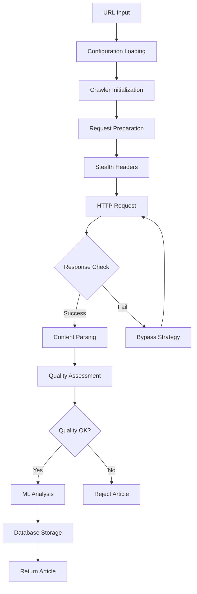
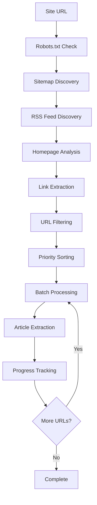

# News Crawler Architecture

This document provides a comprehensive overview of the Lindela News Crawler architecture, design patterns, and implementation details.

## Table of Contents

1. [System Overview](#system-overview)
2. [Core Architecture](#core-architecture)
3. [Component Design](#component-design)
4. [Data Flow](#data-flow)
5. [Configuration System](#configuration-system)
6. [Security and Stealth](#security-and-stealth)
7. [Performance and Scalability](#performance-and-scalability)
8. [Extension Points](#extension-points)
9. [Design Decisions](#design-decisions)

## System Overview

The News Crawler is designed as a modular, extensible system for intelligent news article extraction with advanced stealth capabilities. It follows a layered architecture pattern with clear separation of concerns.

### High-Level Architecture

```
┌─────────────────────────────────────────────────────┐
│                    News Crawler Package                         │
├─────────────────────────────────────────────────────┤
│  User Interface Layer (API, CLI, Web)                          │
├─────────────────────────────────────────────────────┤
│  Core Crawlers (Enhanced + Deep)                               │
├─────────────────────────────────────────────────────┤
│  Support Modules (Parsers, Bypass, Config)                     │
├─────────────────────────────────────────────────────┤
│  Utilities Layer (Monitoring, Caching, Database)               │
├─────────────────────────────────────────────────────┤
│  Infrastructure (HTTP, Browser, Storage)                       │
└─────────────────────────────────────────────────────┘
```

### Key Design Principles

1. **Modularity**: Each component has a single responsibility
2. **Extensibility**: Easy to add new crawlers, parsers, or bypass methods
3. **Fault Tolerance**: Graceful degradation when components are unavailable
4. **Configuration-Driven**: Behavior controlled through configuration
5. **Async-First**: Designed for high-performance asynchronous operation

## Core Architecture

### Package Structure

```
news_crawler/
├── __init__.py              # Package interface and convenience functions
├── README.md                # Package documentation
├── docs/                    # Architecture and user documentation
│   ├── architecture.md      # This document
│   └── user_guide.md       # User guide and examples
├── core/                    # Core crawler implementations
│   ├── __init__.py
│   ├── enhanced_news_crawler.py    # Primary stealth crawler
│   └── deep_crawling_news_crawler.py  # Comprehensive site crawler
├── bypass/                  # Anti-detection and bypass systems
│   ├── __init__.py
│   ├── bypass_manager.py    # Unified bypass coordination
│   ├── cloudflare_bypass.py # Cloudflare-specific bypass
│   ├── anti_403_handler.py  # HTTP 403 error handling
│   └── newspaper_bypass.py  # Newspaper3k integration
├── parsers/                 # Content parsing and extraction
│   ├── __init__.py
│   ├── content_parser.py    # Unified content parser
│   ├── html_parser.py       # HTML structure parsing
│   ├── article_extractor.py # Article content extraction
│   ├── metadata_extractor.py # Metadata extraction
│   └── ml_content_analyzer.py # ML-based content analysis
├── config/                  # Configuration management
│   ├── __init__.py
│   └── unified_config.py    # Unified configuration system
└── examples/               # Usage examples and demonstrations
    ├── __init__.py
    ├── comprehensive_example.py
    ├── deep_crawl_example.py
    ├── standalone_example.py
    └── stealth_example.py
```

## Component Design

### 1. Core Crawlers

#### Enhanced News Crawler (`enhanced_news_crawler.py`)

The primary crawler optimized for stealth and individual article extraction.

```python
class NewsCrawler:
    """
    Primary news crawler with advanced stealth capabilities.

    Architecture:
    - CloudScraper-based HTTP client for Cloudflare bypass
    - Intelligent user agent rotation
    - Configurable delay patterns
    - Multiple extraction fallbacks
    - Real-time database persistence
    """
```

**Key Features:**
- **Stealth-First Design**: All requests use stealth techniques by default
- **Multi-Method Extraction**: Falls back through newspaper3k → trafilatura → BeautifulSoup
- **Intelligent Rate Limiting**: Adaptive delays based on site response
- **Real-Time Persistence**: Immediate database storage with transaction safety

**Request Flow:**
```
URL Input → Stealth Headers → CloudScraper → Content → Multi-Parser → Article → Database
                ↓                          ↓            ↓              ↓
            User Agent      →    Cloudflare   →   Quality    →    ML Analysis
            Rotation              Detection        Assessment
```

#### Deep Crawling News Crawler (`deep_crawling_news_crawler.py`)

Specialized for comprehensive site crawling and bulk article extraction.

```python
class CloudScraperStealthCrawler:
    """
    Deep site crawler for comprehensive article discovery.

    Architecture:
    - Site discovery via sitemaps, RSS, and link crawling
    - Hierarchical URL filtering and prioritization
    - Batch processing with session management
    - Progress tracking and resumption
    - Enhanced crawler integration for stealth
    """
```

**Discovery Methods:**
1. **Sitemap Analysis**: Parse XML sitemaps for article URLs
2. **RSS Feed Processing**: Extract URLs from RSS/Atom feeds
3. **Link Discovery**: Crawl homepage and section pages for article links
4. **Pattern Matching**: Use heuristics to identify article URLs

**Crawling Flow:**
```
Site URL → Discovery → URL Queue → Batch Processing → Articles
    ↓         ↓           ↓            ↓              ↓
 Robots.txt  Sitemap   Priority    Enhanced       Database
   Check     Parser    Sorting     Crawler        Storage
```

### 2. Bypass System

#### Bypass Manager (`bypass_manager.py`)

Unified coordinator for all bypass strategies.

```python
class BypassManager:
    """
    Comprehensive bypass manager that coordinates all bypass strategies.

    Strategy Pattern Implementation:
    1. Direct Request (baseline)
    2. Cloudflare Bypass (for CF-protected sites)
    3. Anti-403 Handling (for forbidden errors)
    4. User Agent Rotation (for basic detection)
    """
```

**Bypass Strategy Chain:**
```
Request → Direct → Cloudflare → Anti-403 → UA Rotation → Fail
   ↓        ↓         ↓          ↓          ↓           ↓
Success   403/503   CF Detect   403 Retry  Basic Bot   Error
Return    Next      Challenge   Handling   Detection   Handling
```

**Components:**
- **CloudflareBypass**: Handles Cloudflare challenges and protection
- **Anti403Handler**: Manages HTTP 403 errors with intelligent retry
- **Session Management**: Rotates sessions and headers
- **Rate Limiting**: Implements exponential backoff

### 3. Parser System

#### Content Parser (`content_parser.py`)

Unified interface for all content extraction methods.

```python
class ContentParser:
    """
    Unified content parser with all parsing capabilities.

    Parser Chain:
    1. HTML Parser → Structure extraction
    2. Article Extractor → Content extraction
    3. Metadata Extractor → Metadata extraction
    4. ML Analyzer → Quality assessment
    """
```

**Parsing Pipeline:**
```
HTML → HTML Parser → Article Extractor → Metadata Extractor → ML Analyzer → Result
  ↓        ↓              ↓                    ↓                 ↓           ↓
 Raw     Structure    Main Content        Title/Author      Quality     Unified
Content   Analysis    Extraction          Extraction        Analysis    Content
```

**Quality Assessment:**
- Content length and readability
- Extraction confidence scores
- Metadata completeness
- ML-based quality metrics

### 4. Configuration System

#### Unified Configuration (`unified_config.py`)

Integration with the utils/config infrastructure.

```python
class NewsConfigurationManager:
    """
    Configuration manager that handles both unified and legacy formats.

    Features:
    - Utils/config integration
    - Environment variable support
    - Configuration validation
    - Hot reloading capabilities
    """
```

**Configuration Hierarchy:**
```
1. Command Line Arguments (highest priority)
2. Environment Variables
3. Configuration Files (JSON/YAML)
4. Default Values (lowest priority)
```

**Configuration Categories:**
- **Performance**: Concurrency, timeouts, rate limits
- **Stealth**: User agents, delays, fingerprint protection
- **Bypass**: Cloudflare, captcha, anti-bot settings
- **Content**: Parsing options, quality thresholds
- **Storage**: Database, caching, output format

## Data Flow

### Article Extraction Flow



### Site Discovery Flow



## Configuration System

### Architecture

The configuration system is built on the utils/config infrastructure with the following layers:

```
Application Layer    │ get_crawler_config()
                    │
Adapter Layer       │ NewsConfigurationAdapter
                    │
Utils Layer         │ UnifiedCrawlerConfiguration
                    │
Environment Layer   │ Environment Variables
                    │
Storage Layer       │ JSON/YAML Files
```

### Configuration Flow

1. **Initialization**: Load configuration from multiple sources
2. **Validation**: Ensure all required settings are present
3. **Adaptation**: Convert between formats if needed
4. **Distribution**: Provide configuration to components
5. **Updates**: Handle runtime configuration changes

### Default Configuration

```python
DEFAULT_CONFIG = {
    # Performance settings
    'max_concurrent_requests': 5,
    'requests_per_second': 2.0,
    'request_timeout': 30,
    'max_retries': 3,

    # Stealth settings
    'enable_stealth': True,
    'enable_enhanced_stealth': True,
    'min_delay': 1.0,
    'max_delay': 3.0,

    # Bypass settings
    'enable_bypass': True,
    'enable_cloudflare_bypass': True,
    'enable_403_handling': True,

    # Content settings
    'enable_ml_analysis': True,
    'min_content_length': 200,
    'quality_threshold': 0.5
}
```

## Security and Stealth

### Stealth Techniques

1. **Browser Mimicking**
   - Realistic user agent strings
   - Complete browser headers
   - TLS fingerprint masking

2. **Behavioral Patterns**
   - Human-like request timing
   - Random delays and jitter
   - Session rotation

3. **Fingerprint Protection**
   - Header randomization
   - Viewport spoofing
   - Font and plugin masking

### Security Considerations

1. **Data Protection**
   - No sensitive data in logs
   - Secure credential storage
   - HTTPS enforcement

2. **Access Control**
   - Rate limiting compliance
   - Robots.txt respect
   - Ethical crawling practices

3. **Error Handling**
   - No information leakage
   - Graceful failure modes
   - Comprehensive logging

## Performance and Scalability

### Performance Optimization

1. **Asynchronous Architecture**
   - Non-blocking I/O operations
   - Concurrent request processing
   - Efficient resource utilization

2. **Caching Strategy**
   - Response caching
   - DNS caching
   - Session reuse

3. **Resource Management**
   - Connection pooling
   - Memory optimization
   - CPU efficiency

### Scalability Design

1. **Horizontal Scaling**
   - Stateless design
   - Distributed processing
   - Load balancing support

2. **Vertical Scaling**
   - Multi-threading support
   - Memory optimization
   - CPU parallelization

### Monitoring and Metrics

```python
class PerformanceMonitor:
    """
    Performance monitoring with metrics collection.

    Metrics:
    - Request rates and response times
    - Success/failure ratios
    - Resource utilization
    - Error patterns
    """
```

## Extension Points

### Adding New Crawlers

1. **Inherit from Base Classes**
   ```python
   class CustomCrawler(NewsCrawler):
       async def crawl_url(self, url: str) -> NewsArticle:
           # Custom implementation
   ```

2. **Register with Factory**
   ```python
   def create_custom_crawler(config):
       return CustomCrawler(config)
   ```

### Adding New Parsers

1. **Implement Parser Interface**
   ```python
   class CustomParser:
       async def parse(self, html: str, url: str) -> ParsedContent:
           # Custom parsing logic
   ```

2. **Register with ContentParser**
   ```python
   content_parser.register_parser('custom', CustomParser)
   ```

### Adding New Bypass Methods

1. **Implement Bypass Interface**
   ```python
   class CustomBypass:
       async def bypass(self, url: str) -> BypassResult:
           # Custom bypass logic
   ```

2. **Register with BypassManager**
   ```python
   bypass_manager.register_bypass('custom', CustomBypass)
   ```

## Design Decisions

### 1. Async-First Architecture

**Decision**: Use asyncio for all I/O operations
**Rationale**:
- Higher throughput for I/O-bound operations
- Better resource utilization
- Natural fit for web crawling workloads

### 2. Modular Component Design

**Decision**: Separate concerns into distinct modules
**Rationale**:
- Easier testing and maintenance
- Flexible configuration options
- Support for different use cases

### 3. Configuration-Driven Behavior

**Decision**: Control behavior through configuration rather than code
**Rationale**:
- Easier deployment in different environments
- No code changes for configuration updates
- Better separation of concerns

### 4. Multiple Parser Strategy

**Decision**: Use multiple parsers with fallback chain
**Rationale**:
- Improved extraction success rates
- Handling of diverse site structures
- Quality improvement through redundancy

### 5. Stealth by Default

**Decision**: Enable stealth features by default
**Rationale**:
- Better success rates on protected sites
- Reduced detection and blocking
- Professional crawling practices

### 6. Utils/Config Integration

**Decision**: Integrate with existing utils/config infrastructure
**Rationale**:
- Consistency across Lindela packages
- Reuse of configuration management
- Better enterprise integration

## Future Enhancements

### Planned Features

1. **Machine Learning**
   - Content quality prediction
   - Site structure learning
   - Adaptive crawling strategies

2. **Advanced Stealth**
   - Browser automation integration
   - Residential proxy support
   - Advanced fingerprint protection

3. **Distributed Crawling**
   - Multi-node coordination
   - Load balancing
   - State synchronization

4. **Real-time Processing**
   - Stream processing
   - Live monitoring
   - Instant alerts

### Extension Opportunities

1. **Custom Extractors**
   - Site-specific parsers
   - Schema.org integration
   - Structured data extraction

2. **Analytics Integration**
   - Content analysis
   - Trend detection
   - Performance analytics

3. **Enterprise Features**
   - Multi-tenancy support
   - Advanced monitoring
   - Compliance reporting
