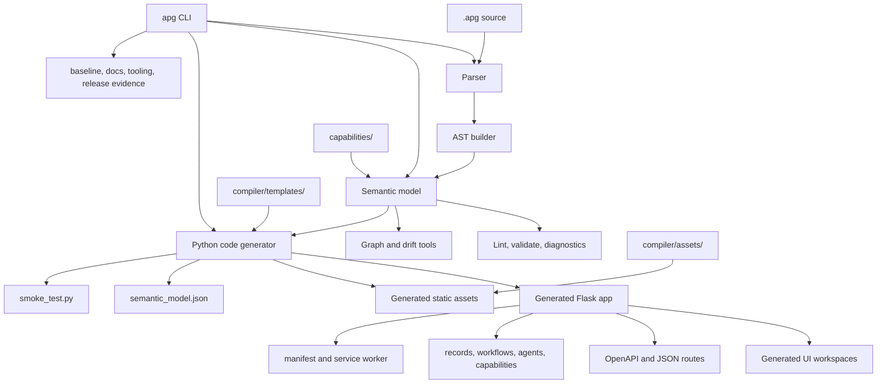

# APG Architecture

APG is the Agentic Platform Generator: a Python-first compiler and capability
platform for producing self-contained Flask business applications from `.apg`
source.

This document reflects the current repository state, not older aspirations for
a monolithic platform stack.

## System View



## Core Layers

| Layer | Current owner | Contract |
| --- | --- | --- |
| CLI | `cli/` | Click command groups exposed by `apg=cli.main:cli`. |
| Legacy CLI | `cli.py` | Backward-compatible argparse helper path. |
| Parser | `compiler/parser.py`, grammar artifacts | Parse `.apg` source. |
| AST | `compiler/ast_builder.py` | Convert parse output into declarations. |
| Semantic model | `compiler/semantic_model.py` | Emit normalized `apg.semantic-model.v1`. |
| Diagnostics | `compiler/diagnostics.py` and lint/validate modules | Explain invalid or risky source. |
| Generator | `compiler/code_generator.py` | Emit generated Flask apps, sidecars, docs, tests, and static assets. |
| UI templates | `compiler/templates/` | Jinja workspace templates embedded in generated apps. |
| UI assets | `compiler/assets/` | Local browser assets copied into generated `static/`. |
| Capability contracts | `capabilities/**/capability_contract.py` | Configuration, rules, UI, theme, i18n, streaming, package metadata. |
| Baseline gate | `compiler/baseline.py` and CLI command | Numbered-example compile and runtime evidence. |

## Generated Flask Runtime

The generated `app.py` is a Flask server with:

- application metadata and semantic model
- OpenAPI 3.1
- component manifest
- health, metrics, self-test, validation, describe, and semantic-model routes
- CRUD routes for generated entities
- workflow run, signal, resume, and compensation routes
- agent and agent-team invocation routes
- capability health, rules, configuration, approval, theme, screen, language,
  and streaming routes
- database catalog and relationship routes
- `/ui` workspace routes
- optional login/logout/locale routes
- server-sent event stream support
- local JSON persistence through `APG_DATA_FILE`
- optional best-effort PostgreSQL persistence through database URL variables

Generated apps are not React apps and do not require a frontend build step.

## Generated UI Architecture

The UI is server-rendered HTML with HTMX-enhanced fragments. It uses:

- `compiler/templates/*.html.j2`
- `compiler/assets/apg.css`
- vendored `htmx`, `sortable`, and `uPlot`
- generated `apg-charts.js` and `apg-sse.js`
- generated manifest and service worker

The persistent shell provides sidebar navigation, topbar navigation, command
palette, notifications, theme switching, language switching, PWA install/update
controls, and offline status. Workspace routes are described in
[Generated UI](generated_ui.md).

## Capability Architecture

Capability packages live under `capabilities/<domain>/<code>/`. The inventory
currently spans 33 domains and 440 non-hidden domain/code directories.

Standard package surfaces include:

```text
capability_contract.py
cap_spec.md
models.py
service.py
api.py
views.py
blueprint.py
semantic_model.json
package_manifest.json
tests/
docs/
domain/
database/
alembic/
```

Not every capability directory has every surface. Use audits to distinguish
domain-specific implementations from materialized baselines, mixed packages, or
contract-only packages:

```bash
apg capabilities validate-contracts --json
apg capabilities implementation-audit --json
apg capabilities lifecycle-audit --json
```

## Data And Persistence

Generated apps start dependency-light:

- in-memory record store
- optional JSON file persistence through `APG_DATA_FILE`
- optional PostgreSQL persistence if a database URL and driver are available
- semantic model and database catalog emitted as generated metadata

PostgreSQL, Redis, NATS, Temporal, and SQLAlchemy are package dependencies for
platform and capability work, but they are not required to compile a simple APG
file or run a generated local app.

## Security Model

Generated apps include:

- optional generated login session flow when auth metadata requires it
- mutation authorization through generated checks
- API-key support with `APG_API_KEY`
- session secret support with `APG_SESSION_SECRET` or `APG_JWT_SECRET`
- tenant scoping based on `tenant_id` fields and request headers
- capability rules and approvals through deterministic contract functions

Capability packages may add stronger security boundaries, but docs should name
the package-level evidence instead of implying all generated apps include a
full enterprise IAM stack by default.

## Release And Verification Architecture

APG verification is command-driven:

```bash
apg lint <source.apg> --json
apg validate <source.apg> --target python --json
apg model <source.apg> --json
apg graph-suite <source.apg> --json
apg compile <source.apg> --output /tmp/apg-out --verify
apg release <source.apg> --json
apg package <source.apg> --target web --out /tmp/apg-package --json
apg package-verify /tmp/apg-package --json
apg deployment verify /tmp/apg-package --json
apg baseline examples --json
apg tooling audit --json
```

The baseline gate covers all numbered examples and is the main compiler
bed-down proof. The current full test target is:

```bash
uv run pytest tests/ -q
```

with 1486 passed, 1 skipped, and 3 warnings.

## Extension Points

Add functionality at the earliest owning layer:

- syntax: grammar, parser fixtures, AST builder
- meaning: semantic model, diagnostics, graph output
- execution: code generator and generated runtime tests
- UI: templates, CSS/assets, generated UI tests
- capability behavior: capability package and focused package tests
- documentation: docs audit and links
- delivery: package, deployment, release evidence commands

Avoid adding dependencies or framework assumptions unless the current source and
tests require them.
